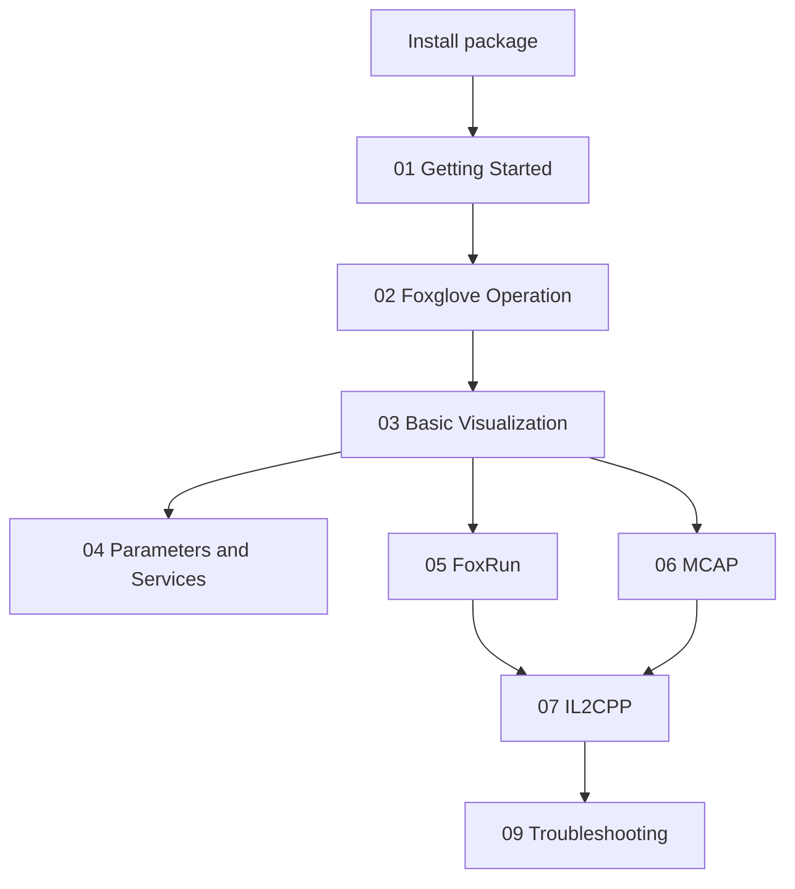

# 1. Unity2Foxglove SDK Documentation

Unity2Foxglove SDK streams Unity real-time data to Foxglove through the Foxglove WebSocket protocol. It supports typed schema publishing, camera streaming, Parameters, Services, FoxRun auto-publishing, MCAP recording/replay, and IL2CPP Player builds.

## 1.1 Purpose

This documentation is the SDK user knowledge base. Use it when you want to integrate the package into your own Unity project, understand how Foxglove panels map to Unity data, or debug package/runtime behavior.

## 1.2 Application

If you cloned the repository only to run the ready-made demo project, start with `Untiy2Foxglove/README.md` instead. If you are installing the package into another Unity project, read these documents in order.

## 1.3 Recommended Reading Flow

## 1.4 English Documents

- [01_GettingStarted.md](en/01_GettingStarted.md): install the package and publish the first `/tf` topic.
- [02_FoxgloveOperation.md](en/02_FoxgloveOperation.md): operate Foxglove panels and import layouts.
- [03_BasicVisualization.md](en/03_BasicVisualization.md): verify 3D, camera, and plot visualization.
- [04_ParametersAndServices.md](en/04_ParametersAndServices.md): configure remote parameters and service calls.
- [05_FoxRun.md](en/05_FoxRun.md): publish debug topics with `[FoxRun]`.
- [06_MCAP.md](en/06_MCAP.md): record and replay MCAP files.
- [07_IL2CPP.md](en/07_IL2CPP.md): build IL2CPP Players and verify generated source fallback.
- [08_Architecture.md](en/08_Architecture.md): understand runtime, transport, replay, recording, and protocol layers.
- [09_Troubleshooting.md](en/09_Troubleshooting.md): diagnose connection, topic, schema, build, and MCAP issues.

## 1.5 中文文档

- [01_快速开始.md](zh/01_快速开始.md): 安装 package 并发布第一个 `/tf` topic。
- [02_Foxglove操作指南.md](zh/02_Foxglove操作指南.md): 操作 Foxglove 面板和导入 layout。
- [03_基础可视化.md](zh/03_基础可视化.md): 验证 3D、Camera、Plot 可视化链路。
- [04_Parameters与Services.md](zh/04_Parameters与Services.md): 配置 Parameters 和 Services。
- [05_FoxRun自动发布.md](zh/05_FoxRun自动发布.md): 使用 `[FoxRun]` 发布调试 topic。
- [06_MCAP录制回放.md](zh/06_MCAP录制回放.md): 录制和回放 MCAP。
- [07_IL2CPP构建.md](zh/07_IL2CPP构建.md): 构建 IL2CPP Player。
- [08_架构说明.md](zh/08_架构说明.md): 理解 SDK 架构。
- [09_常见问题排查.md](zh/09_常见问题排查.md): 排查常见问题。
- [10_ISG构建过程.md](zh/10_ISG构建过程.md): 维护者参考，解释 FoxRun source generation。

## 1.6 Maintainer References

- [90_NativeBackend评估.md](zh/90_NativeBackend评估.md): Native backend feasibility note.
- [91_FoxRun设计笔记.md](zh/91_FoxRun设计笔记.md): early FoxRun design note.

## 1.7 Requirements

- Unity 2022.3 LTS or later.
- `com.unity.nuget.newtonsoft-json` 3.2.1.
- Editor and Standalone Player are supported.
- WebGL is not currently supported.
