# 1. Getting Started

## Who should read this

Read this if you are adding Unity2Foxglove to a Unity project for the first time.

## What you will do

You will install the package, add a `FoxgloveManager`, publish a Transform, optionally publish a Scene cube and Camera image, and connect Foxglove Desktop.

> [!TIP]
> If you have not installed Unity or Foxglove Desktop yet, start with [00_Prerequisites](00_Prerequisites.md).

## 1.1 Install the Package

### 1.1.1 Install from a local package

1. Open Unity.
2. Open **Window > Package Manager**.

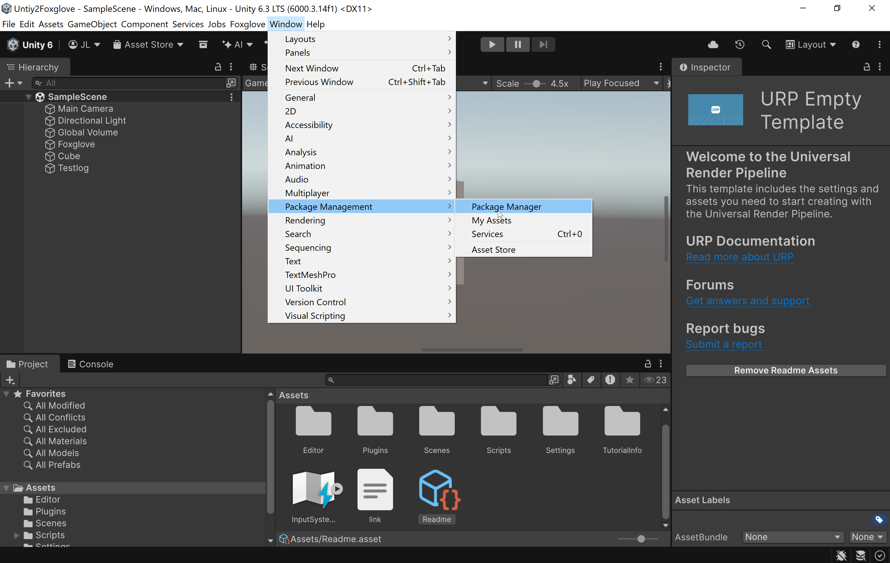
<figcaption>Figure 1: Open Package Manager</figcaption>

3. Click **+ > Add package from disk...**, or select "Install package from git URL" below and enter the URL:  

```http
https://github.com/JianbinLiu-CFLab/unity-foxglove-sdk.git?path=/Packages/dev.unity2foxglove.sdk
```

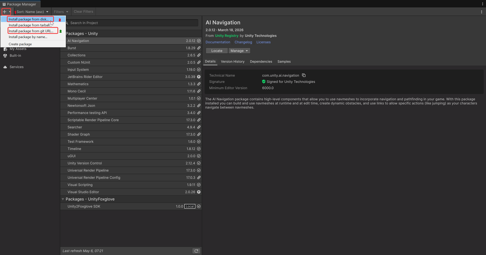
<figcaption>Figure 2: Package Manager Add Menu</figcaption>

4. Select `Packages/dev.unity2foxglove.sdk/package.json`.

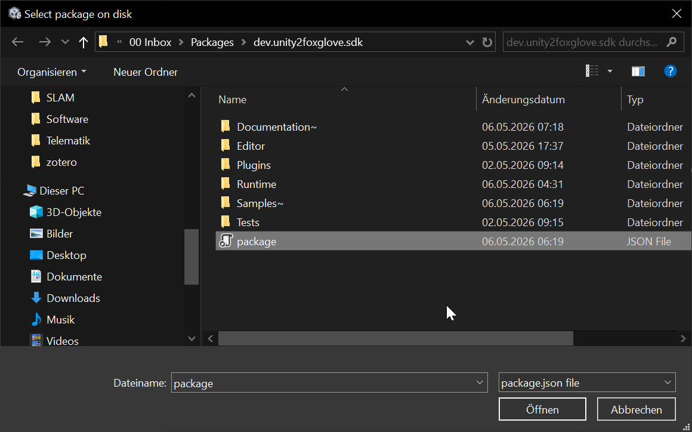
<figcaption>Figure 3: Select package.json File</figcaption>

5. Wait for Unity to resolve dependencies.

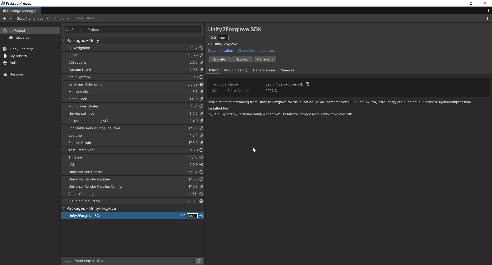
<figcaption>Figure 4: Package Import Confirmation</figcaption>

### 1.1.2 Alternative: edit `manifest.json`

This method is not recommended for general use - Unity may rewrite relative `file:` paths to absolute paths, and the result is not portable. Prefer the Package Manager UI above unless you have a specific reason to edit the manifest.

```json
{
  "dependencies": {
    "dev.unity2foxglove.sdk": "file:../../Packages/dev.unity2foxglove.sdk"
  }
}
```

Adjust the path to match where your project sits relative to the package.

## 1.2 Add the Server Component

1. Create an empty GameObject named `Foxglove`.
2. Add **FoxgloveManager**.

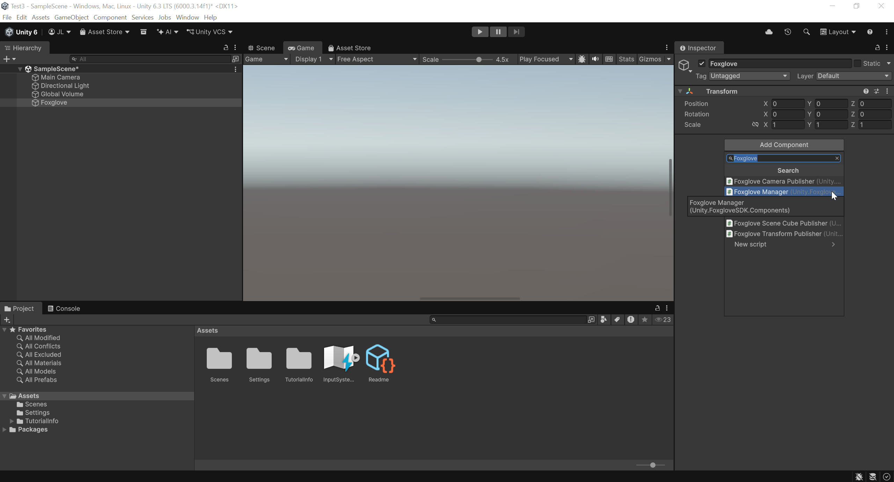
<figcaption>Figure 5: Add Foxglove Manager Component</figcaption>

3. Keep the default settings for the first test:
   - Host: `127.0.0.1`
   - Port: `8765`
   - Start On Enable: enabled
   - Coordinate Mode: `LeftHand`

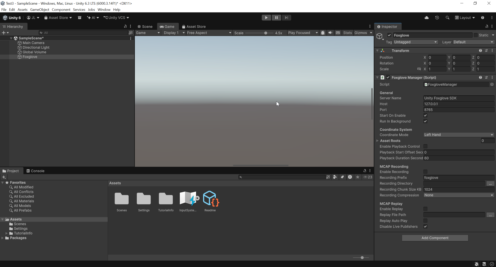
<figcaption>Figure 6: Foxglove Manager Default Settings</figcaption>

Press **Play**. The Unity Console should show a server started message for `ws://127.0.0.1:8765`.

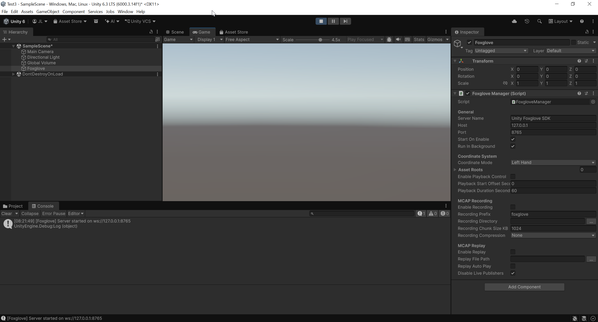
<figcaption>Figure 7: WebSocket Server Start Confirmation</figcaption>

## 1.3 Publish a Transform

1. Create a Cube.
2. Add **Foxglove Transform Publisher** to the Cube.

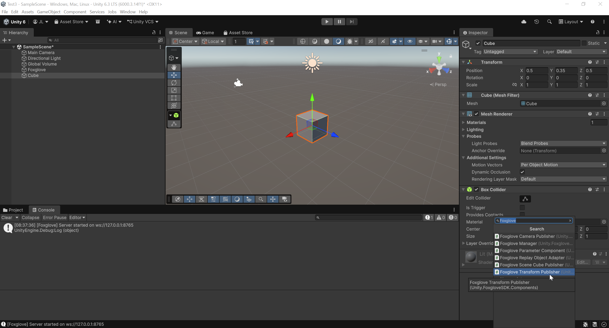
<figcaption>Figure 8: Add Transform Publisher Component</figcaption>

3. Use these first-test values:
   - Topic: leave empty or use `/tf`
   - Parent Frame Id: `unity_world`
   - Child Frame Id: leave empty to use the GameObject name
   - Publish Rate Hz: `10`


<figcaption>Figure 9: Transform Publisher `/tf` Configuration</figcaption>

Move or rotate the Cube while Unity is in Play Mode.

## 1.4 Connect Foxglove Desktop

1. Open Foxglove Desktop.
2. Click **Open connection**.
3. Choose **Foxglove WebSocket**.
4. Enter `ws://127.0.0.1:8765`.
5. Click **Open**.

Confirm that `/tf` appears in the Topics panel. To inspect the raw transform message, add a **Raw Messages** panel and select `/tf`. To visualize the frame, add a **3D** panel.

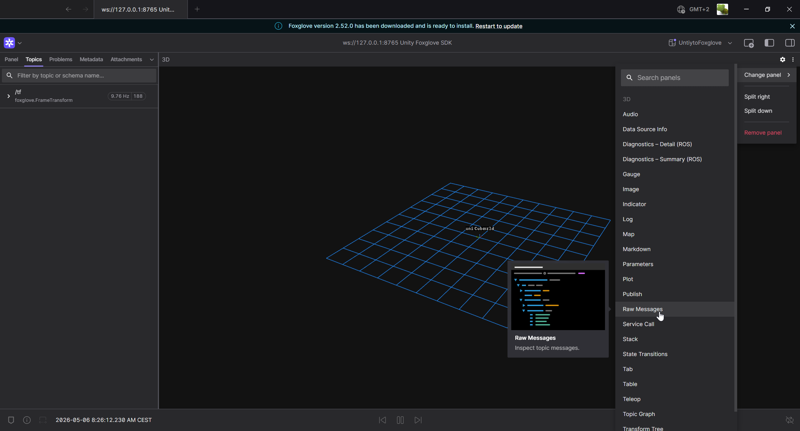
<figcaption>Figure 10: `/tf` Topic Connected in Foxglove</figcaption>

Expected topics:

- `/tf` with schema `foxglove.FrameTransform`

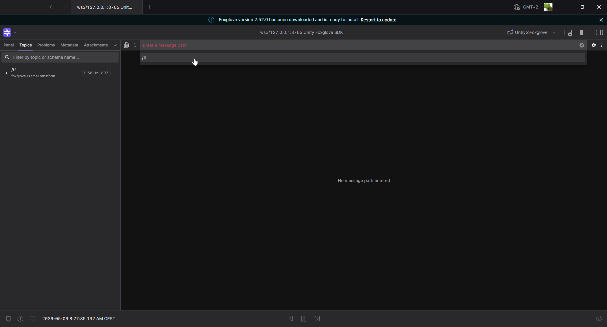
<figcaption>Figure 11: `/tf` FrameTransform Topic Verification</figcaption>


Move or rotate the Cube in the Scene view using the Move Tool or Rotate Tool while Unity is in Play Mode. The Transform changes are published to `/tf` immediately.

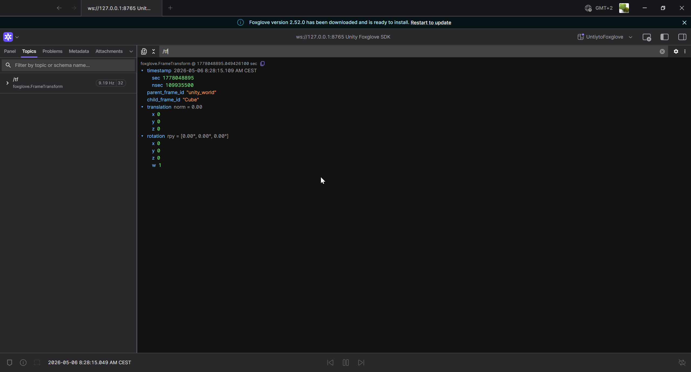
<figcaption>Figure 12: Cube Transform Live Update</figcaption>

## 1.5 Optional: Publish a Scene Cube

Add **Foxglove Scene Cube Publisher** to the Cube if you want Foxglove's 3D panel to show a simple cube primitive rather than only a frame transform.

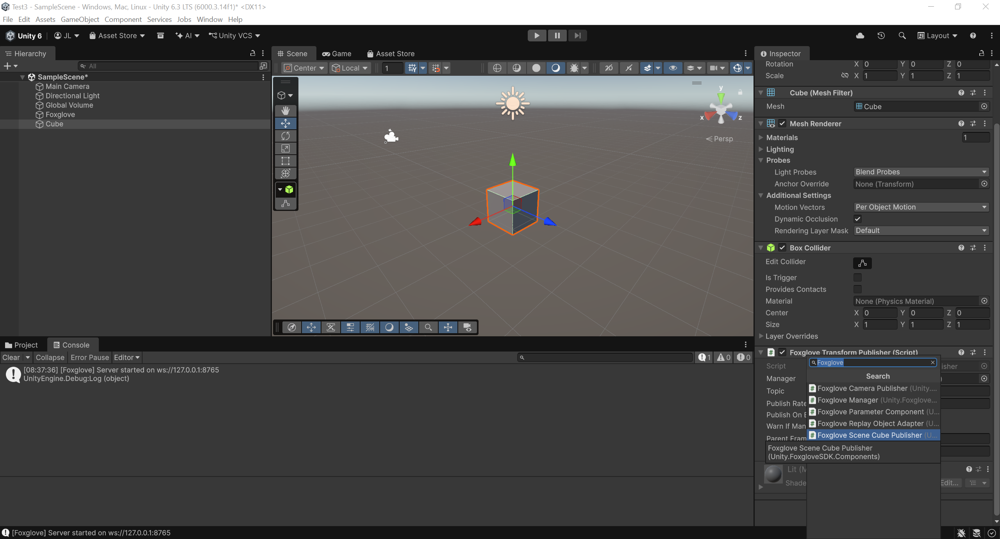
<figcaption>Figure 13: Add Scene Cube Publisher Component</figcaption>

Recommended first-test values:

- Topic: `/scene`
- Frame Id: leave empty to reuse the object/frame name
- Color: green
- Size: `(1, 1, 1)`

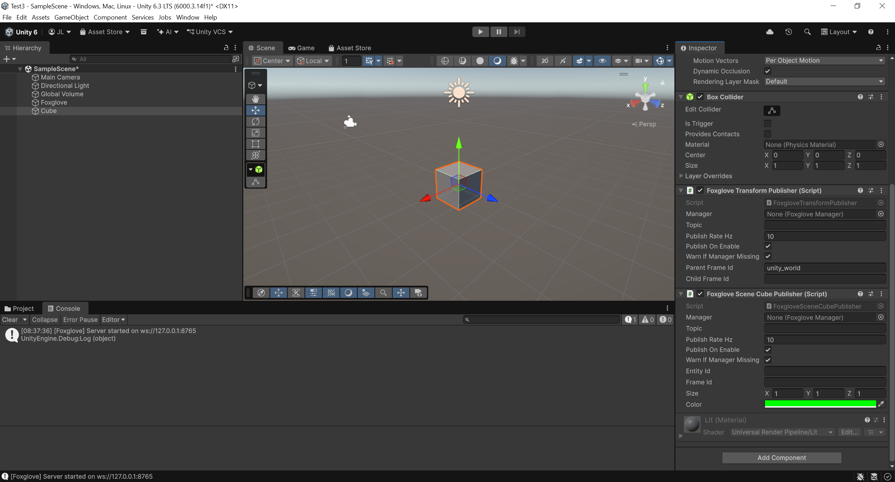
<figcaption>Figure 14: Scene Cube Publisher `/scene` Configuration</figcaption>

Go back to Foxglove and add a new panel.

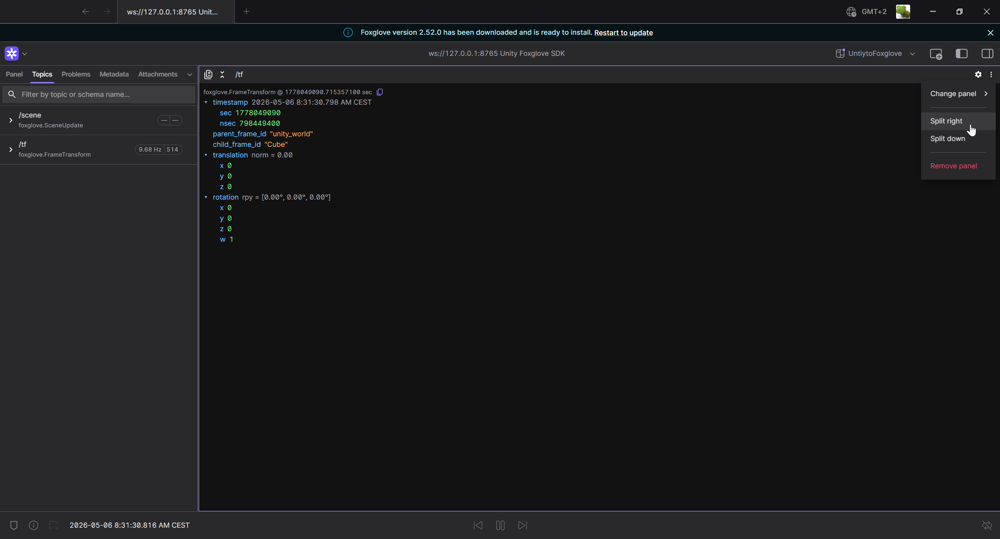
<figcaption>Figure 15: Add Foxglove Panel</figcaption>

Select the 3D panel.

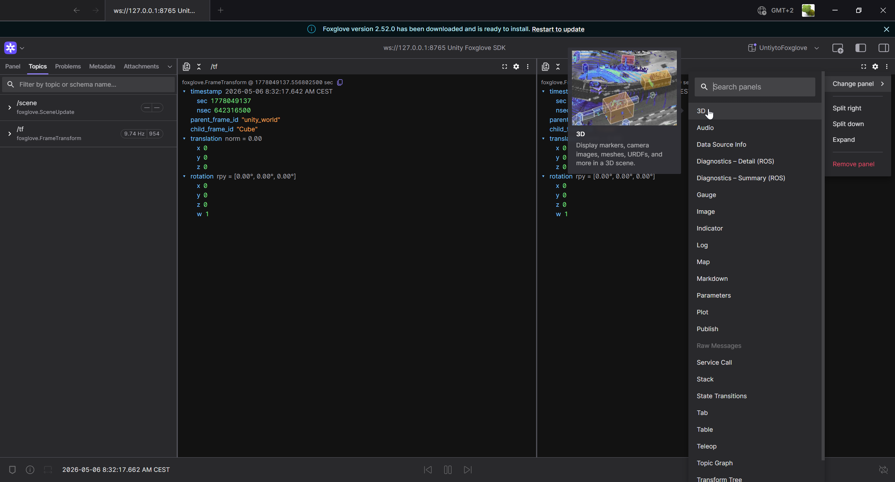
<figcaption>Figure 16: Select 3D Panel</figcaption>

Expected topics:

- `/scene` with schema `foxglove.SceneUpdate`

If you don't see the cube in the 3D panel, find `/scene` in the Topics list on the left Panel and click the visibility icon to enable it.

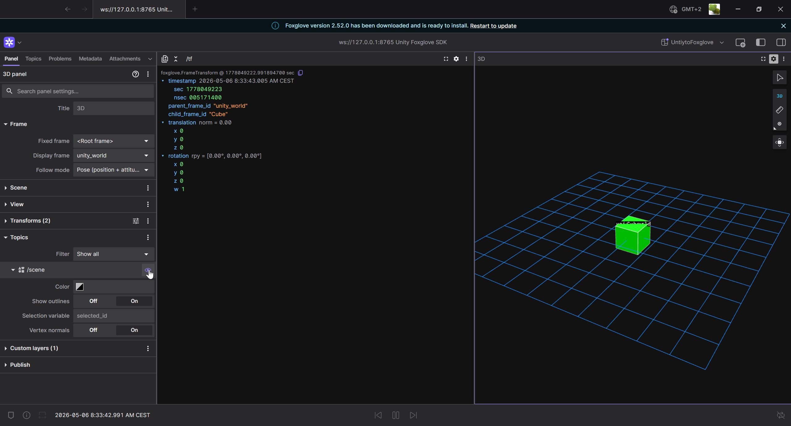
<figcaption>Figure 17: Enable `/scene` Topic in 3D Panel</figcaption>
## 1.6 Optional: Publish a Camera Image

1. Select a Unity Camera.
2. Add **Foxglove Camera Publisher**.

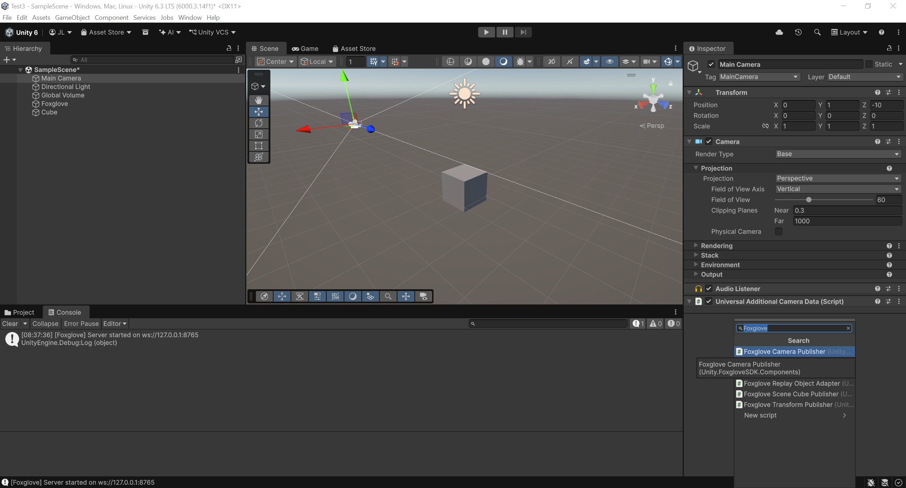
<figcaption>Figure 18: Add Camera Publisher Component</figcaption>

3. Use:
   - Topic: `/unity/camera`
   - Frame Id: `unity_camera`
   - Publish Rate Hz: `10`
   - Width: `640`
   - Height: `480`
   - JPEG Quality: `70`

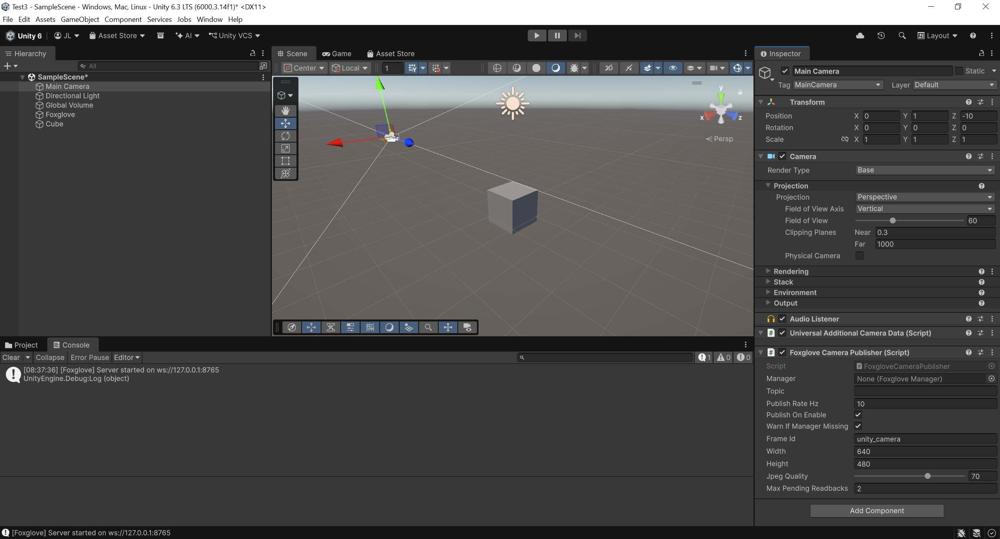
<figcaption>Figure 19: Camera Publisher `/unity/camera` Configuration</figcaption>

Go back to Foxglove and add a new panel.

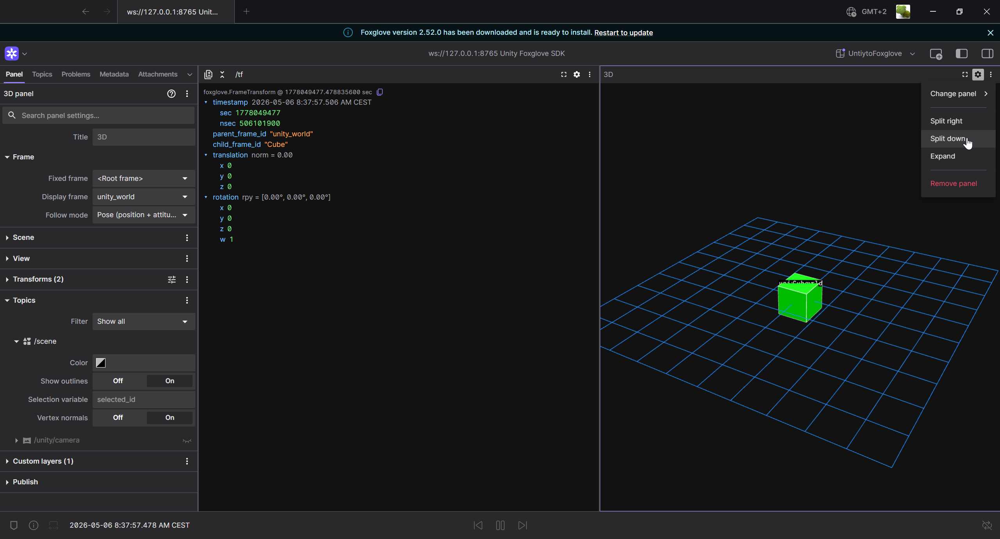
<figcaption>Figure 20: Add Camera Visualization Panel</figcaption>

Select the Image panel.

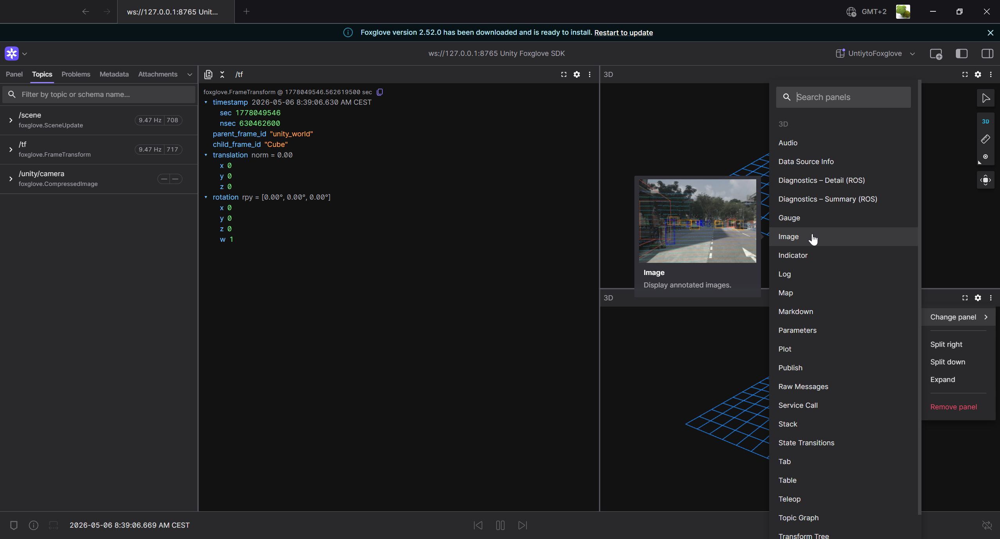
<figcaption>Figure 21: Select Image Panel</figcaption>

Expected topics:

- `/tf` with schema `foxglove.FrameTransform`
- `/scene` with schema `foxglove.SceneUpdate` if you added a scene publisher
- `/unity/camera` with schema `foxglove.CompressedImage` if you added a camera publisher

Move or rotate the Cube in the Scene view using the Move Tool or Rotate Tool while Unity is in Play Mode. Watch the cube move in Foxglove's 3D panel and see the position update in the panels.

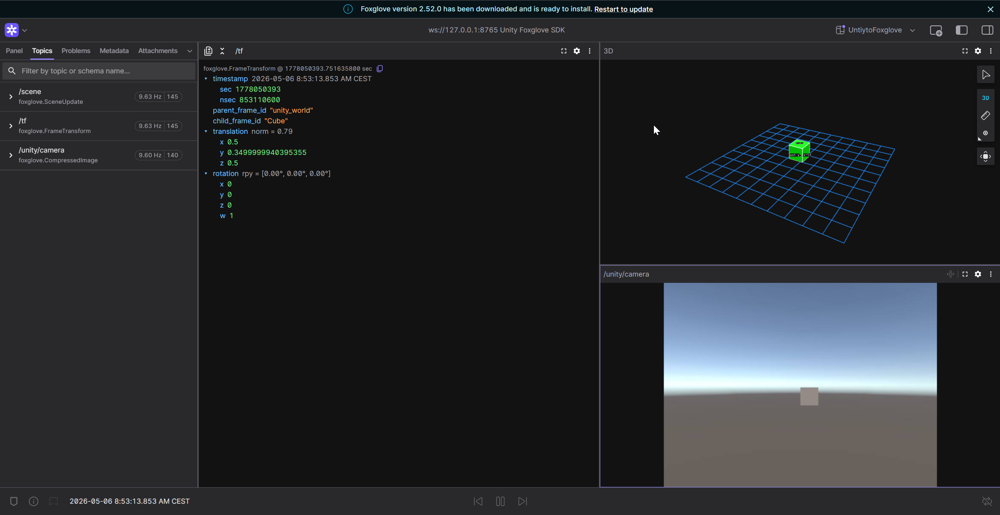
<figcaption>Figure 22: Foxglove Live Update Verification</figcaption>

## 1.7 What Success Looks Like

- The Foxglove **Topics** panel lists your Unity topics.
- The **3D** panel can display the Cube frame or primitive.
- The **Image** panel can display `/unity/camera`.
- Moving the Cube in Unity updates Foxglove live.

## 1.8 Next Steps

- Use [03_Foxglove_Desktop_Operation](03_Foxglove_Desktop_Operation.md) to set up panels and layouts.
- Use [04_Verifying_Basic_Visualization](04_Verifying_Basic_Visualization.md) if you want a packaged minimal scene.
- Use [11_Inspector_Reference](11_Inspector_Reference.md) when you need to tune component fields.
