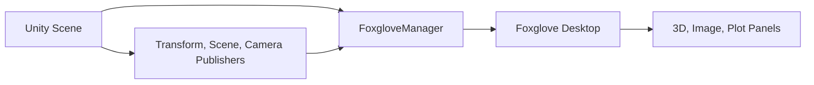

# 1. Basic Visualization

## 1.1 Purpose

This document explains the smallest useful Unity-to-Foxglove visualization loop: publish a transform, publish a scene primitive, stream a camera image, and inspect the result in Foxglove.

## 1.2 Application

Use this document when you want to verify that the SDK is installed correctly before enabling advanced features such as Parameters, Services, FoxRun, or MCAP recording.

## 1.3 Data Flow

## 1.4 Minimal Setup

1. Add `FoxgloveManager` to an empty `Foxglove` GameObject.
2. Add `FoxgloveTransformPublisher` to the GameObject you want to track.
3. Add `FoxgloveSceneCubePublisher` if you want a visible cube primitive in the 3D panel.
4. Add `FoxgloveCameraPublisher` to a Camera if you want `/unity/camera`.
5. Enter Play Mode and connect Foxglove to `ws://127.0.0.1:8765`.

## 1.5 Expected Topics

- `/tf` uses `foxglove.FrameTransform`.
- `/scene` uses `foxglove.SceneUpdate`.
- `/unity/camera` uses `foxglove.CompressedImage`.

## 1.6 Foxglove Panels

- Use the 3D panel to inspect `/tf` and `/scene`.
- Use the Image panel to inspect `/unity/camera`.
- Use the Plot panel to inspect `/tf.translation.x`, `/tf.translation.y`, and `/tf.translation.z`.

## 1.7 Next Steps

- Continue to [04_ParametersAndServices.md](04_ParametersAndServices.md) for interactive controls.
- Continue to [05_FoxRun.md](05_FoxRun.md) for zero-code debug topics.
- Continue to [06_MCAP.md](06_MCAP.md) for recording and replay.
