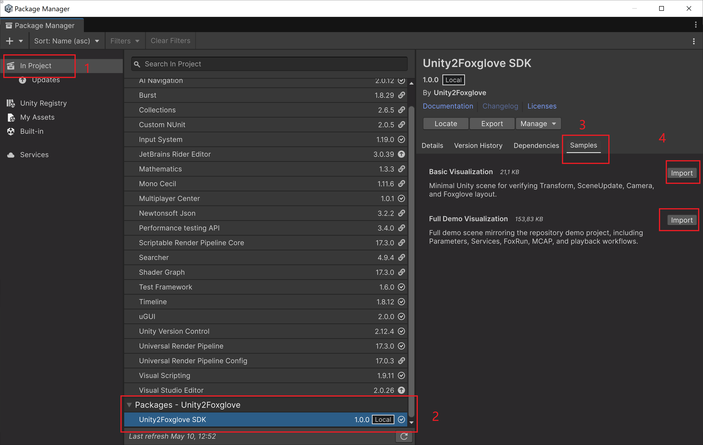

## 1. Purpose

Use this page after Unity2Foxglove SDK is already installed. You do not need to rebuild the quick-start scene from [02_Installation_and_Quick_Start](02_Installation_and_Quick_Start.md) if you want a ready-made example.

The Package Manager provides two prepared samples:

- **Basic Visualization**
- **Full Demo Visualization**

Use **Basic Visualization** for the smallest first check. Use **Full Demo Visualization** for the full feature tour. For normal package users, Full Demo Visualization is usually enough. The separate `Unity2Foxglove/` project is the maintainer/developer test project used for SDK development, manual acceptance, and IL2CPP build validation.

## 2. Sample Selection

| Goal                                         | Use this sample           | Why                                                                                                                |
| -------------------------------------------- | ------------------------- | ------------------------------------------------------------------------------------------------------------------ |
| First connection smoke test                  | Basic Visualization       | Smallest scene; verifies `/tf`, `/scene`, `/unity/camera`, and the simple Foxglove layout.                         |
| Full feature tour                            | Full Demo Visualization   | Includes publishers, Parameters, Services, FoxRun, camera streaming, MCAP workflows, and the full Foxglove layout. |
| SDK development, acceptance, or IL2CPP validation | `Unity2Foxglove/` project | Uses the same project structure as maintainer acceptance and build scripts.                                        |

Start with **Basic Visualization** if you only want to know whether the package works. Use **Full Demo Visualization** when you want to explore the full workflow.

## 3. Basic Visualization

Basic Visualization is the minimal importable sample. It is designed for a fast first run after package installation.

### 3.1 Contents

- `Scenes/BasicVisualization.unity`
- `FoxgloveSimpleLayout.json`
- a `FoxgloveManager`
- a transform publisher
- a scene cube publisher
- a camera publisher

### 3.2 Use Cases

- confirming the package imports correctly;
- confirming Foxglove can connect to Unity;
- checking `/tf`, `/scene`, and `/unity/camera`;
- learning the smallest component setup before adding the SDK to your own scene.

### 3.3 Import Steps

1. Open **Window > Package Manager**.
2. Select **Unity2Foxglove SDK**.
3. Expand **Samples**.
4. Import **Basic Visualization**.
5. Open `BasicVisualization.unity`.
6. Press Play.
7. Connect Foxglove Desktop to `ws://127.0.0.1:8765`.
8. Import `FoxgloveSimpleLayout.json` if you want the prebuilt layout.

### 3.4 Expected Result

- `/tf` appears with schema `foxglove.FrameTransform`.
- `/scene` appears with schema `foxglove.SceneUpdate`.
- `/unity/camera` appears with schema `foxglove.CompressedImage`.
- The simple layout can show 3D, Image, Plot, and raw topic panels.

For the detailed first-run walkthrough, use [05_Verifying_Basic_Visualization](05_Verifying_Basic_Visualization.md).

## 4. Full Demo Visualization

Full Demo Visualization is the larger importable sample. It mirrors the main user-facing features without requiring you to open the repository demo project.

### 4.1 Contents

- `Scenes/FullDemoVisualization.unity`
- `FoxgloveFullLayout.json`
- transform, scene, camera, and log publishers
- Parameter examples for `/cube/color` and `/cube/scale`
- Service example for `/cube/reset_pose`
- FoxRun debug topics such as `/debug/position`, `/debug/position2`, and `/debug/health`
- MCAP recording and replay configuration
- Input System and URP sample assets

### 4.2 Use Cases

- exploring the complete package workflow;
- learning how publishers, Parameters, Services, FoxRun, and MCAP fit together;
- checking the full Foxglove layout;
- using a user-facing demo scene without opening the repository development project.

### 4.3 Import Steps

1. Install Input System and URP if your project does not already have them.
2. Open **Window > Package Manager**.
3. Select **Unity2Foxglove SDK**.
4. Expand **Samples**.
5. Import **Full Demo Visualization**.
6. Open `FullDemoVisualization.unity`.
7. Press Play.
8. Connect Foxglove Desktop to `ws://127.0.0.1:8765`.
9. Import `FoxgloveFullLayout.json`.

### 4.4 Expected Result

- `/tf`, `/scene`, and `/unity/camera` stream live.
- `/debug/position`, `/debug/position2`, and `/debug/health` show FoxRun output.
- `/cube/color` and `/cube/scale` appear in the Parameters panel.
- `/cube/reset_pose` can be called from the Service Call panel.
- The cube can be moved or reset while Foxglove updates.

## 5. Repository Demo Project

Use `Unity2Foxglove/` only when you cloned this repository and want the developer test project.

This project is useful for:

- SDK development and debugging;
- release validation;
- IL2CPP Player smoke tests;
- testing new SDK features before they are promoted into package samples;
- reproducing maintainer acceptance workflows.

It is not required for normal package use. Most users should start with **Basic Visualization** or **Full Demo Visualization** instead. If you only want to try the complete user-facing workflow, **Full Demo Visualization** should be enough.

## 6. Sample Promotion Rule

Package samples should stay clean and user-facing.

New SDK features should be proven in `Unity2Foxglove/` first. Promote a feature to **Full Demo Visualization** only when it is stable, manually validated in Foxglove, and useful for package users. Promote a feature to **Basic Visualization** only when it supports the minimal first-run story without adding extra dependencies.

Do not copy generated files, local build outputs, machine-specific evidence files, or repository-only validation artifacts into package samples.
