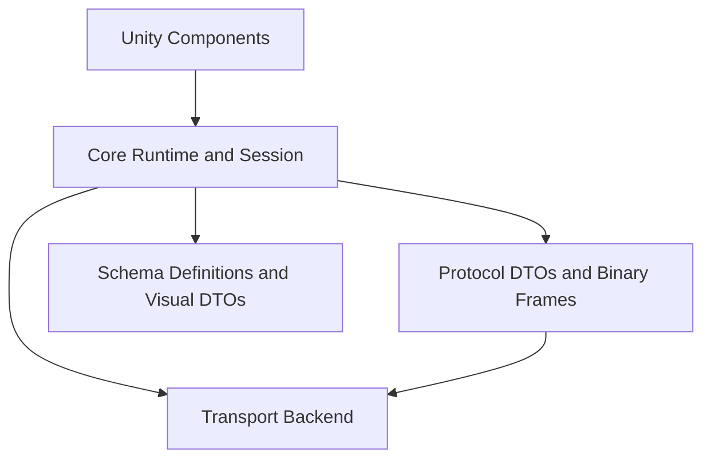
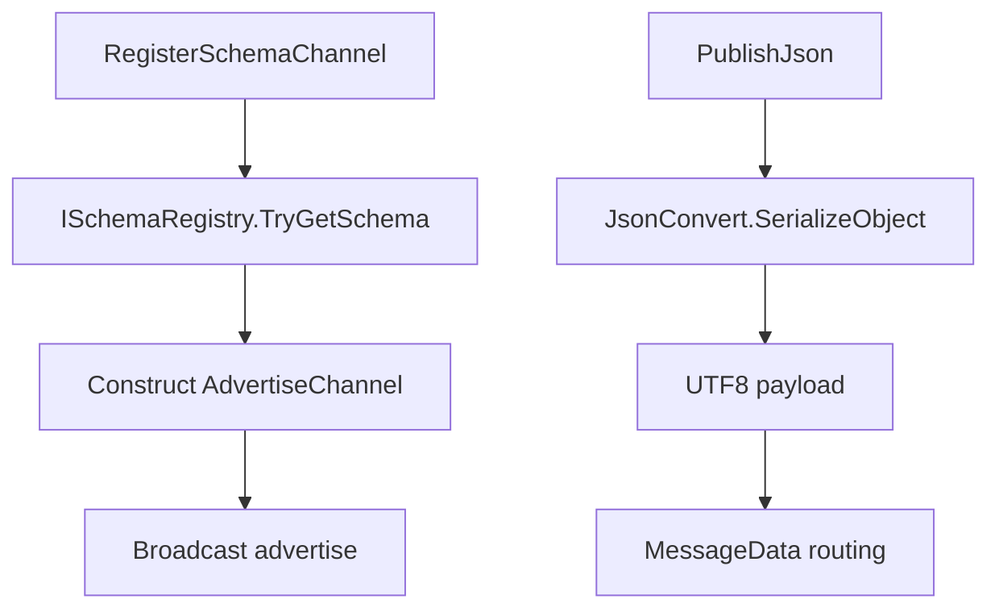
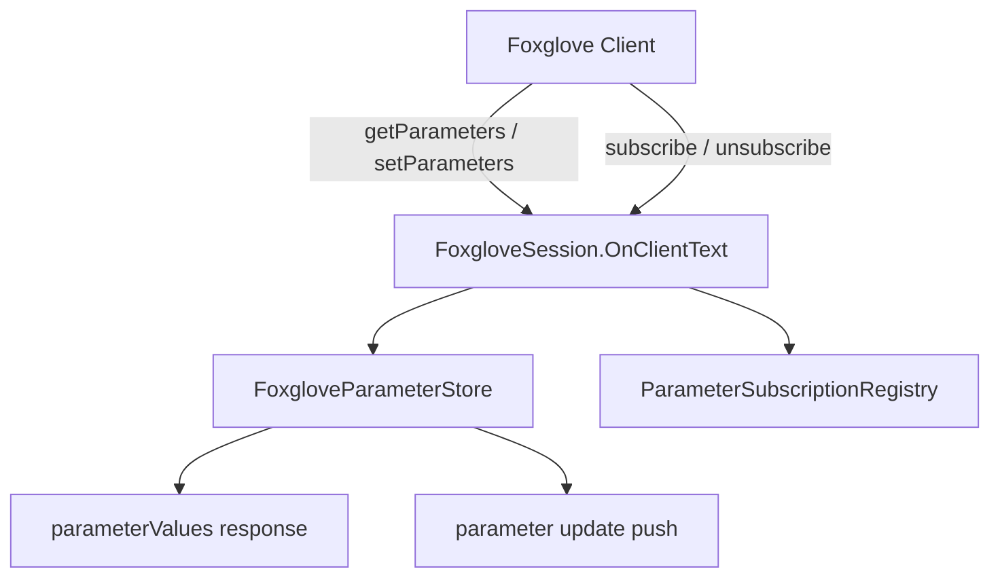
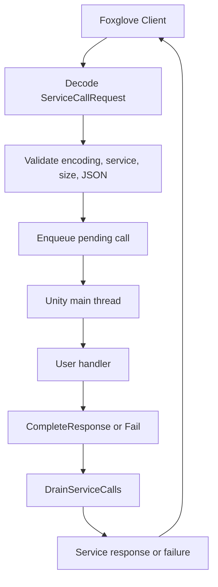

# 1. Architecture

## 1.1 Purpose

Use this document to understand the SDK's internal runtime, protocol, recording, replay, and Unity integration boundaries.

## 1.2 Application

Read this when maintaining the SDK, reviewing a bug, extending protocol support, or deciding whether code belongs in the Unity adapter or the protocol core.

## 1.3 Decision: Pure C# MVP

**Decision date:** 2026-04-30 (last updated 2026-05-05)

We chose **pure C# WebSocket protocol implementation** over wrapping the C FFI.

**Why:**
- Fastest path to a working Unity-to-Foxglove visualization loop.
- No native build/CI/linking overhead during the MVP phase.
- The WebSocket protocol (JSON control plane + binary data) is well-defined and relatively small.

**Outcome (May 2026):** The pure C# path has been validated through all 16 phases, including full MCAP recording/replay with LZ4/Zstd compression, IL2CPP Player builds on Windows, FoxRun ISG source generation, and 465 automated tests. The Native Backend remains available for future integration but is not yet prioritized.

## 2. Phases

| Phase | Status | What |
|-------|--------|------|
| 0 | Done | Package skeleton, abstraction layer, tech decision |
| 1 | Done | WebSocket handshake, subprotocol, serverInfo |
| 2 | Done | Channel advertise, subscribe/unsubscribe, MessageData routing |
| 3 | Done | Official schemas, FrameTransform, SceneUpdate (cube), 3D panel |
| 4 | Done | Unity MonoBehaviour integration, Transform/SceneCube/Camera publishers |
| 5 | Done | IL2CPP hardening, nanosecond timestamps, transport lifecycle, link.xml, package identity migration |
| 6 | Done | Parameters (get/set/subscribe), JSON Services (advertise/call/response/failure/timeout) |
| 7 | Done | ParametersSubscribe push, time capability, logger bridge, ConnectionGraph |
| 8 | Done | ClientPublish, ConnectionGraph refinement |
| 9 | Done | Assets / fetchAsset, PlaybackControl, unified publisher clock |
| 10 | Done | MCAP recording/dual-write (topic messages) |
| 11 | Done | MCAP reader, ReplayEngine, object adapter, coordinate mode |
| 12 | Done | MCAP compression (LZ4/Zstd), Parameters/Services/ClientPublish/ConnectionGraph recording |
| 13 | Done | MCAP attachments, coordinate mode metadata, recording/replay mutual exclusion |
| 14 | Done | FoxRun Roslyn ISG source generation, FoxgloveLogHub scheduling, FoxgloveDemoSetup |
| 15 | Done | MCAP compression DLL bindings, FoxRun IL2CPP fallback generation, build automation |
| 16 | Done | Code review, repo hardening, CI, package metadata for v1.0.0 |

All capabilities are enabled:
- `serverInfo.capabilities` = `["parameters", "services", "assets", "playbackControl"]`
- `serverInfo.supportedEncodings` = `["json"]`
- `parametersSubscribe` / `parametersUnsubscribe` push broadcast is active
- `ConnectionGraph` publisher/subscriber topology broadcast is active
- FoxRun ISG + IL2CPP fallback dual-track generation is complete
- MCAP recording, replay, compression (LZ4/Zstd), and attachments are complete

## 3. Layers

### 3.1 Schema Layer (Phase 3)

- **Source:** `foxglove-sdk/schemas/jsonschema/`, commit `main@b298c3d1649e6e5dfd77a53b12ab7c27f97c7aba`
- **Storage:** Schema JSON files embedded as assembly resources, decoded at static init
- **Schema hashes:** FrameTransform.json sha256=9986de138717bfaf, SceneUpdate.json sha256=7530dfd8585239e5
- **Coordinate strategy:** Unity raw, root frame `unity_world`, no handedness/ENU/ROS conversion
- **SceneUpdate scope:** Cube primitive only; other primitives (arrows, spheres, cylinders, lines, triangles, texts, models) are empty arrays

### 3.2 Phase 3 Data Flow

### 3.3 Parameters & Services Data Flow

#### 3.3.1 Parameters

**Parameter store rules:**
- Parameters must be explicitly registered before clients can read/write them
- `setParameters` from a client only modifies registered writable parameters
- Unknown parameters, read-only parameters, and type mismatches are silently ignored
- `id` field in request -> echoed in `parameterValues` response
- Failed set -> response returns current store value (not error); Foxglove UI rebounces

#### 3.3.2 Services

**Service thread model:**
- Transport callback thread: parse binary request -> validate -> enqueue (no Unity API access)
- Unity main thread: `FoxgloveManager.Update()` -> `DrainServiceCalls()` invokes handlers
- Handlers execute on main thread, can safely access Unity API
- Handlers call `CompleteResponse(encoding, payload)` or `Fail(message)` on the registry

**Service failure guarantees:**
- Every pending call eventually gets a response, failure, or timeout failure
- Unknown service -> immediate `serviceCallFailure`
- Unsupported encoding -> immediate `serviceCallFailure`
- Malformed JSON -> immediate `serviceCallFailure`
- Payload >1 MiB -> immediate `serviceCallFailure`
- Handler exception -> `serviceCallFailure` with error message
- Handler never returns -> 10s timeout -> `serviceCallFailure`
- Client disconnect -> pending calls marked as failed, cleaned in drain

### 3.4 Transport Abstraction

`IFoxgloveTransport` hides the WebSocket implementation.

- **Current (all phases):** `ManagedWsBackend` -- custom RFC 6455 implementation on `System.Net.Sockets.TcpListener`.
- **Former (replaced):** websocket-sharp was dropped (does not echo `Sec-WebSocket-Protocol`).
- **Future:** `NativeFoxgloveBackend` -- P/Invoke to `foxglove-c.h` (not yet prioritized)

### 3.5 Third-party dependencies

- `Newtonsoft.Json` -- via `com.unity.nuget.newtonsoft-json` (Unity) or NuGet (tests)
- No other third-party runtime dependencies

### 3.6 Protocol Constraints (cumulative)

- `serverInfo.capabilities` = `["parameters", "parametersSubscribe", "services", "assets", "connectionGraph", "clientPublish", "playbackControl"]`
- `serverInfo.supportedEncodings` = `["json"]` (services only support JSON encoding)
- `serviceCallRequest` binary: opcode(1=2) + serviceId(u32 LE) + callId(u32 LE) + encodingLength(u32 LE) + encoding bytes + payload
- `serviceCallResponse` binary: opcode(1=3) + serviceId(u32 LE) + callId(u32 LE) + encodingLength(u32 LE) + encoding bytes + payload
- Service request payload limit: 1 MiB; service call timeout: 10 seconds
- `schemaName` and `schema` always serialized (as `""` for schema-less channels)
- `schemaEncoding` = `"jsonschema"` for typed channels, omitted otherwise
- `subscribe` uses `subscriptions: [{ id, channelId }]`
- `unsubscribe` uses `subscriptionIds: [...]`
- `MessageData` binary: opcode(1) + subscriptionId(u32 LE) + logTime(u64 LE) + payload
- `SceneEntityDeletion.type` serialized as integer (0=MATCHING_ID, 1=ALL)
- All `SceneEntity` primitive arrays always present (empty `[]` when not used)
- Unknown `op` / malformed JSON -> logged, connection stays open

### 3.7 Implementation Notes

- **WebSocket server:** `TcpListener` + manual RFC 6455. Read timeout 5s during handshake, infinite after.
- **Subprotocol negotiation:** Exact token match against `["foxglove.sdk.v1", "foxglove.websocket.v1"]`.
- **Schema embedding:** JSON content stored as base64-encoded C# `const` strings. Decoded at static init via `Convert.FromBase64String` + `Encoding.UTF8.GetString`. No runtime file I/O or resource streams.
- **Core schema registration:** Called once in `FoxgloveRuntime` three-parameter constructor. Idempotent (overwrites on duplicate name).
- **DTO field naming:** All wire fields use `[JsonProperty("...")]` with official field names.
- **Disconnect cleanup:** Unified `DisconnectClient(id, conn)` used by send failure, receive finally, and Stop.
- **Unity thread boundary:** `Runtime/Unity/*.cs` components access `UnityEngine` API only within Unity lifecycle callbacks (Awake, OnEnable, Update, LateUpdate, OnDisable, OnDestroy). Transport callbacks (OnClientConnected, OnTextReceived, etc.) do not touch Unity objects. `Runtime/Schemas/*.cs`, `Runtime/Core/*.cs`, `Runtime/Transport/*.cs` remain UnityEngine-free and dotnet-testable.
- **IL2CPP / link.xml:** `Runtime/link.xml` in the package preserves `Newtonsoft.Json` and `Unity.FoxgloveSDK` assemblies with `preserve="all"`. Managed stripping level: `Medium`.
- **Timestamp strategy:** `FoxgloveTimeUtil.NowUnixTimeNs()` uses `Stopwatch.GetTimestamp()` with UTC epoch anchor for nanosecond precision. `SystemClock.NowNs` delegates to the same source. `time` capability declared in `serverInfo`.
- **Service handler thread boundary:** Transport callbacks only parse and enqueue service calls. Unity handlers execute in `FoxgloveManager.Update()` via `DrainServiceCalls()`. Handlers returning `JToken` complete via `CompleteResponse`; exceptions trigger `Fail()`. Handlers must not block for long periods (timeout is 10s).
- **Logger bridge:** `IFoxgloveLogger` replaces raw `Console.Error.WriteLine` for protocol errors/warnings. `ConsoleLogger` (default, writes to stderr) is used in dotnet tests. In Unity Editor, protocol errors appear in the Console window via `Debug.LogWarning`/`Debug.LogError` bridge. In IL2CPP Player, errors route to Unity's native log which is visible in `Player.log`.
- **Coordinate system:** `FoxgloveTransformPublisher` supports two modes via `CoordinateMode` enum. `UnityRaw` (default): X right, Y up, Z forward (left-handed). `FoxgloveStandard`: X forward, Y left, Z up (right-handed), matching Foxglove 3D panel default coordinate system. Translation and rotation are both converted.
- **Transport lifecycle:** `FoxgloveRuntime` owns transport and disposes it. `FoxgloveSession` borrows transport and only unbinds events on dispose. `IFoxgloveTransport : IDisposable`.
- **FoxRun (Phase 14-15):** `[FoxRun]` attribute triggers Roslyn ISG (`FoxgloveLogSourceGenerator`) during Editor compilation. For IL2CPP Player builds, `FoxrunBuildPreprocess` (IPreprocessBuildWithReport) generates `.g.cs` fallback files to `Assets/Scripts/Generated/`. `FoxgloveLogHub` singleton drives per-topic rate scheduling, scanning scenes every 2 seconds. Diagnostics: FOXRUN001 (class not partial), FOXRUN002 (SchemaName mismatch on same topic), FOXRUN003 (underscore name collision).
- **MCAP (Phase 10-13, 15):** `McapWriter` handles recording with configurable chunk size and compression (None/Lz4/Zstd). `McapReader` parses files via `McapRecordReader`. `McapReplayEngine` controls Play/Pause/Seek with state machine (Playing/Paused/Buffering/Ended). Compression DLLs: `IonKiwi.lz4.dll` (MIT), `ZstdSharp.dll` (MIT). Attachments API allows custom key-value metadata at recording time. Recording includes topic messages, parameter snapshots/changes, service call results, connection graph snapshots, and client publish messages. Recording and replay are mutually exclusive (recording takes priority).
