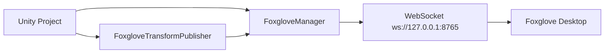

# 1. 快速开始

## 1.1 目的

这份文档用于帮助你在自己的 Unity 项目中完成最小接入：安装 `dev.unity2foxglove.sdk`，挂载 `FoxgloveManager`，发布第一个 `/tf` topic，并在 Foxglove 中看到 Unity 物体的实时位姿。

## 1.2 应用场景

当你第一次把 SDK 接入自己的 Unity 项目时，先按这份文档跑通最小链路。确认连接、topic、schema 和 Foxglove 面板都正常后，再继续使用 Parameters、Services、FoxRun、MCAP 等高级能力。

## 1.3 最小链路



## 1.4 安装 Package

在 Unity 项目的 `Packages/manifest.json` 中添加本地 package 路径：

```json
{
  "dependencies": {
    "dev.unity2foxglove.sdk": "file:../../Packages/dev.unity2foxglove.sdk"
  }
}
```

如果你是通过 Git URL 或 UPM registry 安装，请保持 package id 为 `dev.unity2foxglove.sdk`。

## 1.5 场景配置

1. 在场景中新建一个空 GameObject，命名为 `Foxglove`。
2. 给它添加 `FoxgloveManager` 组件。
3. 选择要跟踪的 GameObject，添加 `FoxgloveTransformPublisher`。
4. 保持默认 host 和 port：`127.0.0.1:8765`。
5. 点击 Unity Play。

## 1.6 连接 Foxglove

1. 打开 Foxglove Desktop。
2. 选择 `Open connection`。
3. 选择 `Foxglove WebSocket`。
4. 输入 `ws://127.0.0.1:8765`。
5. 连接后在 Topics 中确认能看到 `/tf`。

## 1.7 下一步

- 阅读 [02_Foxglove操作指南.md](02_Foxglove操作指南.md) 学习 Foxglove 面板操作。
- 阅读 [03_基础可视化.md](03_基础可视化.md) 跑通 3D、Camera、Plot。
- 阅读 [04_Parameters与Services.md](04_Parameters与Services.md) 添加交互控制。
