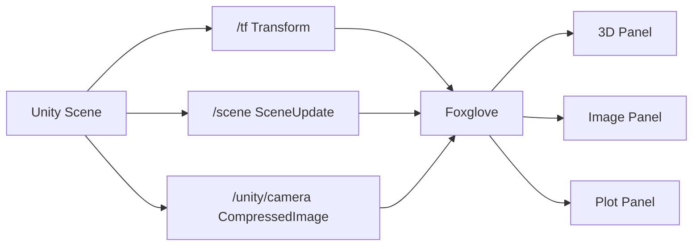

# 1. 基础可视化

## 1.1 目的

这份文档说明 Unity2Foxglove 最核心的可视化链路：Transform 发布、Scene primitive 发布、Camera 图像发布，以及在 Foxglove 中使用 3D、Image、Plot 面板观察结果。

## 1.2 应用场景

当你想确认 SDK 的实时可视化能力是否正常，或者想在自己的项目里复刻 Demo 的基础效果时，使用这份文档。

## 1.3 数据流

## 1.4 需要的组件

- `FoxgloveManager`：启动 WebSocket server，管理 channel、schema、录制、回放。
- `FoxgloveTransformPublisher`：发布 `/tf`。
- `FoxgloveSceneCubePublisher`：发布 `/scene` 中的 cube primitive。
- `FoxgloveCameraPublisher`：发布 `/unity/camera`。

## 1.5 Foxglove 中的预期结果

- 3D panel 显示 `unity_world` 到 cube 的坐标系和场景 cube。
- Image panel 显示 Unity Game view 的实时画面。
- Plot panel 能绘制 `/tf.translation.x/y/z` 曲线。

## 1.6 常见检查点

- 如果 3D panel 没有内容，先检查 Topics 里是否有 `/tf` 和 `/scene`。
- 如果 Image panel 没有画面，检查 `/unity/camera` 是否存在并选择正确 topic。
- 如果 Plot 不变化，确认 Unity 中物体确实在移动或旋转。
