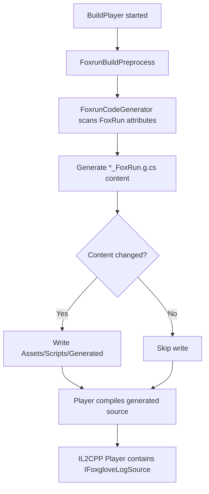

# 1. ISG 构建过程

> [!abstract] 一句话结论
> `FoxRun` 的 Editor 体验依赖 Roslyn Analyzer，IL2CPP/CI 稳定性依赖构建前生成真实 `.g.cs` 文件。两条链路必须同时维护，才能保证 Editor Play Mode 和 Player Build 行为一致。

## 1.1 目的

这份文档用于说明 `FoxRun` Incremental Source Generator（ISG）在 Unity Foxglove SDK 中的构建、加载、生成和 IL2CPP 兼容方案。

它重点回答四个问题：

1. 为什么 Editor 模式下 `/debug/*` topic 正常，但 IL2CPP Player 里可能消失？
2. 为什么不能只依赖 Unity 的 Roslyn Analyzer 机制？
3. 为什么 Phase 15B 选择把生成代码落到 `Assets/Scripts/Generated/`？
4. 之后维护 `[FoxRun]`、source generator、build preprocess 时要注意什么？

## 1.2 应用场景

`FoxRun` 面向的是 Unity 调试数据快速发布场景。用户只需要给字段或属性加 attribute，就能把对象状态发布到 Foxglove。

典型场景：

- 发布位置、速度、健康值、状态机状态等轻量 debug topic。
- 给 Demo、样例、调试工具快速补 `/debug/*` 数据流。
- 在不手写 publisher class 的情况下观察 Unity 对象运行状态。
- 在 Editor 和 IL2CPP Player 中保持同一套调试发布行为。

示例：

```csharp
using UnityEngine;
using Unity.FoxgloveSDK.Components;

public partial class TestLog : MonoBehaviour
{
    [FoxRun("/debug/position")]
    private Vector3 _pos;

    [FoxRun("/debug/health", RateHz = 5)]
    private float _health = 100f;

    private void Update()
    {
        _pos = transform.position;
    }
}
```

期望效果：

- 编译时自动生成 `TestLog_FoxRun.g.cs`。
- `TestLog` 自动实现 `IFoxgloveLogSource`。
- 运行时 `FoxgloveLogHub` 自动发现 source。
- Foxglove Topics 面板出现 `/debug/position` 和 `/debug/health`。

## 1.3 当前稳定方案

Phase 15B 后采用“双轨制”：

1. Editor Play Mode 使用 Roslyn Analyzer，让开发时改完脚本就能马上获得生成代码。
2. BuildPlayer 前运行 `FoxrunBuildPreprocess`，把生成代码写成真实 `.g.cs` 文件。
3. IL2CPP Player 直接编译 `Assets/Scripts/Generated/*_FoxRun.g.cs`，不再依赖 Player 编译链是否加载 analyzer。
4. 生成前比较文件内容，不变则不写，避免 Unity 无限重编译。

> [!warning] 不要只验证 Editor
> Editor Play Mode 通过只能证明 analyzer 在 Editor 编译链路工作。IL2CPP 是否可用，要看 build 前是否生成真实 `.g.cs`，以及 Player assembly 是否包含 `IFoxgloveLogSource` 实现。

# 2. 问题背景

## 2.1 现象

Phase 15 中出现过一个很典型的分裂行为：

- Editor Play Mode 中可以看到 `/debug/position`、`/debug/health`。
- IL2CPP Player 构建成功，但 Foxglove 中没有 `/debug/*` topic。
- 运行时没有明显异常，像是 `FoxgloveLogHub` 没发现任何 source。

## 2.2 根因

排查 Bee 生成的 response file 后发现：

- Editor `Assembly-CSharp.rsp` 包含 `FoxgloveLogSourceGenerator.dll` analyzer。
- Player `Assembly-CSharp.rsp` 不包含这个 analyzer。

Roslyn Source Generator 的输出默认只存在于当前编译内存中，不会自动保存成 Unity 源文件。因此：

1. Editor 编译时生成了 partial class。
2. Player 编译时没有生成 partial class。
3. `TestLog` 在 Player 里没有实现 `IFoxgloveLogSource`。
4. `FoxgloveLogHub` 扫描不到 source。
5. Foxglove 中看不到 `/debug/*` topic。

> [!bug] 关键判断
> 这不是 `FoxgloveLogHub` 的扫描 bug，也不是 WebSocket 发布链路 bug，而是 Player 编译时缺少生成源文件。

# 3. 组件结构

## 3.1 Runtime 组件

### 3.1.1 `[FoxRun]` attribute

路径：

```text
Packages/dev.unity2foxglove.sdk/Runtime/Unity/Attributes/FoxgloveLogAttribute.cs
```

用途：

- 标注需要发布的字段或属性。
- 声明 topic。
- 可选声明 `RateHz` 和 `SchemaName`。
- 允许 schemaless JSON topic。

### 3.1.2 `FoxgloveLogHub`

路径：

```text
Packages/dev.unity2foxglove.sdk/Runtime/Unity/FoxgloveLogHub.cs
```

用途：

- 定义 `IFoxgloveLogSource`。
- 运行时自动创建 hub singleton。
- 扫描场景中的 `MonoBehaviour`。
- 找到实现 `IFoxgloveLogSource` 的对象。
- 按 topic 独立频率调用 `FoxgloveLog_Publish`。

## 3.2 Editor Source Generator 组件

### 3.2.1 ISG 源码

路径：

```text
Packages/dev.unity2foxglove.sdk/Editor/SourceGenerators/src/FoxgloveLogSourceGenerator.cs
```

用途：

- 实现 `IIncrementalGenerator`。
- 使用 `CreateSyntaxProvider` 扫描 `[FoxRun]`。
- 生成 partial class。
- 生成 `IFoxgloveLogSource` 接口实现。

注意：

- Unity 6000.3.x 内置 Roslyn 约为 4.2.x。
- 不要使用 Roslyn 4.3+ 才支持的 `ForAttributeWithMetadataName`。

### 3.2.2 Analyzer DLL

路径：

```text
Packages/dev.unity2foxglove.sdk/Editor/SourceGenerators/analyzers/dotnet/cs/FoxgloveLogSourceGenerator.dll
```

用途：

- 被 Unity Editor 编译链加载为 Roslyn Analyzer。
- 只负责 Editor 编译体验。
- 不作为 IL2CPP Player 唯一依赖。

### 3.2.3 Analyzer `.meta`

路径：

```text
Packages/dev.unity2foxglove.sdk/Editor/SourceGenerators/analyzers/dotnet/cs/FoxgloveLogSourceGenerator.dll.meta
```

关键要求：

```yaml
labels:
- RoslynAnalyzer
PluginImporter:
  validateReferences: 0
```

作用：

- `RoslynAnalyzer` label 让 Unity 把 DLL 当 analyzer/source generator 处理。
- `validateReferences: 0` 避免 Unity 按普通插件方式解析 Roslyn 依赖。

## 3.3 Build-time 文件生成组件

### 3.3.1 `FoxrunCodeGenerator`

路径：

```text
Packages/dev.unity2foxglove.sdk/Editor/FoxrunCodeGenerator.cs
```

用途：

- 反射扫描项目脚本中的 `[FoxRun]`。
- 生成真实 `*_FoxRun.g.cs`。
- 写入前比较内容，内容不变则跳过写入。
- 解决 IL2CPP Player 不加载 analyzer 时的生成代码缺失问题。

### 3.3.2 `FoxrunBuildPreprocess`

路径：

```text
Packages/dev.unity2foxglove.sdk/Editor/FoxrunBuildPreprocess.cs
```

用途：

- 实现 `IPreprocessBuildWithReport`。
- `BuildPlayer` 前自动调用 `FoxrunCodeGenerator`。
- 在 batchmode/CI/IL2CPP 构建中自动准备 generated source。

### 3.3.3 Generated 输出目录

路径：

```text
Untiy2Foxglove/Assets/Scripts/Generated/*_FoxRun.g.cs
```

用途：

- 存放 build 前生成的真实 C# 源文件。
- 由 Unity Player 编译链当普通脚本编译。
- 不提交到 git，不手工编辑。

`.gitignore` 规则：

```gitignore
# ISG generated source files are rebuilt before IL2CPP/CI builds
Untiy2Foxglove/Assets/Scripts/Generated/
Untiy2Foxglove/Assets/Scripts/Generated.meta
```

# 4. Source Generator 构建规则

## 4.1 Roslyn 依赖规则

Unity 编译器进程自带 Roslyn。Generator DLL 被加载时，Roslyn 依赖由编译器进程提供。

因此不要把这些 DLL 放进 Unity 项目：

- `Microsoft.CodeAnalysis.dll`
- `Microsoft.CodeAnalysis.CSharp.dll`
- `System.Collections.Immutable.dll`

如果把它们复制到 Unity 项目中，Unity 会把它们当普通插件加载，容易出现版本冲突或引用解析失败。

## 4.2 `.csproj` 版本规则

`FoxgloveLogSourceGenerator.csproj` 应匹配 Unity 内置 Roslyn 版本。

当前策略：

- `TargetFramework` 使用 `netstandard2.0`。
- `Microsoft.CodeAnalysis.CSharp` 使用 4.2.x。
- `Microsoft.CodeAnalysis.Analyzers` 使用 3.3.x。
- `EnableDefaultCompileItems` 关闭，显式包含 `src/**/*.cs`。

示例：

```xml
<Project Sdk="Microsoft.NET.Sdk">
  <PropertyGroup>
    <TargetFramework>netstandard2.0</TargetFramework>
    <LangVersion>9.0</LangVersion>
    <EnforceExtendedAnalyzerRules>true</EnforceExtendedAnalyzerRules>
    <IsRoslynComponent>true</IsRoslynComponent>
    <EnableDefaultCompileItems>false</EnableDefaultCompileItems>
  </PropertyGroup>

  <ItemGroup>
    <Compile Include="src\**\*.cs" />
  </ItemGroup>

  <ItemGroup>
    <PackageReference Include="Microsoft.CodeAnalysis.CSharp" Version="4.2.0" PrivateAssets="all" />
    <PackageReference Include="Microsoft.CodeAnalysis.Analyzers" Version="3.3.4" PrivateAssets="all" />
  </ItemGroup>
</Project>
```

## 4.3 `bin/obj` 重定向规则

Unity 会递归扫描 package 目录。`dotnet build` 默认生成的 `bin/`、`obj/` 如果留在 Unity 扫描范围内，Unity 可能加载中间产物并报错。

典型错误：

```text
Unable to resolve reference 'Microsoft.CodeAnalysis'
Unable to resolve reference 'Microsoft.CodeAnalysis.CSharp'
Unable to resolve reference 'System.Collections.Immutable'
```

解决方式是在 `Editor/SourceGenerators/Directory.Build.props` 中重定向输出：

```xml
<Project>
  <PropertyGroup>
    <SgBuildRoot>$(MSBuildThisFileDirectory)..\..\..\..\build\SourceGenerators\</SgBuildRoot>
    <BaseOutputPath>$(SgBuildRoot)</BaseOutputPath>
    <BaseIntermediateOutputPath>$(SgBuildRoot)obj\</BaseIntermediateOutputPath>
    <MSBuildProjectExtensionsPath>$(SgBuildRoot)obj\</MSBuildProjectExtensionsPath>
    <RestoreOutputPath>$(SgBuildRoot)obj\</RestoreOutputPath>
  </PropertyGroup>
</Project>
```

## 4.4 `src/` 隔离规则

`Editor/SourceGenerators/src/` 下的源码引用 Roslyn API，不能被 Unity 当普通 Editor 脚本编译。

使用 asmdef 隔离：

```json
{
  "name": "Unity.FoxgloveSDK.SourceGenerators",
  "references": [],
  "includePlatforms": [],
  "excludePlatforms": [],
  "allowUnsafeCode": false,
  "overrideReferences": true,
  "autoReferenced": false,
  "defineConstraints": ["UNITY_EXCLUDE_FROM_COMPILATION"],
  "noEngineReferences": true
}
```

`UNITY_EXCLUDE_FROM_COMPILATION` 是一个永远不定义的 symbol。这样 Unity 会跳过该 assembly，源码只供 `dotnet build` 使用。

# 5. IL2CPP 生成链路

## 5.1 构建前生成流程



## 5.2 为什么要比较内容

如果每次生成都无条件写文件，Unity 会看到源文件时间戳变化，然后触发重新编译。重新编译又可能触发生成，形成循环。

正确行为：

- 内容变化时写入。
- 内容不变时跳过。
- 日志仍然说明扫描结果，方便排查。

## 5.3 为什么生成目录不提交

`Assets/Scripts/Generated/` 是构建产物，不是源代码真相来源。

不提交的原因：

- 避免 generated code 和 attribute 源码不一致。
- 避免 CI 或不同平台生成格式差异造成噪音。
- 避免用户手工修改生成文件。

# 6. Phase 15B 修复记录

## 6.1 初始修复

DeepSeek 先实现了 build-time 文件生成链路：

- 新增 `Editor/FoxrunCodeGenerator.cs`。
- 新增 `Editor/FoxrunBuildPreprocess.cs`。
- 恢复 `FoxgloveBuild.cs`，移除临时 hack。
- `.gitignore` 排除 `Untiy2Foxglove/Assets/Scripts/Generated/`。

## 6.2 构建时 NRE

第一次 IL2CPP 构建时，build preprocess 已被调用，但生成器崩溃：

```text
[FoxrunBuildPreprocess] Generating FoxRun source files...
NullReferenceException in FoxrunCodeGenerator.EmitSourceFile
```

根因是 schemaless topic 的 schema 推断没有判空。

问题代码：

```csharp
fields.FirstOrDefault(f => !string.IsNullOrEmpty(f.SchemaName)).SchemaName
```

`TestLog` 的 `[FoxRun]` 没有指定 `SchemaName`，所有字段都是 schemaless。`FirstOrDefault(...)` 返回 `null` 后访问 `.SchemaName`，触发 NRE。

## 6.3 修复方式

修复为 null-safe 写法：

```csharp
var schema = fields.FirstOrDefault(f => !string.IsNullOrEmpty(f.SchemaName))?.SchemaName ?? "";
```

同时补充忽略 Unity 自动生成的目录 meta：

```gitignore
Untiy2Foxglove/Assets/Scripts/Generated.meta
```

## 6.4 修复后的验证

IL2CPP 构建命令：

```powershell
& 'C:\Program Files\Unity\Hub\Editor\6000.3.14f1\Editor\Unity.exe' `
  -batchmode `
  -quit `
  -projectPath '<repo-root>/Untiy2Foxglove' `
  -executeMethod FoxgloveBuild.BuildWindowsIl2Cpp `
  -logFile '<repo-root>/build/Unity/il2cpp.log'
```

关键日志：

```text
[FoxrunBuildPreprocess] Generating FoxRun source files...
[FoxrunCodeGenerator] Generated TestLog_FoxRun.g.cs
[FoxrunBuildPreprocess] Generated 1 file(s): TestLog_FoxRun.g.cs
Build Finished, Result: Success.
Build succeeded: build/Unity/WindowsIL2CPP/FoxgloveDemo.exe
```

生成文件：

```text
Untiy2Foxglove/Assets/Scripts/Generated/TestLog_FoxRun.g.cs
```

Player assembly 中可检索到：

```text
Unity.FoxgloveSDK.Components.IFoxgloveLogSource.FoxgloveLog_Publish
/debug/position
/debug/health
```

这说明 IL2CPP Player 已经把 `TestLog_FoxRun.g.cs` 编译进 `Assembly-CSharp.dll`。

# 7. 手动验收

## 7.1 Editor 验收

1. 打开 Unity Editor。
2. 等待脚本编译完成。
3. 确认 Console 没有 C# 编译错误。
4. 进入 Play Mode。
5. 连接 Foxglove：`ws://127.0.0.1:8765`。
6. 确认 Topics 面板出现 `/debug/position` 和 `/debug/health`。

## 7.2 IL2CPP 验收

1. 运行 `FoxgloveBuild.BuildWindowsIl2Cpp`。
2. 检查 build log 是否出现 `[FoxrunBuildPreprocess]`。
3. 检查是否生成 `Assets/Scripts/Generated/TestLog_FoxRun.g.cs`。
4. 运行 `build/Unity/WindowsIL2CPP/FoxgloveDemo.exe`。
5. 连接 Foxglove：`ws://127.0.0.1:8765`。
6. 确认 Topics 面板出现 `/debug/position` 和 `/debug/health`。
7. 观察 `/debug/position` 随对象位置变化。
8. 观察 `/debug/health` 按约 5 Hz 更新。

# 8. 排障清单

## 8.1 Editor 有 topic，Player 没有 topic

优先检查：

- `Assets/Scripts/Generated/*_FoxRun.g.cs` 是否生成。
- build log 是否出现 `[FoxrunBuildPreprocess]`。
- Player assembly 是否包含 `IFoxgloveLogSource.FoxgloveLog_Publish`。

结论方向：

- 如果 generated 文件不存在，多半是 build preprocess 没跑或生成器崩溃。
- 如果 generated 文件存在但 Player 无 topic，再查 `FoxgloveLogHub` 扫描和 runtime 注册。

## 8.2 构建日志没有 preprocess 输出

优先检查：

- `FoxrunBuildPreprocess.cs` 是否位于 `Editor/` assembly。
- 是否实现 `IPreprocessBuildWithReport`。
- `callbackOrder` 是否正常。
- 文件是否被 asmdef 排除。

## 8.3 生成器出现 NRE

优先检查：

- schemaless topic 是否没有 `SchemaName`。
- `FirstOrDefault(...)` 后是否直接访问属性。
- 字段列表为空时是否有保护。

维护原则：

- schemaless 是合法输入。
- `SchemaName == ""` 必须被允许。
- 生成器不能因为没有 schema 而失败。

## 8.4 Unity 报 Roslyn 引用缺失

典型错误：

```text
Unable to resolve reference 'Microsoft.CodeAnalysis'
```

优先检查：

- `Editor/SourceGenerators/bin/` 是否存在。
- `Editor/SourceGenerators/obj/` 是否存在。
- `Directory.Build.props` 是否把 restore/build 输出重定向到 Unity 扫描范围之外。
- 是否误把 Roslyn 依赖 DLL 复制到了 Unity 项目。

## 8.5 Analyzer DLL 不工作

优先检查：

- `.dll.meta` 是否包含 `RoslynAnalyzer` label。
- `.dll.meta` 是否设置 `validateReferences: 0`。
- DLL 是否位于 `Editor/SourceGenerators/analyzers/dotnet/cs/`。
- Unity 是否重新导入了该 DLL。

## 8.6 Unity 反复重编译

优先检查：

- `FoxrunCodeGenerator` 写入前是否比较内容。
- 内容不变时是否跳过写文件。
- 是否有 `.meta` 或 generated 文件未被忽略导致反复变动。

# 9. 维护规则

## 9.1 生成文件规则

- 不手工编辑 `Assets/Scripts/Generated/*_FoxRun.g.cs`。
- 不提交 generated 文件。
- 需要改变生成结果时，修改 attribute、generator 或 build-time generator。

## 9.2 Editor 与 Player 一致性规则

- Editor analyzer 和 build-time generator 的输出语义必须一致。
- 新增类型映射时，两条链路都要覆盖。
- 新增错误诊断时，要确认 Player 构建不会静默缺失 generated 文件。

## 9.3 Schemaless 规则

- `SchemaName == ""` 是合法输入。
- Schemaless topic 应走普通 JSON channel。
- 不要把空 schema 传入 schema channel 注册路径。

## 9.4 验证规则

每次改 ISG 或 build preprocess 后，至少验证：

1. Editor Play Mode 能看到 `/debug/*`。
2. IL2CPP build log 中出现 `[FoxrunBuildPreprocess]`。
3. `Assets/Scripts/Generated/*_FoxRun.g.cs` 正常生成。
4. Player assembly 包含 `IFoxgloveLogSource` 实现。
5. Foxglove 连接 Player 后能看到 `/debug/*`。

