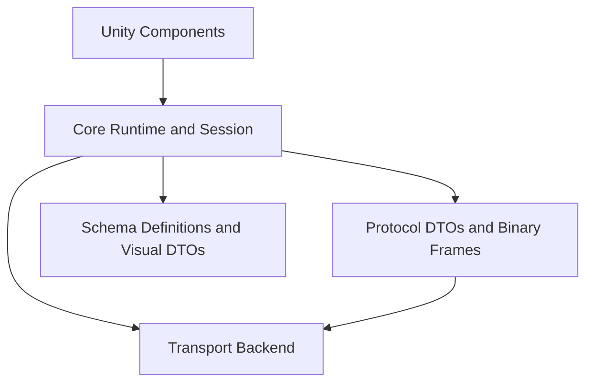

# 1. 架构说明

## 1.1 目的

这份文档用于说明 SDK 内部的 Runtime、Session、Transport、Recording、Replay、Unity 组件和协议层边界。

## 1.2 应用场景

当你要维护 SDK、审查 bug、扩展协议能力，或判断某段代码应该放在 Unity adapter 还是 protocol core 时，阅读这份文档。

## 1.3 Decision: Pure C# MVP

**Decision date:** 2026-04-30 (last updated 2026-05-03)

We chose **pure C# WebSocket protocol implementation** over wrapping the official `foxglove-sdk` C FFI.

**Why:**
- Fastest path to a working Unity↔Foxglove visualization loop.
- No native build/CI/linking overhead during MVP phase.
- The WebSocket protocol (JSON control plane + binary data) is well-defined and relatively small.

**When to switch to Native Backend (Phase 5):**
- Pure C# path fails IL2CPP tests on target platforms.
- Protocol drift becomes unmanageable vs. official SDK.
- We need Parameters/Services/PlaybackControl and the C FFI is more reliable.

## Phases

| Phase | Status | What |
|-------|--------|------|
| 0 | Done | Package skeleton, abstraction layer, tech decision |
| 1 | Done | WebSocket handshake, subprotocol, serverInfo |
| 2 | Done | Channel advertise, subscribe/unsubscribe, MessageData routing |
| 3 | Done | Official schemas, FrameTransform, SceneUpdate (cube), 3D panel |
| 4 | Done | Unity MonoBehaviour integration, Transform/SceneCube/Camera publishers |
| 5 | Done | IL2CPP hardening, nanosecond timestamps, transport lifecycle, link.xml, package identity migration |
| 6 | Done | Parameters (get/set/subscribe), JSON Services (advertise/call/response/failure/timeout) |
| 7 | Done | ParametersSubscribe push, time capability, logger bridge, ConnectionGraph |
| 8 | Done | ClientPublish, ConnectionGraph refinement |
| 9 | Done | Assets / fetchAsset, PlaybackControl, unified publisher clock |
| 10 | Done | MCAP recording/dual-write (topic messages) |
| 11 | Done | MCAP reader, ReplayEngine, object adapter, coordinate mode |
| 12 | Done | MCAP compression (LZ4/Zstd), Parameters/Services/ClientPublish/ConnectionGraph recording |
| 13+ | Superseded | 后续阶段已转向 FoxRun、MCAP、Protobuf、背压、可观测性和发布验收；不再维护早期 OPC UA 占位目标。 |

## Layers



### Schema Layer (Phase 3)

- **Source:** `foxglove-sdk/schemas/jsonschema/`, commit `main@b298c3d1649e6e5dfd77a53b12ab7c27f97c7aba`
- **Storage:** Schema JSON files embedded as assembly resources, decoded at static init
- **Schema hashes:** FrameTransform.json sha256=9986de138717bfaf, SceneUpdate.json sha256=7530dfd8585239e5
- **Coordinate strategy:** Unity raw, root frame `unity_world`, no handedness/ENU/ROS conversion
- **SceneUpdate scope:** Cube primitive only; other primitives (arrows, spheres, cylinders, lines, triangles, texts, models) are empty arrays

### Phase 3 Data Flow

```
RegisterSchemaChannel(id, topic, schemaName)
  → ISchemaRegistry.TryGetSchema(schemaName)
  → Construct AdvertiseChannel(encoding="json", schemaEncoding="jsonschema", schema=content)
  → RegisterChannel(channel) → BroadcastText(advertise)

PublishJson(channelId, message)
  → JsonConvert.SerializeObject(message)
  → Encoding.UTF8.GetBytes(json)
  → Publish(channelId, payload) → MessageData routing
```

### Phase 6: Parameters & Services Data Flow

#### Parameters

```
Client → setParameters / getParameters (JSON)
  → FoxgloveSession.OnClientText case "setParameters"/"getParameters"
  → FoxgloveParameterStore (thread-safe, lock-protected Dictionary)
  → parameterValues response (with optional id roundtrip)

Client → subscribeParameterUpdates / unsubscribeParameterUpdates (JSON)
  → FoxgloveSession.OnClientText case "subscribeParameterUpdates"/"unsubscribeParameterUpdates"
  → ParameterSubscriptionRegistry (per-client subscription tracking)
  → Push broadcast deferred to Phase 7; Parameters panel reads via polling (getParameters).
```

**Parameter store rules:**
- Parameters must be explicitly registered before clients can read/write them
- `setParameters` from client only modifies registered writable parameters
- Unknown parameters, read-only parameters, type mismatches are silently ignored
- `id` field in request → echoed in `parameterValues` response
- Failed set → response returns current store value (not error), Foxglove UI rebounces

#### Services

```
Client → Binary ServiceCallRequest (opcode=2 little-endian)
  → BinaryEncoding.TryDecodeClientServiceCallRequest (serviceId, callId, encoding, payload)
  → FoxgloveServiceRegistry validation chain:
      1. Encoding must be "json" → else serviceCallFailure
      2. Service must be registered → else serviceCallFailure
      3. Payload ≤ 1 MiB → else serviceCallFailure
      4. Payload must be valid UTF-8 JSON → else serviceCallFailure
  → FoxgloveServiceRegistry.Enqueue (pending call, CreatedAt = UtcNow)

Unity Main Thread (FoxgloveManager.Update):
  → FoxgloveSession.DrainServiceCalls()
    1. SweepTimeouts(10s) → auto-fail timed out calls
    2. DrainCompleted() → send binary ServiceCallResponse or text serviceCallFailure

User handler (e.g. FoxgloveDemoSetup.Update):
  → session.Services.GetPendingCalls()
  → Process call, call CompleteResponse / Fail
  → Next frame's DrainServiceCalls sends result
```

**Service thread model:**
- Transport callback thread: parse binary request → validate → enqueue (no Unity API access)
- Unity main thread: `FoxgloveManager.Update()` → `DrainServiceCalls()` invokes handlers
- Handlers execute on main thread, can safely access Unity API
- Handlers call `CompleteResponse(encoding, payload)` or `Fail(message)` on the registry

**Service failure guarantees:**
- Every pending call eventually gets a response, failure, or timeout failure
- Unknown service → immediate `serviceCallFailure`
- Unsupported encoding → immediate `serviceCallFailure`
- Malformed JSON → immediate `serviceCallFailure`
- Payload >1 MiB → immediate `serviceCallFailure`
- Handler exception → `serviceCallFailure` with error message
- Handler never returns → 10s timeout → `serviceCallFailure`
- Client disconnect → pending calls marked as failed, cleaned in drain

### Transport Abstraction

`IFoxgloveTransport` hides the WebSocket implementation.

- **Current (Phase 1–6):** `ManagedWsBackend` — custom RFC 6455 implementation on `System.Net.Sockets.TcpListener`.
- **Former (replaced):** websocket-sharp was dropped (does not echo `Sec-WebSocket-Protocol`).
- **Future:** `NativeFoxgloveBackend` — P/Invoke to `foxglove-c.h` (not yet prioritized)

### Third-party dependencies

- `Newtonsoft.Json` — via `com.unity.nuget.newtonsoft-json` (Unity) or NuGet (tests)
- No other third-party runtime dependencies

### Protocol Constraints (cumulative)

- `serverInfo.capabilities` = `["parameters", "services"]` (parametersSubscribe push broadcast deferred to Phase 7; Parameters panel uses polling via getParameters)
- `serverInfo.supportedEncodings` = `["json"]` (Phase 6 services only support JSON encoding)
- `serviceCallRequest` binary: opcode(1=2) + serviceId(u32 LE) + callId(u32 LE) + encodingLength(u32 LE) + encoding bytes + payload
- `serviceCallResponse` binary: opcode(1=3) + serviceId(u32 LE) + callId(u32 LE) + encodingLength(u32 LE) + encoding bytes + payload
- Service request payload limit: 1 MiB; service call timeout: 10 seconds
- `schemaName` and `schema` always serialized (as `""` for schema-less channels)
- `schemaEncoding` = `"jsonschema"` for typed channels, omitted otherwise
- `subscribe` uses `subscriptions: [{ id, channelId }]`
- `unsubscribe` uses `subscriptionIds: [...]`
- `MessageData` binary: opcode(1) + subscriptionId(u32 LE) + logTime(u64 LE) + payload
- `SceneEntityDeletion.type` serialized as integer (0=MATCHING_ID, 1=ALL)
- All `SceneEntity` primitive arrays always present (empty `[]` when not used)
- Unknown `op` / malformed JSON → logged, connection stays open

### Implementation Notes

- **WebSocket server:** `TcpListener` + manual RFC 6455. Read timeout 5s during handshake, infinite after.
- **Subprotocol negotiation:** Exact token match against `["foxglove.sdk.v1", "foxglove.websocket.v1"]`.
- **Schema embedding:** JSON content stored as base64-encoded C# `const` strings. Decoded at static init via `Convert.FromBase64String` + `Encoding.UTF8.GetString`. No runtime file I/O or resource streams.
- **Core schema registration:** Called once in `FoxgloveRuntime` three-parameter constructor. Idempotent (overwrites on duplicate name).
- **DTO field naming:** All wire fields use `[JsonProperty("...")]` with official field names.
- **Disconnect cleanup:** Unified `DisconnectClient(id, conn)` used by send failure, receive finally, and Stop.
- **Unity thread boundary:** `Runtime/Unity/*.cs` components access `UnityEngine` API only within Unity lifecycle callbacks (Awake, OnEnable, Update, LateUpdate, OnDisable, OnDestroy). Transport callbacks (OnClientConnected, OnTextReceived, etc.) do not touch Unity objects. `Runtime/Schemas/*.cs`, `Runtime/Core/*.cs`, `Runtime/Transport/*.cs` remain UnityEngine-free and dotnet-testable.
- **IL2CPP / link.xml:** `Runtime/link.xml` in the package is a **template** — Unity does not use it directly. The consuming project MUST copy it to `Assets/link.xml`. It preserves `Newtonsoft.Json` and `Unity.FoxgloveSDK` assemblies with `preserve="all"`. Managed stripping level: `Medium`. See `NativeBackendEvaluation.md` for native backend assessment.
- **Timestamp strategy:** `FoxgloveTimeUtil.NowUnixTimeNs()` uses `Stopwatch.GetTimestamp()` with UTC epoch anchor for nanosecond precision. `SystemClock.NowNs` delegates to the same source. No `time` capability declared in `serverInfo`.
- **Service handler thread boundary:** Transport callbacks only parse and enqueue service calls. Unity handlers execute in `FoxgloveManager.Update()` via `DrainServiceCalls()`. Handlers returning `JToken` complete via `CompleteResponse`; exceptions trigger `Fail()`. Handlers must not block for long periods (timeout is 10s).
- **Logger bridge (Phase 6):** `IFoxgloveLogger` replaces raw `Console.Error.WriteLine` for protocol errors/warnings. `ConsoleLogger` (default, writes to stderr) is used in dotnet tests. In Unity Editor, protocol errors appear in the Console window via `Debug.LogWarning`/`Debug.LogError` bridge. In IL2CPP Player, errors route to Unity's native log which is visible in `Player.log`.
- **Coordinate system:** `FoxgloveTransformPublisher` supports two modes via `CoordinateMode` enum. `UnityRaw` (default): X right, Y up, Z forward (left-handed). `FoxgloveStandard`: X forward, Y left, Z up (right-handed), matching Foxglove 3D panel default coordinate system. Translation and rotation are both converted.
- **Transport lifecycle:** `FoxgloveRuntime` owns transport and disposes it. `FoxgloveSession` borrows transport and only unbinds events on dispose. `IFoxgloveTransport : IDisposable`.
