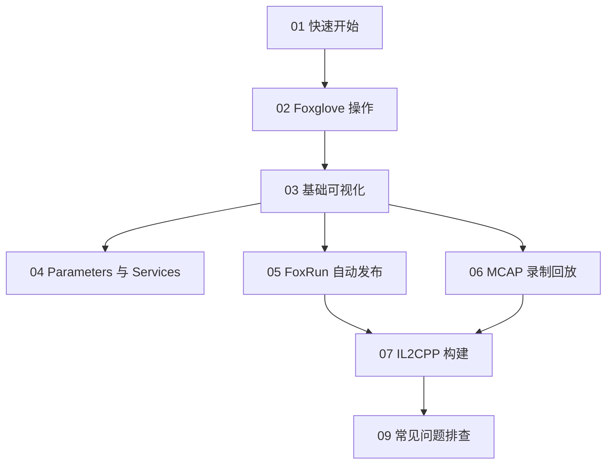

# 1. Unity2Foxglove SDK 中文文档

Unity2Foxglove SDK 是一个 Unity package，用于通过 Foxglove WebSocket 协议把 Unity 中的 Transform、场景实体、相机画面、调试字段、Parameters、Services 和 MCAP 数据发送到 Foxglove。

## 1.1 目的

这套中文文档面向 SDK 用户，帮助你把 `dev.unity2foxglove.sdk` 接入自己的 Unity 项目，而不是只运行仓库里的 demo。

## 1.2 应用场景

如果你只是想打开现成 demo project，请从 `Untiy2Foxglove/README.md` 开始。如果你要在自己的 Unity 项目里使用 package，请按下面顺序阅读。

## 1.3 阅读路线

## 1.4 用户文档

- [01_快速开始.md](01_快速开始.md)：安装 package、挂载 `FoxgloveManager`、连接 Foxglove。
- [02_Foxglove操作指南.md](02_Foxglove操作指南.md)：Topics、3D、Camera、Plot、Parameters、Services 面板怎么用。
- [03_基础可视化.md](03_基础可视化.md)：跑通 `/tf`、`/scene`、`/unity/camera`。
- [04_Parameters与Services.md](04_Parameters与Services.md)：远程参数和服务调用。
- [05_FoxRun自动发布.md](05_FoxRun自动发布.md)：用 `[FoxRun]` 自动发布调试字段。
- [06_MCAP录制回放.md](06_MCAP录制回放.md)：录制、压缩、回放 MCAP 文件。
- [07_IL2CPP构建.md](07_IL2CPP构建.md)：IL2CPP 构建、`link.xml`、source generation fallback。
- [08_架构说明.md](08_架构说明.md)：SDK 架构和数据流。
- [09_常见问题排查.md](09_常见问题排查.md)：连接、topic、schema、构建、MCAP 常见问题。

## 1.5 维护者参考

- [10_ISG构建过程.md](10_ISG构建过程.md)：FoxRun ISG 和 IL2CPP fallback 的构建细节。
- [90_NativeBackend评估.md](90_NativeBackend评估.md)：Native backend 评估记录。
- [91_FoxRun设计笔记.md](91_FoxRun设计笔记.md)：早期 FoxRun 设计笔记。
