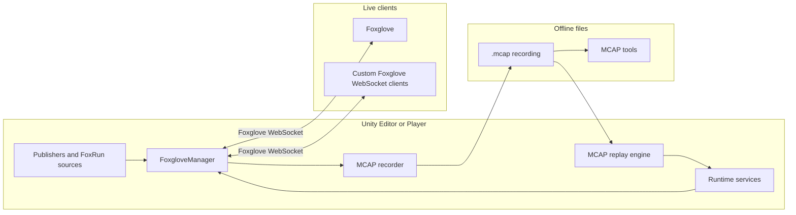
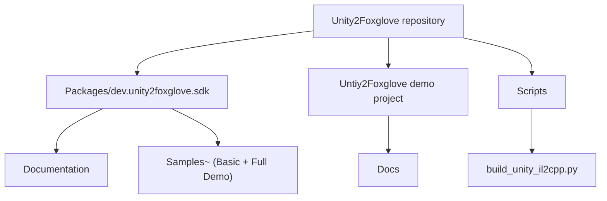

# 1. Unity2Foxglove

[](LICENSE)
[](https://unity.com/)
[](https://dotnet.microsoft.com/)
[](https://github.com/JianbinLiu-CFLab/Unity2Foxglove/releases)

A cross-platform Unity SDK for real-time runtime data streaming, MCAP recording and replay, and in-editor debugging. It runs inside Unity, speaks the Foxglove WebSocket protocol directly, and can work with [Foxglove](https://foxglove.dev), MCAP files, or custom clients.

## 1.1 Purpose

Unity2Foxglove turns your Unity Editor and standalone player into a live data server. It addresses four core needs:

### 1.1.1 Real-time Streaming
- Live WebSocket streaming of Unity runtime data to Foxglove or any compatible client.
- Zero external processes — the server runs entirely in-process.
- Topics update at configurable rates (default 10 Hz), with sub-millisecond timestamp precision.

### 1.1.2 Runtime Debugging
- Replace scattered `Debug.Log` calls with real-time Plots, 3D overlays, and parameter tuning panels.
- Attach `[FoxRun]` to any field and watch it stream live — a [Rerun](https://rerun.io)-like experience directly in your Unity workflow.
- Modify parameters from Foxglove and see changes instantly in Unity, without stopping Play Mode.

### 1.1.3 MCAP Recording and Replay
- Record entire sessions to [MCAP](https://mcap.dev) (MCAP Specification by Foxglove) files with LZ4/Zstd compression.
- **Drive scene reproduction** — Replay recorded MCAP files to drive GameObjects, reconstructing the exact scene state from recorded data. Every Transform update, parameter change, and service call is preserved and replayed in sequence.
- **Why MCAP?**
  - Open format with a well-defined [specification](https://mcap.dev/specification) — no vendor lock-in.
  - Random-access seek via chunk indexes, enabling instant jump to any point in time.
  - Built-in compression (LZ4, Zstd) with per-chunk granularity.
  - Self-describing: schemas and channels are embedded in the file alongside data.
  - Growing ecosystem of readers and tools across Python, Rust, C++, TypeScript, and now C#.

### 1.1.4 Cross-Platform Data Bridge
- A pure C# WebSocket server that runs on any platform Unity supports (Windows, Linux, macOS).
- No ROS installation, no Python bridge process, no native dependencies required.
- Same code path in Editor, Standalone Player, and IL2CPP builds.

## 1.2 Application Scenarios

Typical scenarios:

- Robotics and autonomous systems: visualize sensor data, debug control loops, tune parameters online, record and replay test runs.
- Game development: monitor gameplay metrics, record playtest sessions for post-mortem analysis and scene reproduction.
- Simulation and digital twins: stream real-time state to external dashboards or analysis pipelines, replay historical runs.
- Unity tooling: expose runtime state through a stable protocol instead of one-off editor windows, UDP scripts, or temporary debug UI.

## 1.3 The Problem

Existing approaches for getting Unity runtime data to external tools share common pain points:

- **ROS2/ROS bridge** — Requires a ROS installation on the host, complex middleware setup, and is effectively Linux-only. Custom message types need code generation and bridge configuration.
- **Third-party SDKs** — Official Foxglove C++/Python SDKs require a separate process running outside Unity, additional serialization steps, and are constrained to the platforms those SDKs support.
- **Ad-hoc UDP/TCP scripts** — Manual socket code, fragile serialization, no schema validation, and no built-in replay or compression.

All of these share the same fundamental problem: **Unity runs in-process, but the data consumer is out-of-process**. The bridge becomes a project of its own — adding complexity, platform constraints, and maintenance burden.

## 1.4 The Solution

Unity2Foxglove embeds the entire stack inside Unity:



No external processes. No ROS installation. No platform lock-in. Just attach a `FoxgloveManager` component, press Play, and connect.

## 1.5 Project Layout



- Use `Packages/dev.unity2foxglove.sdk` when you want to install the SDK into your own Unity project.
- Use `Untiy2Foxglove` when you want a ready-to-open demo project for Foxglove panels, MCAP recording, replay, IL2CPP, and manual acceptance.
- Use `Samples~/BasicVisualization` for the minimal publisher setup (no extra dependencies).
- Use `Samples~/FullDemoVisualization` for the complete demo experience (requires Input System + URP).

---

## 2. Installation

### 2.1 Use as Unity Package (recommended)

For adding the SDK to your own Unity project.

1. Clone this repository
2. Unity menu: `Window > Package Manager > + > Add package from disk...`
3. Select `Packages/dev.unity2foxglove.sdk/package.json`

Or install via Git URL:

```
https://github.com/JianbinLiu-CFLab/Unity2Foxglove.git?path=Packages/dev.unity2foxglove.sdk
```

### 2.2 Open the Demo Project

For quickly exploring all features without creating a new project.

1. Clone this repository
2. Unity Hub > Open > select the `Untiy2Foxglove` directory
3. Press Play to start

---

## 3. Quick Connection

1. Open **Foxglove Desktop** or **Foxglove Studio**
2. "Open connection" > select **Foxglove WebSocket**
3. Enter URL `ws://127.0.0.1:8765`
4. The Topics panel will show `/tf`, `/scene`, `/unity/camera`, etc.
5. Switch to the 3D panel and select the `/scene` topic to see the Cube

---

## 4. Documentation

- [Package documentation](Packages/dev.unity2foxglove.sdk/Documentation~/README.md) — SDK concepts, API usage, architecture, FoxRun, MCAP, IL2CPP, and troubleshooting.
- [Demo project](Untiy2Foxglove/README.md) — ready-to-open Unity project for Foxglove operation, manual acceptance, replay, recording, and build verification.
- [Sample: BasicVisualization](Packages/dev.unity2foxglove.sdk/Samples~/BasicVisualization/README.md) — minimal package sample for users who only want the basic publisher setup.
- [Sample: FullDemoVisualization](Packages/dev.unity2foxglove.sdk/Samples~/FullDemoVisualization/README.md) — complete demo sample (Parameters, Services, FoxRun, MCAP; requires Input System + URP).
- [Changelog](CHANGELOG.md)
- [Third-party notices](THIRD_PARTY_NOTICES.md)
- [v1.0.0 release notes](RELEASE_NOTES_v1.0.0.md)

---

## 5. Running Tests

```bash
dotnet run --project Packages/dev.unity2foxglove.sdk/Tests/Runtime/FoxgloveSdk.Tests.csproj
```

---

## 6. License

This project is licensed under the [Apache License 2.0](LICENSE).

---

> Unity2Foxglove is an independent project and is not affiliated with or endorsed by Foxglove.
