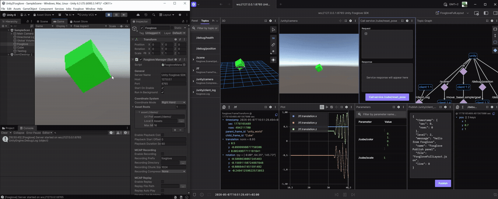
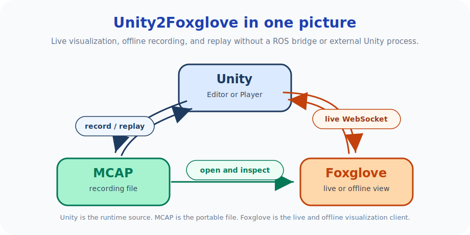
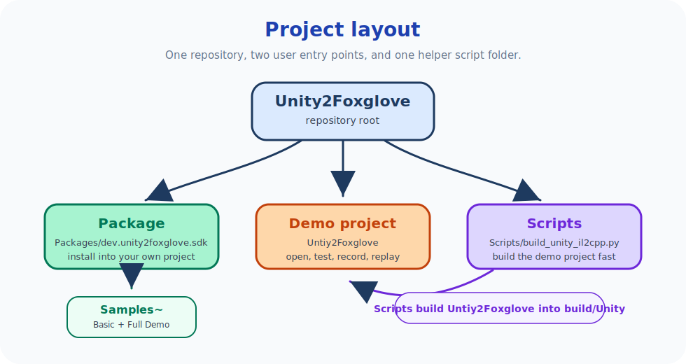

# 1. Unity2Foxglove

[](LICENSE)
[](https://unity.com/)
[](https://dotnet.microsoft.com/)
[](https://github.com/JianbinLiu-CFLab/unity-foxglove-sdk/releases)
[](https://doi.org/10.5281/zenodo.20112833)
[](https://github.com/JianbinLiu-CFLab/unity-foxglove-sdk/actions/workflows/dotnet-tests.yml)
[](https://github.com/JianbinLiu-CFLab/unity-foxglove-sdk/actions/workflows/docs-check.yml)

> **Positioning**: Unity2Foxglove is a **Unity-focused Foxglove SDK bridge**. It aims for official Foxglove SDK capability parity where that matters for Unity workflows, while adding Unity-native extensions such as `[FoxRun]`, Inspector-driven publishers, MCAP replay, and IL2CPP-oriented validation. It is not an official Foxglove project and does not target multi-language SDK parity.

A cross-platform Unity SDK for real-time runtime data streaming, MCAP recording and replay, and in-editor debugging. It runs inside Unity, speaks the Foxglove WebSocket protocol directly, and can work with [Foxglove](https://foxglove.dev), MCAP files, or custom clients.

## Citation / Research Positioning

Unity2Foxglove introduces an AOT-safe dual-host source generation architecture with a shared emitter for zero-reflection telemetry publishing in Unity Editor and IL2CPP Player builds.

If you use this project in research, cite the Zenodo Concept DOI [`10.5281/zenodo.20112833`](https://doi.org/10.5281/zenodo.20112833) or use [`CITATION.cff`](CITATION.cff). For reproducible reports that must pin an exact artifact, cite the version-specific DOI shown on the relevant Zenodo release page. See [`PAPER.md`](PAPER.md) for the research positioning, contribution boundaries, and evidence checklist. The `[FoxRun]` code-generation architecture is described in [`docs/research-shared-emitter-architecture.md`](docs/research-shared-emitter-architecture.md).



## 1.1 Purpose

Unity2Foxglove turns your Unity Editor and standalone player into a live data server. It addresses four core needs:

### 1.1.1 Real-time Streaming

- Live WebSocket streaming of Unity runtime data to Foxglove or any compatible client.
- Zero external processes: the server runs entirely in-process.
- Topics update at configurable rates (default 10 Hz), with timestamps derived from `Stopwatch`; precision is hardware-dependent and typically sub-millisecond.

### 1.1.2 Runtime Debugging

- Replace scattered `Debug.Log` calls with real-time Plots, 3D overlays, and parameter tuning panels.
- Attach `[FoxRun]` to any field and watch it stream live: a [Rerun](https://rerun.io)-like experience directly in your Unity workflow.
- Modify parameters from Foxglove and see changes instantly in Unity, without stopping Play Mode.

### 1.1.3 MCAP Recording and Replay

- Record entire sessions to [MCAP](https://mcap.dev) files with LZ4/Zstd compression.
- **Drive scene reproduction**: replay recorded MCAP files as timestamped snapshots for Transform and Scene topics. Recorded topic messages, parameter changes, and service call results are preserved in sequence, but replay is not a deterministic physics/input simulation.
- **Why MCAP?** Open format, random-access seek, chunk compression, embedded schemas/channels, and a growing ecosystem of readers and tools across Python, Rust, C++, TypeScript, and now C#.

### 1.1.4 Cross-Platform Data Bridge

- A pure C# WebSocket server for Unity Editor and Standalone Player. Windows is verified for v1.7.0; macOS/Linux are intended targets but not yet verified.
- No ROS installation, no Python bridge process, no native dependencies required.
- Same code path in Editor, Standalone Player, and IL2CPP builds.

Unity2Foxglove does not require ROS for normal Foxglove WebSocket streaming, MCAP recording, or replay. The optional **ROS2 Bridge** is disabled by default, runs independently from WebSocket output, and can mirror selected publisher CDR payloads to a localhost ROS 2 sidecar under `Tools/ros2_bridge` when developers explicitly want a ROS 2 graph integration path.

## 1.2 Who This Is For

Unity2Foxglove is for Unity developers who want runtime data to be visible outside the Game view without building a custom debug UI or running a separate bridge process.

It is especially useful for:

- Robotics, simulation, and digital-twin teams already using Foxglove or MCAP.
- Unity developers who need live plots, 3D overlays, camera streams, parameters, and service calls during Play Mode.
- Researchers and tool builders who want a lightweight C# data bridge that also works in standalone and IL2CPP builds.
- Teams that need reproducible debugging through MCAP recording and replay.

## 1.3 Application Scenarios

Typical scenarios:

- Robotics and autonomous systems: visualize sensor data, debug control loops, tune parameters online, record and replay test runs.
- Game development: monitor gameplay metrics, record playtest sessions for post-mortem analysis and scene reproduction.
- Simulation and digital twins: stream real-time state to external dashboards or analysis pipelines, replay historical runs.
- Unity tooling: expose runtime state through a stable protocol instead of one-off editor windows, UDP scripts, or temporary debug UI.

## 1.4 The Problem

Existing approaches for getting Unity runtime data to external tools share common pain points:

- **ROS2/ROS bridge**: requires a ROS installation on the host, complex middleware setup, and is effectively Linux-only. Custom message types need code generation and bridge configuration.
- **Third-party SDKs**: official Foxglove C++/Python SDKs require a separate process running outside Unity, additional serialization steps, and are constrained to the platforms those SDKs support.
- **Ad-hoc UDP/TCP scripts**: manual socket code, fragile serialization, no schema validation, and no built-in replay or compression.

All of these share the same fundamental problem: **Unity runs in-process, but the data consumer is out-of-process**. The bridge becomes a project of its own, adding complexity, platform constraints, and maintenance burden.

## 1.5 The Solution

Unity2Foxglove keeps the user-facing model simple:



Unity talks to Foxglove directly over the Foxglove WebSocket protocol for live visualization and control. Unity can also record MCAP files, replay them back inside Unity, or let Foxglove open them later for offline inspection.

No external processes. No ROS installation. No platform lock-in. Just attach a `FoxgloveManager` component, press Play, and connect.

## 1.6 Project Layout



- Use `Packages/dev.unity2foxglove.sdk` when you want to install the SDK into your own Unity project.
- Use `Unity2Foxglove` when you want a ready-to-open demo project for Foxglove panels, MCAP recording, replay, IL2CPP, and manual acceptance.
- Use `Packages/dev.unity2foxglove.sdk/Samples~/BasicVisualization` for the minimal publisher setup (no extra dependencies).
- Use `Packages/dev.unity2foxglove.sdk/Samples~/FullDemoVisualization` for the complete demo experience (requires Input System + URP).
- Use `Scripts/build_tools/unity_il2cpp.py` together with `Unity2Foxglove` to quickly produce IL2CPP standalone builds under `build/Unity`.

---

## 2. Installation

SDK core targets Unity 6000.0 LTSC or later (compatible with 6000.0.74f1 LTSC). The included demo project and IL2CPP build workflow are developed and tested on Unity 6000.3.14f1 LTSC.

### 2.1 Use as Unity Package (recommended)

For adding the SDK to your own Unity project.

1. Clone this repository.
2. Unity menu: `Window > Package Manager > + > Add package from disk...`
3. Select `Packages/dev.unity2foxglove.sdk/package.json`.

Or install via Git URL:

```text
https://github.com/JianbinLiu-CFLab/unity-foxglove-sdk.git?path=/Packages/dev.unity2foxglove.sdk
```

If this repository is moved or forked, replace the owner/repository part of the URL and keep the `?path=/Packages/dev.unity2foxglove.sdk` suffix.

### 2.2 Open the Demo Project

For quickly exploring all features without creating a new project.

1. Clone this repository.
2. Unity Hub > Open > select the `Unity2Foxglove` directory.
3. Wait for Unity Package Manager to resolve the local SDK package from `../../Packages/dev.unity2foxglove.sdk`.
4. Press Play to start.

> [!NOTE]
> Keep `Unity2Foxglove` inside this repository. If Unity cannot find `dev.unity2foxglove.sdk`, reopen the full repository or restore the manifest path to `file:../../Packages/dev.unity2foxglove.sdk`.

---

## 3. Quick Connection

1. Open **Foxglove Desktop** or **Foxglove Studio**.
2. "Open connection" > select **Foxglove WebSocket**.
3. Enter URL `ws://127.0.0.1:8765`.
4. The Topics panel will show `/tf`, `/scene`, `/unity/camera`, etc.
5. Switch to the 3D panel and select the `/scene` topic to see the Cube.

---

## 4. Documentation

Start with the document that matches what you are trying to do:

| Goal | Read this |
|------|-----------|
| Install the SDK into your own Unity project | [Package documentation](Packages/dev.unity2foxglove.sdk/Documentation~/README.md) |
| Open a ready-made project and verify Foxglove, MCAP, IL2CPP, and replay | [Demo project guide](Unity2Foxglove/README.md) |
| Import the smallest possible UPM sample | [Basic Visualization sample](Packages/dev.unity2foxglove.sdk/Samples~/BasicVisualization/README.md) |
| Import the full UPM sample with Parameters, Services, FoxRun, MCAP, Input System, and URP | [Full Demo Visualization sample](Packages/dev.unity2foxglove.sdk/Samples~/FullDemoVisualization/README.md) |
| Understand the SDK architecture and design boundaries | [Architecture patterns and design restraint](docs/architecture-patterns.md) |

The documentation is intentionally split by audience:

- **Package docs** explain the reusable SDK: concepts, APIs, architecture, FoxRun, MCAP, IL2CPP, and troubleshooting.
- **Demo docs** explain the standalone `Unity2Foxglove` Unity project: Foxglove operation, manual acceptance, recordings, replay files, and build verification.
- **Sample docs** explain what Unity Package Manager imports into a user's project.

Release and compliance documents:

- [Roadmap](ROADMAP.md)
- [Changelog](CHANGELOG.md)
- [Third-party notices](THIRD_PARTY_NOTICES.md)
- [v1.7.0 release notes](docs/releases/RELEASE_NOTES_v1.7.0.md)
- [v1.6.0 release notes](docs/releases/RELEASE_NOTES_v1.6.0.md)
- [v1.5.0 release notes](docs/releases/RELEASE_NOTES_v1.5.0.md)
- [v1.4.0 release notes](docs/releases/RELEASE_NOTES_v1.4.0.md)
- [v1.3.0 release notes](docs/releases/RELEASE_NOTES_v1.3.0.md)
- [v1.2.0 release notes](docs/releases/RELEASE_NOTES_v1.2.0.md)
- [v1.1.0 release notes](docs/releases/RELEASE_NOTES_v1.1.0.md)
- [v1.0.0 release notes](docs/releases/RELEASE_NOTES_v1.0.0.md)

Development planning notes are not shipped with the repository. If you need the phase plans or implementation history, please contact the author.

### 4.1 Citation / Research Positioning

If you use Unity2Foxglove in research, please cite the software metadata in [CITATION.cff](CITATION.cff). The Zenodo Concept DOI points to the latest archived version; use a version-specific Zenodo DOI when reproducibility requires an exact release. A concise research-positioning note is available in [PAPER.md](PAPER.md).

---

## 5. Developer Tests

These tests are mainly for contributors and maintainers before changing SDK internals. The suite validates protocol messages, schemas, transport behavior, MCAP read/write paths, replay logic, package metadata, and release checks.

```bash
dotnet run --project Packages/dev.unity2foxglove.sdk/Tests/Runtime/FoxgloveSdk.Tests.csproj
```

---

## 6. Capabilities & Limitations

### Supported

- Real-time data streaming (transform, scene entities, camera images)
- Typed sensor publishers for `foxglove.PointCloud`, `foxglove.LaserScan`, and `foxglove.CameraCalibration` in JSON, Protobuf, or ROS2 mode
- ROS2 output for transform, scene cube, JPEG camera, camera calibration, laser scan, raw point cloud, and Draco-compressed point cloud publishers using official Foxglove `ros2msg` schemas with CDR payloads
- Optional ROS2 Bridge mirror output, disabled by default, for the validated publisher set through a localhost sidecar bridge
- Managed WebSocket backpressure with per-client bounded queues and drop-oldest live data behavior for slow clients
- MCAP recording with LZ4/Zstd compression and topic-schema guard
- MCAP replay for transform/scene snapshot reconstruction, paused scrub scene updates, and bounded panel-history replay after seek debounce
- Parameters (get, set, subscribe), Services (call/response), Connection Graph, Client Publish, Playback Control
- Asset fetching (fetchAsset) with configurable asset roots
- FoxRun attribute-based zero-code publishing via generated code, including fixed-rate, change-driven, interval, and explicit `OnTrigger` topics
- Optional Unity-native WSS/TLS transport, local dev certificate generation, root CA distribution helper, and lightweight shared query-token gate
- IL2CPP build support with automatic link.xml generation

### Not Supported

- **WebGL** - the WebSocket server requires `System.Net.Sockets`, which is unavailable on WebGL
- **Production authentication / authorization** - the shared token is a lightweight local/LAN gate, not OAuth, mTLS, users, roles, or permissions
- **Multi-language SDK parity** - this is a Unity bridge, not a full foxglove-sdk replacement
- **Physics/input simulation replay** - MCAP replay is transform snapshot playback; non-deterministic components such as physics, random state, and live input are not replayed
- **Production ROS 2 bridge UX** - the current ROS 2 sidecar bridge is experimental, localhost-only, and has no Inspector health panel, QoS UI, installer, or remote-host support

### Security

- **CSWSH Origin Guard** (Phase 28): browser-origin WebSocket connections are rejected by default. An Inspector-configurable allowlist enables specific origins. `file://` origins (Electron/Foxglove Desktop) are always permitted.
- **SecureWebSocket mode**: optional `wss://` support loads a PFX certificate and private key in Unity. The root CA distributor is only a bootstrap helper; verify the SHA-256 fingerprint before trusting a CA.
- **Shared token gate**: optional `?token=...` matching can reject missing or wrong tokens before WebSocket upgrade. Prefer using it with WSS; do not treat it as strong identity.
- **Default bind**: `127.0.0.1:8765`. Do not expose this port on untrusted networks.
- **Plain WebSocket remains default**: anyone who can reach an unsecured plain WebSocket port can interact with parameters, services, and published data unless the optional token gate is configured.

---

## 7. License

This project is licensed under the [Apache License 2.0](LICENSE) so it can be used, modified, and integrated in research, commercial, and open-source Unity projects with a clear patent and attribution model.

Apache-2.0 was chosen instead of MIT because this is an SDK/protocol bridge that may be embedded into larger products. The Apache license keeps the permissive spirit of MIT while adding an explicit patent grant and clearer attribution terms.

---

Unity2Foxglove is an independent personal project. The idea grew out of work and experiments at [Construction Future Lab](https://cflab.de), then continued as a weekend project in my own time.
