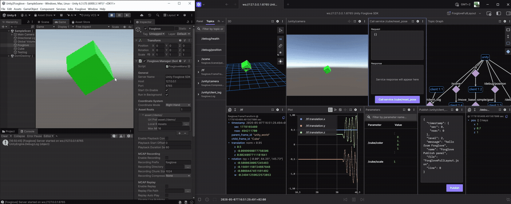

# Unity2Foxglove

[](LICENSE)
[](https://unity.com/)
[](https://dotnet.microsoft.com/)
[](https://github.com/JianbinLiu-CFLab/unity-foxglove-sdk/releases)
[](https://doi.org/10.5281/zenodo.20112833)
[](https://github.com/JianbinLiu-CFLab/unity-foxglove-sdk/actions/workflows/dotnet-tests.yml)
[](https://github.com/JianbinLiu-CFLab/unity-foxglove-sdk/actions/workflows/docs-check.yml)

Unity2Foxglove is a Unity-focused SDK for live Foxglove visualization and control, MCAP recording/replay, generated FoxRun bindings, and optional ROS2 data exchange. The server runs in-process in Unity; the project is independent and is not an official Foxglove product.



## Quick Start

Unity2Foxglove does not require ROS for its core WebSocket, MCAP, Replay, or FoxRun workflows.

1. Add the package in Unity Package Manager with `Add package from disk...` and select:

   ```text
   Packages/dev.unity2foxglove.sdk/package.json
   ```

   Or use the Git URL:

   ```text
   https://github.com/JianbinLiu-CFLab/unity-foxglove-sdk.git?path=/Packages/dev.unity2foxglove.sdk
   ```

2. Add `FoxgloveManager` to a scene and enter Play Mode.
3. In Foxglove, open a **Foxglove WebSocket** connection to `ws://127.0.0.1:8765`.
4. Add Topics, Plot, 3D, Camera, Parameters, or Service Call panels for the data you need.

For a ready-made project, open the `Unity2Foxglove` directory in Unity Hub. The Unity2Foxglove demo project contains the full manual-acceptance and combined-package workflows.

## What It Provides

| Area | Current capability |
| --- | --- |
| Live protocol | In-process managed WebSocket/WSS server with schemas, channels, time, status, graph, client publish, assets, parameters, services, and playback control. |
| FoxRun | AOT-safe generated field/property bindings for publish, subscribe, and debug-oriented full duplex; JSON, Protobuf, multi-sink output, single-source input, and main-thread apply. |
| MCAP | Indexed recording with LZ4/Zstd, attachments, schema evidence, bounded reading, seek/history, and Unity scene reproduction. |
| Foxglove replay control | Remote files plus the `Unity Replay Sync` panel let Foxglove Timeline and Plot seek drive the Unity scene. |
| Sensors | Transform, scene primitives, camera, IMU, laser scan, point cloud, camera calibration, raw/compressed point-cloud, and high-rate pipeline controls. |
| Data exchange | Independent Foxglove WebSocket, optional ROS2 Bridge, and optional ROS2 Native output; WebSocket or ROS2 Native input where the generated contract supports it. |

### FoxRun in One Minute

```csharp
using static Unity.FoxgloveSDK.Components.FoxRunFlow;
using static Unity.FoxgloveSDK.Components.FoxRunPolicy;

public partial class RobotStateView : MonoBehaviour
{
    // Default: Publish + FixedRate + 10 Hz.
    [FoxRun("/robot/pose")]
    private PoseState _pose;

    [FoxRun("/robot/state", Mode = Subscribe, Policy = Change, Hz = 30)]
    private RobotState _state;

    [FoxRun("/debug/state", Mode = PublishAndSubscribe, Policy = FixedRate, Hz = 10)]
    private DebugState _debugState;
}
```

One subscribed member resolves one input source for a session. Published data
can fan out to more than one enabled destination. `Hz` overrides the
directional cadence. `Policy = Change, Hz = ...` adds a bounded heartbeat;
`Tolerance` controls supported semantic comparisons, and `OnlyIf` names one
positive condition. None of these settings changes network receive rate or
ROS2 QoS.

See [FoxRun shared-emitter architecture](docs/research-shared-emitter-architecture.md) for the complete flow/policy semantics and AOT boundary.

### Replay in One Minute

1. In `FoxgloveManager > MCAP Record & Replay`, choose a replay file.
2. Enable `Foxglove as Replay Timeline` and enter Play Mode.
3. Open the generated Foxglove URL as a Remote file.
4. Add `Unity Replay Sync` and keep sync enabled.
5. Play, scrub the Timeline, or seek from Plot; Unity follows the Foxglove cursor.

Foxglove owns interactive time. Unity applies ordered forward ranges during normal playback and latest-at snapshots for seeks; it does not claim deterministic physics/input simulation. See [Foxglove-owned timeline and scene reproduction](docs/research-remote-timeline-scene-reproduction.md).

## Package Combinations

**Most projects need only `dev.unity2foxglove.sdk`.** It is the complete
ROS-free product for Foxglove WebSocket streaming, FoxRun over WebSocket, MCAP
recording/replay, sensors, services, and the optional `ROS2 Bridge` sidecar.
Do not add a ROS2 runtime merely because a project publishes data to Foxglove.
ROS2 Bridge output is independent from WebSocket output and disabled by default.

The repository contains candidate packages for optional capabilities. A package
folder on disk is not an instruction to add it to a Unity project: only the
packages resolved by that project's `Packages/manifest.json` are active.

| Role | Package | Add it only when you need it |
| --- | --- | --- |
| Core | `dev.unity2foxglove.sdk` | Always. This is the normal and sufficient installation. |
| Remote gateway | `dev.unity2foxglove.remotegateway.win64` | Windows x64 Foxglove Cloud remote-access gateway. It depends on the core SDK. |
| ROS2 facade | `dev.unity2foxglove.ros2forunity` | Direct native ROS2 communication through ROS2 For Unity. It depends on the core SDK but has no runtime by itself. |
| ROS2 runtime | One of `dev.unity2foxglove.ros2forunity.runtime.humble.win64`, `dev.unity2foxglove.ros2forunity.runtime.jazzy.win64`, or `dev.unity2foxglove.ros2forunity.runtime.lyrical.win64` | Direct native ROS2 on Windows x64. Select exactly one distro. Lyrical Fast DDS versus Zenoh is a communication-mode setting, not another package. |
| Custom interface source | `dev.unity2foxglove.foxrun.ros2.interfaces` | Native ROS2 for generated custom FoxRun DTOs. This is a locked source and schema package, not a runtime. |
| Custom typesupport | The matching `dev.unity2foxglove.foxrun.ros2.interfaces.typesupport.<distro>.win64` | Only with the custom-interface source package and its same-distro runtime. Select exactly one add-on. |

Choose one active set rather than accumulating packages:

| Goal | Packages the Unity project must resolve | Do not add for this goal |
| --- | --- | --- |
| Normal Unity-to-Foxglove, FoxRun/WebSocket input, MCAP, Replay, or ROS2 Bridge | `dev.unity2foxglove.sdk` | ROS2 facade, runtime, static interface, and typesupport packages. |
| Windows x64 remote gateway | Core + `dev.unity2foxglove.remotegateway.win64` | ROS2 packages unless the project also has a separate native ROS2 need. |
| Direct native ROS2 using packaged standard messages | Core + `dev.unity2foxglove.ros2forunity` + exactly one matching runtime | Custom interface and custom typesupport packages. |
| Direct native ROS2 using generated custom FoxRun DTOs | Core + facade + exactly one runtime + `dev.unity2foxglove.foxrun.ros2.interfaces` + the exact matching typesupport add-on | Every other runtime and every other typesupport add-on. |
| Existing external ROS2 For Unity import | Core + facade + the external ROS2 For Unity runtime | All packaged `dev.unity2foxglove.ros2forunity.runtime.*` packages. |

From a repository checkout, use Unity Package Manager's **Add package from
disk...** command for each `Packages/<package-id>/package.json` in the one row
you selected. The [`Unity2Foxglove/Packages/manifest.json`](Unity2Foxglove/Packages/manifest.json)
file is a working combined-project example, not a list to copy wholesale.
For Lyrical, choose `Zenoh (rmw_zenoh_cpp)` in the FoxgloveManager Inspector at
**Data Transport > ROS 2 Native Runtime (R2FU) — Shared** before entering Play
Mode. The [ROS2 For Unity package guide](Packages/dev.unity2foxglove.ros2forunity/README.md)
has the native-runtime prerequisites and switching details.

Never resolve two packaged ROS2 runtimes, two custom typesupport add-ons, or a
packaged runtime together with the legacy `Assets/Ros2ForUnity` runtime. Those
sets can load conflicting managed and native ROS2 libraries. For a custom DTO,
the source interface and matching add-on must both be present; the add-on does
not replace the source package. Select or switch the runtime before entering
Play Mode; after native ROS2 DLLs have loaded, restart the Unity Editor before
changing distro.

The `Unity2Foxglove` directory is the combined demo and manual-acceptance
project, not a package that application projects need to install.

### ROS2 Evidence Boundary

The Windows-local Unity Editor matrix has passed Humble/Fast DDS, Jazzy/Fast DDS, Lyrical/Fast DDS, and Lyrical/Zenoh. This is not Windows Player, Linux, macOS, cross-machine, or production redistribution certification.

Windows Firewall can block Fast DDS discovery traffic. Configure an inbound allow rule for the Unity process or use a Fast DDS Discovery Server where appropriate. WSL2 is usable only when the selected network/firewall topology is configured correctly.

## Documentation

| Goal | Document |
| --- | --- |
| Install and use the reusable package | [Package documentation](Packages/dev.unity2foxglove.sdk/Documentation~/README.md) |
| Run the full Unity demo | [Demo project guide](Unity2Foxglove/README.md) |
| Import the minimal sample | [Basic Visualization](Packages/dev.unity2foxglove.sdk/Samples~/BasicVisualization/README.md) |
| Import the full sample | [Full Demo Visualization](Packages/dev.unity2foxglove.sdk/Samples~/FullDemoVisualization/README.md) |
| Understand subsystem boundaries | [Architecture patterns](docs/architecture-patterns.md) |
| See completed and remaining work | [Roadmap](ROADMAP.md) |

Release and compliance: [v1.9.6 release notes](docs/releases/RELEASE_NOTES_v1.9.6.md) · [Changelog](CHANGELOG.md) · [Third-party notices](THIRD_PARTY_NOTICES.md)

## Support Boundaries

- Core WebSocket/MCAP: Windows is verified for v1.9.6; macOS and Linux are intended targets but are not yet certified for this release.
- WebGL is unsupported because the in-process server requires socket APIs unavailable on WebGL.
- Replay reproduces recorded scene state; it does not rewind physics, random state, external services, or arbitrary user scripts.
- The local token gate and development certificates are not a production identity/authorization system.
- ROS2 Bridge remains a manually operated localhost sidecar, not a remote deployment product.
- ROS2 For Unity runtimes are optional preview packages. A local Editor PASS does not imply every Player or network topology.

## Security Defaults

- Bind address defaults to `127.0.0.1:8765`.
- Browser WebSocket origins are rejected unless allowed; Foxglove Desktop's local-file origin is supported.
- WSS can load a project-supplied PFX. Verify generated CA fingerprints before trusting them.
- The shared query token is suitable only as a lightweight trusted-local/LAN gate.
- Do not expose parameter, service, client-publish, or replay-control surfaces to an untrusted network without an external production security boundary.

## Contributor Verification

Run the repository validation suite before changing protocol, generator, MCAP, package, or release behavior:

```bash
python Scripts/release/run_ci.py
```

All generated build, restore, test, Unity, CMake, and colcon output belongs below the repository `build/` root; it is not source-package content.

## Citation and License

For research use, cite [CITATION.cff](CITATION.cff) or the Zenodo Concept DOI [`10.5281/zenodo.20112833`](https://doi.org/10.5281/zenodo.20112833). Use the version-specific DOI from the relevant archived release when exact artifact reproduction matters. Research positioning and evidence boundaries are summarized in [PAPER.md](PAPER.md).

Unity2Foxglove is licensed under the [Apache License 2.0](LICENSE). It is an independent project that grew from experiments at [Construction Future Lab](https://cflab.de).
