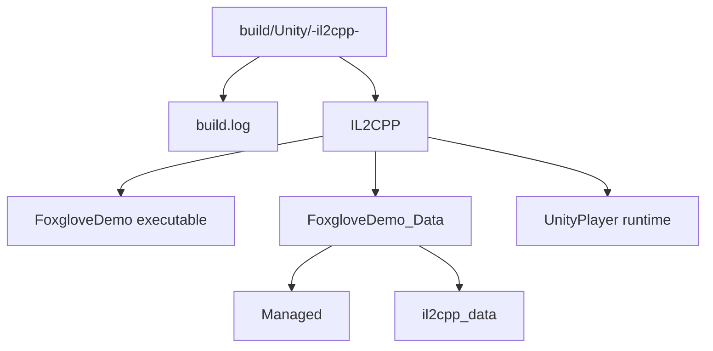

# 1. IL2CPP Build Guide

This document covers how to build the Unity2Foxglove Demo project as an IL2CPP standalone player and verify the SDK's behavior in an IL2CPP environment.

## 1.1 Purpose

Use this guide to build the demo project as an IL2CPP Player and verify Player-only behavior.

## 1.2 Application

Read this when testing source-generation fallback, Newtonsoft/link.xml preservation, compression DLL loading, or standalone Player connectivity.

## 1. Why IL2CPP builds matter

The Unity Editor runs C# code using Mono JIT. However, many advanced features (such as the `[FoxRun]` Source Generator) may behave differently under IL2CPP AOT compilation. IL2CPP builds are used to verify:

- FoxRun Source Generator physical fallback source files (`*_FoxRun.g.cs`) are correctly generated and compiled
- WebSocket, serialization, and other runtime features work correctly under IL2CPP
- The published Player can be correctly connected and data-interacted by Foxglove Desktop

## 2. Prerequisites

### 2.1 Unity installation

1. **Unity 6000.0 LTSC or later** is installed
2. The **Build Support** module for the target platform is installed, especially **Windows IL2CPP** (or Linux IL2CPP, macOS IL2CPP)

   - Unity Hub > Installs > click the gear icon next to the Unity version > **Add modules**
   - Confirm "Windows Build Support (IL2CPP)" is checked and installed

3. Unity Editor is closed (running the Editor simultaneously with a batchmode build may cause Library file conflicts)

### 2.2 Python environment

- **Python 3.8 or later** (required for command-line build script)
- Verify installation: `python --version`

## 3. Basic build command

Run from the repository root:

```powershell
# Default: auto-select target based on current OS
python Scripts/build_unity_il2cpp.py

# Explicitly specify Windows 64-bit
python Scripts/build_unity_il2cpp.py --target win64

# Specify Linux 64-bit
python Scripts/build_unity_il2cpp.py --target linux64

# Specify macOS
python Scripts/build_unity_il2cpp.py --target macos
```

The build script automatically:
1. Locates the Unity executable (via `UNITY_EXE` environment variable or common Unity Hub install paths)
2. Creates a timestamped output directory
3. Runs Unity in batchmode, executing `FoxgloveBuild.BuildIl2CppFromCommandLine`
4. Configures IL2CPP scripting backend and Medium-level managed code stripping
5. Prints key lines from the Unity log in real time (e.g., `[FoxrunBuildPreprocess]`, `[FoxgloveBuild]`, compilation errors, etc.)

## 4. Optional parameters

### 4.1 --unity: specify Unity path

If the script does not auto-find Unity, pass the path to your local Unity Editor executable.
Replace `<path-to-your-Unity.exe>` with the Unity version installed on your machine.

```powershell
python Scripts/build_unity_il2cpp.py --target win64 --unity "<path-to-your-Unity.exe>"
```

Or set via environment variable:

```powershell
$env:UNITY_EXE = "<path-to-your-Unity.exe>"
python Scripts/build_unity_il2cpp.py --target win64
```

For example, a typical Unity Hub installation on Windows may look like:

```powershell
$env:UNITY_EXE = "C:\Program Files\Unity\Hub\Editor\<unity-version>\Editor\Unity.exe"
```

### 4.2 --output-dir / --build-dir: specify output directory

Custom build output directory (default: `build/Unity/<target>-il2cpp-<timestamp>/`):

```powershell
python Scripts/build_unity_il2cpp.py --target win64 --build-dir build\Unity\my-custom-build
```

### 4.3 --output: specify Player output path

Precisely control the Player executable location:

```powershell
python Scripts/build_unity_il2cpp.py --target win64 --output build\Unity\manual\WindowsIL2CPP\FoxgloveDemo.exe
```

### 4.4 --log: specify build log path

```powershell
python Scripts/build_unity_il2cpp.py --target win64 --log build\Unity\custom-build.log
```

### 4.5 --dry-run: trial run (check parameters only, do not start Unity)

Verify paths and parameters before a real build:

```powershell
python Scripts/build_unity_il2cpp.py --target win64 --dry-run
```

Example output:

```text
[build_unity_il2cpp] Project:   Unity2Foxglove
[build_unity_il2cpp] Target:    win64
[build_unity_il2cpp] Log:       build\Unity\win64-il2cpp-20260505-141111\build.log
[build_unity_il2cpp] Output:    build\Unity\win64-il2cpp-20260505-141111\WindowsIL2CPP\FoxgloveDemo.exe
[build_unity_il2cpp] Dry run only; Unity was not started.
```

### 4.6 --progress-interval: adjust progress heartbeat frequency

```powershell
# Print build progress every 30 seconds (default 15 seconds)
python Scripts/build_unity_il2cpp.py --target win64 --progress-interval 30
```

## 5. Build output structure



## 6. Verifying the build log

After building, check `build.log` (or terminal output) for these key markers:

```text
[FoxrunBuildPreprocess] Generating FoxRun source files...
[FoxgloveBuild] Starting Windows IL2CPP Player build...
Build succeeded: build/Unity/WindowsIL2CPP/FoxgloveDemo.exe
```

- `[FoxrunBuildPreprocess]`: confirms FoxRun Source Generator IL2CPP fallback files were generated
- `[FoxgloveBuild]`: confirms the build process started
- `Build succeeded`: confirms the build completed successfully

If `[FoxrunBuildPreprocess]` is missing, FoxRun log topics may not be generated correctly. Check whether `Unity2Foxglove/Assets/Scripts/Generated/*_FoxRun.g.cs` files exist.

## 7. Running the IL2CPP Player

1. Navigate to the build output directory and run `FoxgloveDemo.exe` (Windows) or the corresponding platform executable
2. After the Player starts, the WebSocket server starts at `ws://127.0.0.1:8765`

   > **Note**: The IL2CPP Player is a **headless window** environment (no Unity Editor Game view). Camera streaming still works normally; data is sent to Foxglove via WebSocket.

3. Open Foxglove Desktop and connect to `ws://127.0.0.1:8765`
4. Import the layout file to confirm all panels display correctly

## 8. IL2CPP Player verification checklist

Verify each item according to the manual acceptance steps in **[04 Troubleshooting](04%20Troubleshooting.md)** and the SDK package documentation under `Packages/dev.unity2foxglove.sdk/Documentation~/`, with special attention to:

- [ ] WebSocket connection successful; all topics visible
- [ ] `/tf` topic: coordinate frame works correctly
- [ ] `/scene` topic: cube primitive displays correctly
- [ ] `/unity/camera` topic: camera frames stream correctly (even in headless mode)
- [ ] Parameters: `/cube/color` and `/cube/scale` are readable and writable
- [ ] Services: `/cube/reset_pose` can be called correctly
- [ ] FoxRun: `/debug/position` and `/debug/health` topics exist and have data
  - **This is the most important verification point**: confirms `*_FoxRun.g.cs` fallback source files work correctly under IL2CPP

## 9. Recording test results

It is recommended to record the following information for traceability:

| Item | Value |
|------|-------|
| Platform (target) | win64 / linux64 / macos |
| Unity version | (e.g., 6000.3.14f1) |
| Foxglove Desktop version | (e.g., 2.20.0) |
| Build log path | `build/Unity/.../build.log` |
| Build succeeded | Yes / No |
| FoxRun /debug/* topics | Pass / Fail |
| All manual acceptance items | Passed count / Total count |

## 10. Cross-platform notes

- Building for **Linux/macOS** targets requires the corresponding Unity Build Support modules
- **macOS Player** is best built on a macOS host; Windows hosts may not produce signable macOS apps
- IL2CPP builds take a long time (typically 10-30 minutes); run `--dry-run` first to confirm parameters
- Best to **close the Unity Editor** before building to avoid Library directory and script compilation state conflicts
- If the build fails, prioritize checking `build.log` for `[FoxrunBuildPreprocess]`, `error CS`, `Tundra build failed`, etc.

## 11. Troubleshooting

### 11.1 Unity not found

```text
Unity executable was not found. Pass --unity or set UNITY_EXE/UNITY_PATH.
```

**Resolution**: use the `--unity` parameter to specify the path, or set the `UNITY_EXE` environment variable.

### 11.2 Build error: "IL2CPP module not installed"

**Resolution**: in Unity Hub, install the "Windows Build Support (IL2CPP)" module for the Unity version.

### 11.3 No [FoxrunBuildPreprocess] in build log

**Resolution**: check whether `.cs` files exist under `Unity2Foxglove/Assets/Scripts/Generated/`. If they do not exist, first open the project in the Unity Editor and compile once to ensure the Source Generator triggers.

### 11.4 Foxglove connection fails after Player starts

- Confirm port 8765 is not occupied (`netstat -ano | findstr 8765`)
- Confirm the firewall does not block the Player's network connection
- See **[04 Troubleshooting](04%20Troubleshooting.md)** for more troubleshooting
