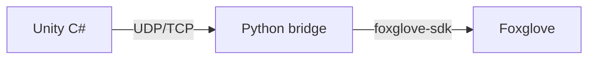
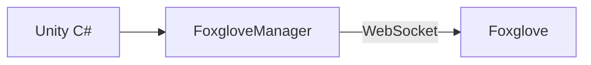

# BasicVisualization Sample

The basic visualization sample for the Unity2Foxglove SDK. Includes a complete, runnable sample scene and a pre-configured Foxglove Layout file for quickly verifying core SDK functionality.

## Purpose

Use this sample to verify the SDK inside an arbitrary Unity project after importing it through Package Manager.

## Application

Use this when you are evaluating the package as a user. If you cloned this repository and want the full demo/test project, use `Unity2Foxglove/README.md` instead.

## Importing this sample into your project

1. After installing the `dev.unity2foxglove.sdk` package via Unity Package Manager, open **Window > Package Manager**
2. Find **Unity2Foxglove SDK** in the package list
3. Expand the **Samples** dropdown
4. Click **Import** next to **BasicVisualization**
5. After import, the sample files appear under `Assets/Samples/Unity2Foxglove SDK/<version>/BasicVisualization/`

## What the import includes

- **Sample scene**: a complete scene with FoxgloveManager, Cube (with Transform / Scene / MouseDrag components), Camera, FoxgloveDemoSetup, and Hub (FoxRun logging)
- **FoxgloveLayout.json**: a pre-configured Foxglove Desktop panel layout file for one-click restoration of all views

## Minimal verification steps

1. Open the imported sample scene
2. Click the **Play** button in the Unity Editor toolbar
3. Open Foxglove Desktop and connect via `ws://127.0.0.1:8765`
4. Import `FoxgloveLayout.json` (in Foxglove: `Layout > Import from file...`)
5. Verify each panel feature (see below)

## Quick feature verification

| Feature | How to verify | Expected result |
|---------|---------------|-----------------|
| Transform publishing | View Foxglove 3D panel | `unity_world` -> `unity_cube` coordinate frame visible; drag the cube and it moves synchronously |
| Scene cube | View Foxglove 3D panel | Colored cube visible, matching Unity position |
| Camera streaming | View Foxglove Image panel | Real-time Unity Game view frames displayed |
| Parameters | Foxglove Parameters panel | `/cube/color` and `/cube/scale` are readable and writable; 3D cube responds to changes |
| Services | Foxglove Service Call panel | Call `/cube/reset_pose` (`{}`); cube returns to origin |
| FoxRun logging | Foxglove Topics list | `/debug/position` and `/debug/health` topics have data |
| MCAP recording/replay | Foxglove record/playback | Can record, stop, and replay data |

## Component quick reference

| Component | Published topic | Schema | Default rate |
|-----------|----------------|--------|-------------|
| FoxgloveTransformPublisher | `/tf` | foxglove.FrameTransform | 10 Hz |
| FoxgloveSceneCubePublisher | `/scene` | foxglove.SceneUpdate | 10 Hz |
| FoxgloveCameraPublisher | `/unity/camera` | foxglove.CompressedImage | 10 Hz |
| FoxgloveManager | -- (server) | foxglove.WebSocket | -- |
| `[FoxRun]` (TestLog) | `/debug/position`, `/debug/health` | JSON | 10 Hz / 5 Hz |

## Using in your own project

Refer to this sample's scene structure and component configuration. In your project:

1. Create a `Foxglove` GameObject and attach the `FoxgloveManager` component
2. On any GameObject whose Transform you want to publish, attach `FoxgloveTransformPublisher`
3. On any GameObject whose 3D primitive you want to publish, attach `FoxgloveSceneCubePublisher`
4. On the Camera, attach `FoxgloveCameraPublisher`
5. For parameters/services, refer to `FoxgloveDemoSetup.cs` for registration patterns
6. For FoxRun log topics, declare a `partial class` in any MonoBehaviour and annotate fields with `[FoxRun]`

## Migrating from the old Python Bridge

Old approach:

New approach (this SDK):

No longer needed:
- `UdpClient.Send(jsonBytes)` -> replace with `FoxgloveTransformPublisher`
- `TcpClient.Connect(host, 9001)` -> replace with `FoxgloveCameraPublisher`
- Python bridge process -> WebSocket server runs directly inside Unity

## Full documentation

For more details, see the SDK documentation:

- SDK API docs: `Packages/dev.unity2foxglove.sdk/Documentation~/`
- Demo project guide: `Unity2Foxglove/Docs/01 Running the Demo.md`
- Manual acceptance checklist: `Unity2Foxglove/Docs/02 Manual Acceptance Checklist.md`
- IL2CPP build guide: `Unity2Foxglove/Docs/03 Building IL2CPP Standalone.md`
- Troubleshooting: `Unity2Foxglove/Docs/04 Troubleshooting.md`
