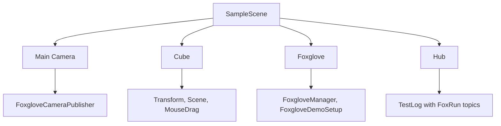

# Untiy2Foxglove — Dev & Test Project

> **Note:** This is not the SDK package and not a user template. It is the repository's full Unity project for development, manual verification, IL2CPP builds, and bug reproduction.

## Purpose

- Run and verify all Unity2Foxglove SDK features in a real Unity project.
- Provide a complete manual acceptance environment for Transform, Scene, Camera, Parameters, Services, FoxRun, MCAP, and replay workflows.
- Verify standalone Player and IL2CPP behavior before release.

## When To Use This Project

Use `Untiy2Foxglove/` when you are developing or validating the SDK itself.

If you are a package user, install `dev.unity2foxglove.sdk` into your own Unity project and import one of the Package Manager samples instead:

- **Basic Visualization** — minimal scene, no extra dependencies.
- **Full Demo Visualization** — complete demo experience; requires Input System and URP.

## Opening The Project

1. Open **Unity Hub**.
2. Click **Add** > **Add project from disk**.
3. Select `Untiy2Foxglove/`.
4. Wait for Unity to import assets and compile scripts.

## Requirements

- Unity 6000.3 LTSC / Unity 6.3 LTSC is the current verified environment.
- Windows, macOS, or Linux standalone target support for Editor use.
- Platform-specific IL2CPP build support if you want Player builds.
- Python 3.8+ for `Scripts/build_unity_il2cpp.py`.

## Demo Scene

Scene file: `Assets/Scenes/SampleScene.unity`



## Running In Editor

1. Open `Assets/Scenes/SampleScene.unity`.
2. Press **Play**.
3. Open Foxglove Desktop.
4. Connect to `ws://127.0.0.1:8765`.
5. Import `Configs/FoxgloveFullLayout.json`.

Expected topics include `/tf`, `/scene`, `/unity/camera`, `/debug/position`, and `/debug/health`.

## IL2CPP Build

Run from the repository root:

```powershell
python Scripts/build_unity_il2cpp.py --target win64
```

The script resolves the Unity project path relative to the repository root, so the command is portable across clones.

For more detail, see [Docs/03_BuildIL2CPP.md](Docs/03_BuildIL2CPP.md).

## Documentation

- [Run Demo](Docs/01_RunDemo.md)
- [Manual Acceptance](Docs/02_FoxgloveManualAcceptance.md)
- [Build IL2CPP](Docs/03_BuildIL2CPP.md)
- [Demo Troubleshooting](Docs/04_DemoTroubleshooting.md)

## Notes

- `Packages/manifest.json` references the SDK package by relative local path.
- `Configs/FoxgloveFullLayout.json` is the full Foxglove Desktop layout used by this development project.
- Runtime recordings under `Recordings/` are local outputs and should not be committed.
