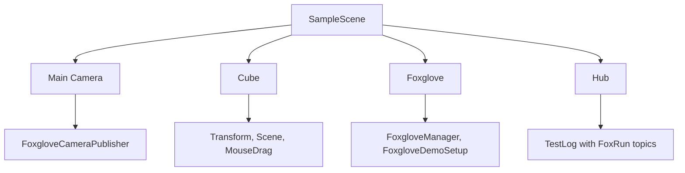

# Unity2Foxglove Demo Project

> **Note: This is not the SDK itself.** This is a complete Unity project used to demonstrate and verify all features of the Unity2Foxglove SDK. The SDK package is located at `Packages/dev.unity2foxglove.sdk/`.

## Purpose

- Run and verify all SDK features in a real Unity environment
- Provide a visual manual acceptance environment for each feature (Transform publishing, scene cube, camera streaming, parameters, services, FoxRun logging)
- Provide an IL2CPP Player build entry point to verify SDK behavior in production builds

## Application

Use this project when you want a complete, ready-to-run demo instead of installing the package into a separate Unity project. For package integration guidance, start from `Packages/dev.unity2foxglove.sdk/Documentation~/README.md`.

## Opening the project

1. Open **Unity Hub**
2. Click **Add** in the top-right > **Add project from disk**
3. Select this directory (`Untiy2Foxglove/`)
4. Wait for Unity to import assets and compile scripts

## Requirements

- **Unity version**: 2022.3 or later (LTS recommended)
- **Target platforms**: Windows, macOS, Linux standalone
- **IL2CPP builds**: requires installation of the corresponding **Windows IL2CPP / Linux IL2CPP / macOS IL2CPP** Build Support modules
- **Python 3.8+** (only needed for command-line IL2CPP builds)

## Sample scene contents

Sample scene file: `Assets/Scenes/SampleScene.unity`

The scene includes the following feature demonstrations:

| Feature | Component | Description |
|---------|-----------|-------------|
| Transform publishing | `FoxgloveTransformPublisher` | Publishes `/tf` at 10 Hz, includes `unity_world` to `unity_cube` coordinate transform |
| Scene cube | `FoxgloveSceneCubePublisher` | Publishes `/scene` at 10 Hz, displays a colored cube in the Foxglove 3D panel |
| Camera streaming | `FoxgloveCameraPublisher` | Publishes `/unity/camera` at 10 Hz, streams the Game view as compressed images to Foxglove |
| Mouse interaction | `MouseDragCube` | Left-drag to rotate, right-drag to pan, scroll to zoom the cube |
| Parameters | `FoxgloveDemoSetup` | Registers `/cube/color` (writable) and `/cube/scale` (writable) parameters; cube updates in real time |
| Services | `FoxgloveDemoSetup` | Registers `/cube/reset_pose` service; calling it resets the cube's position, rotation, scale, and color |
| FoxRun logging | `[FoxRun]` Source Generator | Autonomously publishes `/debug/position` and `/debug/health` topics via `[FoxRun]` annotations in `TestLog.cs` |

Scene hierarchy (GameObject tree):



## Entering Play Mode

Click the **Play** button in the Unity Editor toolbar (or press `Ctrl+P`). The server automatically starts at `ws://127.0.0.1:8765`.

## Connecting to Foxglove

1. Open **Foxglove Desktop** ([download](https://foxglove.dev/download))
2. Click **Open connection** > select **Foxglove WebSocket**
3. Enter URL: `ws://127.0.0.1:8765`
4. Click **Open** to connect

## Importing the layout

Import the pre-configured layout file to restore all panels and views with one click.

1. In Foxglove Desktop, click the top menu **Layout** > **Import from file...**
2. Select: `Packages/dev.unity2foxglove.sdk/Samples~/BasicVisualization/FoxgloveSimpleLayout.json`
3. (If that path is not visible, use the alternative: open the .json file in a text editor, copy its contents, then **Layout > Import > Paste layout JSON**)

## Expected panels

After importing the layout, the Foxglove interface should display the following panel arrangement:

| Position | Panel type | Expected content |
|----------|-----------|------------------|
| Left | **3D panel** | Shows `/tf` coordinate frame (unity_world -> unity_cube) and `/scene` cube primitive. Drag the mouse to rotate/zoom the view. |
| Left | **Raw Messages** | Real-time raw JSON data from the `/tf` topic. |
| Upper-center | **Image panel** | Shows the `/unity/camera` topic, i.e., the Unity Camera's real-time rendered frame. |
| Lower-center-left | **Service Call panel** | Service name `/cube/reset_pose`. Click **Call service** to reset the cube to origin. |
| Lower-center-center | **Topic Graph panel** | Shows the connection graph of all active topics. |
| Upper-right | **Plot panel** | Plots `/tf.translation.x`, `/tf.translation.y`, `/tf.translation.z` curves. Curves update in real time when the cube is dragged. |
| Lower-right-left | **Parameters panel** | Shows `/cube/color` (color array `[r, g, b, a]`) and `/cube/scale` (scale value). Both are modifiable online. |
| Lower-right-center | **Publish panel** | Manually publish CompressedImage messages to `/unity/camera` (for verification). |
| Lower-right-right | **Raw Messages** | Real-time raw data from the `/debug/position` topic, verifying FoxRun generator operation. |

## Manual verification workflow

1. **Drag the cube**: Use the mouse in the Unity Game view to drag the cube (left-drag to rotate, right-drag to pan, scroll to zoom). Observe the 3D panel and Plot panel updating in real time.
2. **Modify parameters**: In the Foxglove Parameters panel, modify `/cube/color` (e.g., `[1.0, 0.0, 0.0, 1.0]` for red) or `/cube/scale` (e.g., `2.0` to enlarge). Observe the cube changing in the 3D panel.
3. **Call service**: In the Service Call panel, click **Call service**. The cube returns to origin and plot curves return to zero.
4. **Check FoxRun**: Confirm the Raw Messages panel shows `/debug/position` and `/debug/health` topic data.

For detailed step-by-step instructions, see **Developer/01 Installation and Quick Start**. For the manual acceptance checklist, see **Developer/02 Foxglove Desktop Operation**.

## IL2CPP build

The SDK provides a command-line script for IL2CPP standalone player builds:

```powershell
# Run from the repository root (target auto-selected based on current OS)
python Scripts/build_unity_il2cpp.py

# Explicitly specify Windows 64-bit
python Scripts/build_unity_il2cpp.py --target win64
```

After building, run the generated Player and connect Foxglove to `ws://127.0.0.1:8765` to verify all features.

For detailed build instructions, see **[Docs/03 Building IL2CPP Standalone](Docs/03%20Building%20IL2CPP%20Standalone.md)**.

## Troubleshooting

See **[Docs/04 Troubleshooting](Docs/04%20Troubleshooting.md)** for common issues and solutions.

## Notes

- **This is a test/demo project, not a template for new projects.** To use the SDK in your own Unity project, import the `dev.unity2foxglove.sdk` package via Package Manager and refer to the samples under the Samples directory.
- This project is pre-configured with all package dependencies (`Packages/manifest.json`). Open it directly and run -- no additional installation is required.
- Each time the project opens, Unity recompiles scripts automatically. If you encounter compilation errors, first confirm that `dev.unity2foxglove.sdk` is correctly linked in Package Manager.
