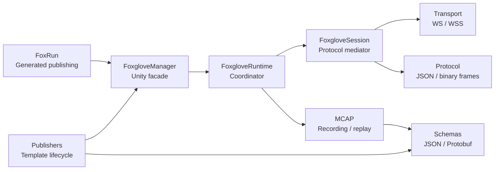

# Architecture Patterns and Design Restraint

Unity2Foxglove uses explicit architecture patterns where they reduce coupling, improve testability, or make subsystem boundaries easier to understand. It avoids adding abstraction layers solely to match a named design pattern.

This note is for contributors who need to find the right subsystem before changing code. It is not a prescription to wrap existing code in more interfaces.

## Component Map



## Existing Patterns

| Area | Pattern / style | Where to look | Why it exists |
| --- | --- | --- | --- |
| Unity entry point | Facade | `Runtime/Components/FoxgloveManager.cs`; `Runtime/Core/FoxgloveRuntime.cs` | Keeps most users on a small Unity-facing surface while runtime internals stay split by responsibility. |
| Session protocol handling | Mediator / coordinator | `Runtime/Core/Session/` | Routes WebSocket operations such as parameters, services, client publish, graph updates, assets, and playback control without pushing protocol details into publishers. |
| Publisher lifecycle | Template method | `Runtime/Components/Publishing/`; `Runtime/Schemas/Proto/Publishers/` | Shares manager resolution, channel registration, encoding choice, and publish calls while letting typed publishers build their own payloads. |
| Encoding and publish rules | Policy / strategy functions | `Runtime/Components/Publishing/FoxglovePublisherEncoding.cs`; `Runtime/Utilities/FoxRunPublishPolicy.cs` | Keeps variable rules small, deterministic, and easy to test without creating interface hierarchies. |
| Camera backpressure | Policy function plus transport snapshots | `Runtime/Utilities/CameraBackpressurePolicy.cs`; `Runtime/Transport/TransportStats.cs` | Allows camera publishers to react to queue pressure without depending on WebSocket queue internals. |
| Unity-to-Foxglove conversion | Adapter / builder helpers | `Runtime/Components/Replay/FoxgloveReplayObjectAdapter.cs`; `Runtime/Schemas/Proto/Builders/` | Keeps Unity object models separate from Foxglove schema and wire formats. |
| Playback and replay state | State machine / command queue | `Runtime/Core/Replay/`; `Runtime/Core/Session/SessionPlaybackHandler.cs`; `Runtime/Transport/Clock/PlaybackClock.cs` | Keeps seek, pause, replay snapshots, and request-correlated playback responses explicit and testable. |
| Protocol state | Registry | `Runtime/Core/Registries/`; `Runtime/Core/Services/`; `Runtime/Core/Assets/` | Centralizes mutable protocol state such as channels, subscriptions, parameters, services, and assets. |
| Transport | Interface-backed backend | `Runtime/Transport/IFoxgloveTransport.cs`; `Runtime/Transport/WebSocket/` | Lets the same session code run against managed WS, managed WSS, and test transports. |
| MCAP | Pipeline separation | `Runtime/IO/Mcap/`; `Runtime/Core/Recording/`; `Runtime/Core/Replay/` | Keeps binary file records, recording orchestration, replay reading, and runtime replay behavior separate. |
| FoxRun generation | Shared model + shared emitter | `Editor/Shared/FoxRunDescriptor/`; `Editor/Shared/FoxgloveSourceEmitter/FoxgloveSourceEmitter.cs`; `Editor/FoxRun/`; `Editor/SourceGenerators/` | Keeps Roslyn source generation and build-time physical `.g.cs` generation aligned through one semantic model and one emitter. The model separates raw observed type names, legal emission type names, and canonical schema type names so host-specific type strings do not leak into generated source or schema identity. See [Shared-Emitter Dual-Host AOT Code Generation](research-shared-emitter-architecture.md). |

## Why Some Abstractions Stay Lightweight

Not every variation point needs an interface. Several Unity2Foxglove rules are intentionally implemented as pure functions or small helpers because they are deterministic and easy to validate:

- publisher encoding resolution;
- FoxRun publish policy;
- camera backpressure decisions;
- protobuf message construction helpers.

This keeps hot paths and Unity-facing code easier to read. A new abstraction is justified when there is a real second implementation, a public API need, a testing seam that cannot be reached otherwise, or a reliability problem that the abstraction directly solves.

## Contributor Guide

Use these entry points when changing a subsystem:

- **Transport or WSS:** start in `Runtime/Transport/`, then check `Runtime/Core/Session/` for protocol interactions.
- **Protocol JSON or binary frames:** start in `Runtime/Protocol/` and the relevant session handler.
- **Publishers:** start in `Runtime/Components/Publishing/` or `Runtime/Schemas/Proto/Publishers/`.
- **FoxRun:** start with `Editor/Shared/FoxRunDescriptor/` and `Editor/Shared/FoxgloveSourceEmitter/FoxgloveSourceEmitter.cs`, then inspect the Roslyn and build-time hosts.
- **MCAP recording:** start with `Runtime/Core/Recording/RecordingController.cs`, then `Runtime/IO/Mcap/Recording/McapRecorder.cs` and `Runtime/IO/Mcap/McapWriter.cs`.
- **MCAP replay:** start with `Runtime/Core/Replay/ReplayController.cs`, `Runtime/Core/Replay/ReplaySnapshotStateMachine.cs`, and `Runtime/IO/Mcap/Replay/McapReplayEngine.cs`.
- **Schemas:** start with `Runtime/Schemas/Registry/` for JSON schema definitions and `Runtime/Schemas/Proto/Registry/` for protobuf catalog behavior.

## Phase 126 Architecture Gate

Phase 126 adds a repeatable architecture health check before the next ROS2/RViz2 roadmap wave. Run:

```bash
python Scripts/architecture/analyze_coupling.py --format text --output build/architecture/phase126-coupling-report.txt
```

The report is intentionally heuristic. It measures C# file-size hotspots, namespace fan-in/fan-out, asmdef references, and obvious asmdef cycles. Treat it as a refactor triage input, not a permanent quality score. Deferred candidates belong in [Architecture Backlog](architecture-backlog.md).

Validation categories are explicit:

- **CI-safe:** default `dotnet run --project Packages/dev.unity2foxglove.sdk/Tests/Runtime/FoxgloveSdk.Tests.csproj` checks. These must depend only on tracked repository artifacts and runtime-generated files.
- **Local Evidence:** opt-in checks that may require machine-local tools, generated artifacts, or external runtimes. Run them with `--local-evidence` or a specific phase flag.
- **Manual Smoke / Optional Tooling:** commands that require live services, native tools, generated fixtures, or external runtimes.

Tracked demo-only experiments should use `Experimental/`. Validation must never require contributor-private notes.

## Restraint Rules

- Prefer existing facades, registries, policies, and handlers before adding a new layer.
- Add an interface only when there is a concrete second implementation or a clear testability need.
- Keep Unity `MonoBehaviour` and Inspector-facing APIs stable unless a migration is planned.
- Do not introduce a dependency-injection framework for ordinary runtime composition.
- Do not turn MCAP or WebSocket code into generic frameworks unless a Unity workflow requires it.

For research positioning and related work, see [Research Related Work Evidence](research-related-work-evidence.md). For the FoxRun code-generation architecture, see [Shared-Emitter Dual-Host AOT Code Generation](research-shared-emitter-architecture.md).
