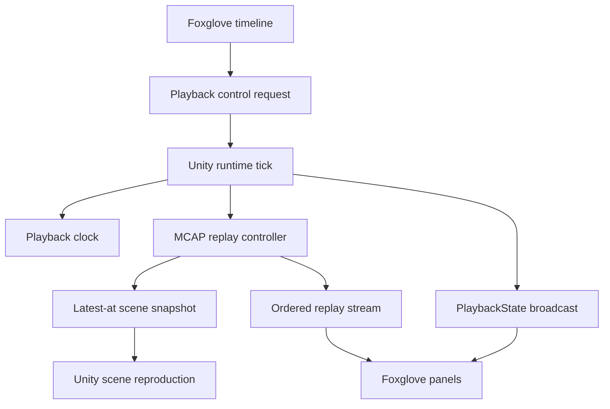
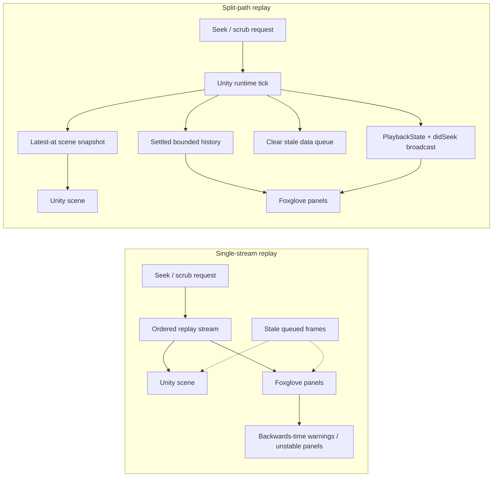

# Remote Timeline-Controlled Scene Reproduction for Unity-Based Telemetry Replay

**Draft Research Note — Unity2Foxglove Project, 2026-05-12**

## 1 Introduction

Telemetry replay is a standard capability in robotics and simulation tooling. Systems such as ROS 2 `rosbag2_transport`, Foxglove Studio, and Rerun allow developers to record timestamped message streams and play them back for analysis. During ordinary forward playback, a single ordered message stream can serve multiple consumers. During paused scrubbing, however, the consumers diverge in what they need from the same replay timestamp.

This note describes the replay architecture behind Unity2Foxglove's paused-scrub behavior. The central problem is not merely playing an MCAP file. It is allowing a remote Foxglove client to control a replay timeline while an external Unity scene reproduces the corresponding simulation state without mixing stale live telemetry, replay data, and panel reset traffic.

The key observation is that paused scrubbing is not ordinary playback at a different speed. It is a state-reproduction query initiated by a remote client.

Unity2Foxglove addresses this by separating three responsibilities: protocol state broadcast, latest-at scene reproduction, and ordered replay/panel data delivery. Full continuous range-history reconstruction is treated as follow-up work. This separation produces a replay loop where Foxglove is not only a viewer of MCAP data, but also a controller of the Unity replay timeline.

## 2 Problem

A typical telemetry replay system has one timeline and several consumers. Unity and Foxglove panels want different things from the same replay timestamp:

- The Unity scene wants the latest state at time *T* (a latest-at query).
- A time-series panel wants a range of samples around or before time *T* (a range query).
- The WebSocket protocol wants a coherent playback-state transition so panels can reset their local state.
- The transport queue wants stale data removed so old frames do not arrive after the seek.

Using one undifferentiated replay stream for all of these consumers leads to observable failure modes:

- Unity applies scene updates from a non-main thread.
- Old live publisher frames interleave with replay frames.
- Data messages arrive with log times older than the client has already processed.
- Foxglove panels report "data went back in time."
- Paused scrubbing can clear panels or destabilize the client.
- Replay can work while playing forward but fail when the user drags backwards.

## 3 Related Work

### 3.1 Rerun: Latest-At and Range Access

Rerun [1, 2] distinguishes latest-at and range-style access patterns as first-class concepts in its data model. When no visual time range applies, views use latest-at semantics: starting from the time cursor, the viewer queries the latest available data for each component type. Rerun's chunk store documentation exposes separate latest-at and range relevant-chunk query paths. This distinction is highly relevant to Unity2Foxglove: Unity scene reproduction corresponds to latest-at access, and Foxglove Plot reconstruction corresponds to range access. However, Rerun applies this distinction inside its own viewer architecture. It does not drive an external 3D engine such as Unity.

### 3.2 MCAP

MCAP [3, 4] provides the timestamped, multi-channel log container used by Unity2Foxglove replay. MCAP is an open container format for multimodal log data, supporting pre-serialized data across channels, schemas embedded alongside messages, optional chunk indexes for efficient seeking, and LZ4/Zstandard chunk compression. Unity2Foxglove builds on these MCAP properties rather than replacing them. The contribution here is not a new file format; it is the control and consumption architecture around MCAP replay inside Unity.

### 3.3 Foxglove PlaybackControl Protocol

Foxglove's PlaybackControl capability [5, 6, 7] lets the Foxglove UI control an external WebSocket server that owns playback. Foxglove sends play, pause, seek, and speed changes; the application loads data, handles requests, advances time, and returns updated playback state so the UI stays synchronized. The SDK `PlaybackState` frame includes a `did_seek` field [8], and Foxglove panel render state exposes `didSeek` so panels can clear stale state when data may have been skipped [9]. Unity2Foxglove uses this protocol directly. The important difference is that Unity2Foxglove is not only streaming data back to Foxglove — it also uses the same replay control path to reproduce a Unity scene from MCAP state.

### 3.4 Dexory foxglove_mcap_player

Dexory's `foxglove_mcap_player` [11] is a ROS 2 node that plays MCAP files with dual output: a Foxglove WebSocket server with playback controls, and ROS 2 topic republishing to original topics. This is an important precedent for dual-output replay. The boundary is that Dexory republishes the same ordered message stream to both consumers. It does not separate latest-at scene reconstruction from panel streaming.

### 3.5 ROS Foxglove Bridge

The ROS Foxglove bridge [12, 13] is a high-performance C++ WebSocket bridge for ROS 1/ROS 2. It is a useful contrast for Unity2Foxglove as a whole: the Foxglove bridge is an external ROS bridge process, while Unity2Foxglove is an in-process Unity package where the bridge, playback controller, MCAP reader, scene adapter, and runtime publishers are all inside Unity.

### 3.6 ROS 2 Replay and rosbag2_transport

ROS 2's `rosbag2_transport` Player supports remote-control services including seek-related playback control [14, 15]. Its replay model moves through recorded topic data and republishes messages through the ROS graph. It does not perform latest-at scene reconstruction for an external Unity scene at the seek target. ROS replay testing packages [16, 17] demonstrate the importance of replay-driven development, but their primary target is ROS node execution rather than remote timeline-controlled Unity scene reproduction.

### 3.7 Isaac Sim and USD + ROS Bag Workflows

Isaac Sim's ROS 2 Bridge and simulation-control documentation [18, 19] show a related reproducibility pattern: recorded topic data, ROS bridge state, and saved scene/world descriptions all matter for simulation context. A separate workflow combining ROS 2 bags with USD scenes [20] makes that relationship explicit. The similarity is conceptual — recorded data alone is not enough; scene context matters. The difference is operational: Unity2Foxglove performs seek-time scene reproduction in a live Unity process controlled by Foxglove over WebSocket.

### 3.8 Unity Replay Systems

Unity-specific replay systems such as commercial asset-store tools and open-source replay frameworks demonstrate that scene replay and state reproduction are established Unity needs. They usually record Unity-side component state or deterministic inputs and then replay them inside Unity. Unity2Foxglove differs in both data source and control surface: the source of truth is MCAP telemetry, Foxglove controls the replay timeline remotely, and the same replay session must remain coherent for WebSocket clients.

### 3.9 Comparison

| Feature | Rerun | Dexory | Foxglove native | Foxglove bridge | Unity replay systems | rosbag2 / ROS replay testing | Unity2Foxglove |
| --- | --- | --- | --- | --- | --- | --- | --- |
| MCAP data source | Partial | Yes | Yes | No | No | Yes | Yes |
| External Unity scene reproduction | No | No | No | No | Yes (Unity-local) | No | Yes |
| Latest-at scene state | Yes (viewer) | No | Client-local | No | Snapshot-like | No | Yes |
| Range panel data | Yes | Ordered stream | Client/file | Live stream | Usually no | ROS topic stream / assertions | Current point / limited batch; full curve future |
| Dual output (3D engine + panels) | No | Yes | No | ROS to Foxglove | Unity-only | ROS nodes | Yes |
| Remote timeline controls | Viewer-local | PlaybackControl | Client controls | No | Unity-local | CLI/test-runner | PlaybackControl |
| Multi-client state broadcast | N/A | Partial | Client-local | No | No | No | Yes |
| Stale live/replay queue separation | N/A | Ordered stream | Client/file | No | No | No | Yes |

## 4 Design Principle

The design principle is:

> Separate scene reproduction from telemetry streaming.

Unity scene reproduction is a latest-at operation. It asks: what should the scene look like at time *T*?

Telemetry streaming is an ordered-message operation. It asks: what messages should subscribers receive as playback time advances?

Foxglove panel history is a range operation. It asks: what data points should an analytical panel have in its local window?

These three operations are related, but they should not be forced through the same code path.

The contrast with a single-stream replay loop is the important architectural boundary:

## 5 Architecture

### 5.1 Playback Control Serialization

Playback-control requests arrive from the WebSocket receive path. They are not applied directly on that thread. Instead, requests are queued and drained by the Unity runtime tick. This ensures that seek, pause, play, replay cursor mutation, and scene snapshot application are serialized with Unity's main update loop. This matters because Unity scene objects cannot be safely mutated from transport threads.

### 5.2 Broadcast Playback State

When a client seeks, the resulting playback state is broadcast to all connected clients rather than only returned to the initiating client. This keeps multiple Foxglove panels or clients aligned on the same `currentTime`, `status`, and `didSeek` transition. The request identifier is primarily meaningful to the initiating client, but the state transition itself is global for the replay session.

### 5.3 Queue Reset Before Replay Resume

Seek changes invalidate stale queued data frames. Before replay data resumes, data-priority queues are cleared. This prevents old MessageData frames from arriving after Foxglove has already reset its playback state. Reliable control frames and droppable data frames therefore have different roles: control frames preserve protocol state; data frames may be discarded during seek reset.

### 5.4 Scene Snapshot Path

Paused seek applies a latest-at MCAP snapshot to Unity scene listeners. This path is scene-only: it does not publish the snapshot as Foxglove MessageData. This is the key reproduction behavior. The Unity scene follows the Foxglove timeline even while playback is paused.

### 5.5 Active Scrub and Settled State

Paused scrubbing has two phases:

- **Active drag phase:** every seek command updates playback state and Unity scene state. Panel history is suppressed. Plot may remain empty or stale during this phase.
- **Settled phase:** after a debounce window expires with no newer seek, the SDK sends coherent panel data for the settled time and then parks Foxglove time at the requested seek time. This stabilizes current-point panel state; full continuous Plot reconstruction remains a separate bounded-history problem.

This avoids flooding the WebSocket client while the user is still dragging and prevents transient backwards-time warnings.

### 5.6 Playback Resumption

When playback resumes, panel-history delta state is invalidated. The next paused seek should not assume that the previous paused history window is still a valid basis for a delta update. This keeps Play, Pause, and Seek transitions from reusing stale range state.

## 6 Current Semantics

The current implementation supports the following user-facing behavior:

- Forward playback drives Unity and Foxglove normally.
- Paused seek updates the Unity scene to the requested time.
- Backward paused seek does not produce Foxglove "data went back in time" warnings.
- Foxglove remains connected and stable during repeated paused scrubbing.
- The Plot panel may show the current coherent point rather than a continuous historical curve.
- Pressing Play after paused seek resumes replay successfully.

Scene reproduction applies recorded telemetry state to Unity objects. It does not re-simulate physics, user input, random state, gameplay logic, or other nondeterministic systems from the original run.

This is a deliberate semantic boundary. A single point in paused mode is acceptable for scene reproduction. A continuous Plot curve requires a bounded history-window policy and is a separate feature described in Section 9.

## 7 Validation Evidence

The implementation is covered by runtime validation and manual Foxglove acceptance.

Automated checks include:

- Playback-control requests are queued and drained on runtime tick.
- Runtime drains playback controls before advancing replay time.
- Playback seek broadcasts `didSeek` state to all connected clients.
- Paused seek applies a scene-only latest-at snapshot.
- Active paused scrub suppresses panel history before the settled debounce.
- Superseded paused scrub requests cancel the older pending history operation.
- Play invalidates paused history delta state.
- Replay mode suppresses live publisher frames and live channel advertisements.
- Replay MessageData uses the clearable data-priority path.

Recent validation results:

- Phase 13 replay validation passed.
- Full runtime validation passed.
- Release package validation passed.
- Manual Foxglove testing confirmed no warnings during paused backward scrub.

**Implementation status note:** The checks listed above reflect currently implemented behavior. Full continuous Plot reconstruction, large-MCAP scrub latency, and deeper backpressure benchmarking remain follow-up evidence items.

## 8 Contribution

Unity2Foxglove introduces a WebSocket-controlled replay architecture for Unity scenes backed by MCAP data. The contribution is a **compositional systems contribution**: it does not invent MCAP playback, Foxglove playback controls, Unity scene updates, or latest-at queries, but combines them into a Unity-native replay path where:

- a remote Foxglove timeline can seek the Unity replay state,
- playback-control requests are serialized onto Unity's runtime tick,
- scene reproduction is driven from MCAP latest-at snapshots,
- replay output is separated from live publisher output,
- WebSocket `didSeek` state is broadcast to connected clients,
- queued stale data is cleared before replay data resumes,
- paused scrub no longer causes "data went back in time" warnings.

The main contribution boundary is not "Unity2Foxglove is the first replay system." It is narrower and more specific: Unity2Foxglove applies remote WebSocket playback control to an in-process Unity MCAP replay server and separates latest-at scene reproduction from replay streaming sufficiently to support stable paused backward scrubbing.

The current completed claim is **scene reproduction**, not full historical panel reconstruction. Continuous range-history reconstruction is a related follow-up problem. The claim should avoid overstatements such as asserting that Foxglove's native MCAP playback has been reimplemented over WebSocket, that all large-MCAP performance cases are solved, or that this is the first system to replay a 3D scene from telemetry.

## 9 Future Work

The next research and engineering step is bounded panel history reconstruction:

- Forward paused scrub can publish a delta range.
- Backward paused scrub may rebuild a bounded window (e.g., 30 seconds before the seek target).
- Long MCAP files need caps and backpressure-aware batching.
- Active dragging should continue to suppress heavy panel history.
- Settled scrub should publish only after the seek stabilizes.
- Old history generations should be cancelled when a newer seek arrives.

An alternative architecture is client-side preloading: serving the MCAP file via Foxglove's `fetchAsset` capability so the client performs its own range queries locally. A more client-native variant would expose indexed MCAP assets through `fetchAsset` or a range-capable asset service, letting Foxglove-side code perform cached range queries directly. This could reduce server-push pressure for large MCAP files and align more closely with native MCAP playback behavior, but it requires client or panel support, cache invalidation policy, asset authorization design, and agreement on how cloud-hosted or remote MCAP indexes are discovered. The bounded server-push approach was chosen for Phase 54 because it works within the existing WebSocket streaming model.

This follow-up would extend scene reproduction into full dual-consumer replay: latest-at for Unity scene state, bounded range for Foxglove analytical panels.

## 10 Conclusion

This note describes a replay architecture that separates remote timeline control, Unity scene reproduction, and Foxglove panel data delivery. The architecture uses the latest-at/range distinction — established in systems such as Rerun — as an architectural boundary between scene state and analytical panel history, applied to a remote WebSocket-controlled Unity replay loop.

The current system demonstrates stable paused scrubbing without backwards-time warnings, while bounded panel history reconstruction remains future work. The contribution is best understood as a compositional systems contribution: mature pieces exist in neighboring systems, but their combination creates a system shape for Unity-based telemetry replay that, to the best of our knowledge, has not been documented before.

## References

[1] Rerun Contributors. "VisibleTimeRanges." Rerun documentation. https://ref.rerun.io/docs/python/0.26.1/common/blueprint_archetypes/

[2] Rerun Contributors. "re_chunk_store." Rerun Rust API documentation. https://docs.rs/rerun/latest/rerun/external/re_chunk_store/index.html

[3] MCAP Contributors. "MCAP." https://mcap.dev/

[4] MCAP Contributors. "MCAP Format Specification." https://mcap.dev/spec

[5] Foxglove Technologies. "Connect Foxglove to your local player with PlaybackControl." Foxglove Blog, 2026. https://foxglove.dev/blog/connect-foxglove-to-your-local-player-with-playback-control

[6] Foxglove Technologies. "WebSocket Server: Playback control." Foxglove Documentation. https://docs.foxglove.dev/docs/sdk/websocket-server

[7] Foxglove Technologies. "Playback." Foxglove Documentation. https://docs.foxglove.dev/docs/visualization/playback

[8] Foxglove Technologies. "PlaybackState source." Foxglove Rust SDK documentation. https://docs.rs/foxglove/latest/src/foxglove/websocket/ws_protocol/server/playback_state.rs.html

[9] Foxglove Technologies. "RenderState." Foxglove Extension API documentation. https://docs.foxglove.dev/docs/extensions/extension-api/type-aliases/RenderState

[10] Foxglove Technologies. "foxglove/ws-protocol." Archived GitHub repository. https://github.com/foxglove/ws-protocol

[11] Dexory / BotsAndUs. "foxglove_mcap_player." GitHub repository. https://github.com/botsandus/foxglove_mcap_player

[12] Foxglove Technologies. "ROS Foxglove bridge." Foxglove Documentation. https://docs.foxglove.dev/docs/connecting-to-data/ros-foxglove-bridge

[13] Foxglove Technologies. "ros-foxglove-bridge." GitHub repository. https://github.com/foxglove/ros-foxglove-bridge

[14] ROS 2 Contributors. "rosbag2." GitHub repository. https://github.com/ros2/rosbag2

[15] ROS Index. "rosbag2_transport package." https://index.ros.org/p/rosbag2_transport/

[16] ROS Index. "replay_testing package." https://index.ros.org/p/replay_testing/

[17] Polymath Robotics contributors. "replay_testing." GitHub repository. https://github.com/polymathrobotics/replay_testing

[18] NVIDIA. "Isaac Sim ROS 2 Bridge." https://docs.isaacsim.omniverse.nvidia.com/5.0.0/py/source/extensions/isaacsim.ros2.bridge/docs/index.html

[19] NVIDIA. "Isaac Sim ROS2 Simulation Control." https://docs.isaacsim.omniverse.nvidia.com/5.1.0/ros2_tutorials/tutorial_ros2_simulation_control.html

[20] Champion3D. "Combining ROS 2 Bag Files with USD Scenes." 2025. https://www.champion3d.io/ros-2/combining-ros-2-bag-files-with-usd-scenes

## Authorship and Disclosure

This document records the design state as of 2026-05-12 for Unity2Foxglove. Git history, release notes, and dated documentation provide authorship evidence. If the work is intended for academic submission, a later version should add a more complete related-work review, precise citations, benchmark data, screenshots or videos from the Foxglove/Unity replay workflow, and a clearly versioned implementation artifact.
