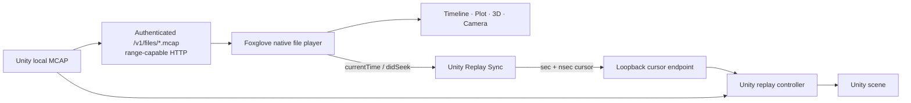

# Foxglove-Owned Timeline and Deterministic Unity Scene Reproduction

Updated: 2026-07-20

## Abstract

Unity2Foxglove replay treats Foxglove as the interactive time owner and Unity as a deterministic scene-state follower. Foxglove opens the recorded MCAP through the Manager's local Remote files endpoint, so its Timeline, Plot, 3D, camera, and other panels retain their native file-playback behavior. The `Unity Replay Sync` extension observes Foxglove's global playback cursor and forwards only that cursor to a loopback Unity endpoint. Unity reads the same MCAP locally and applies the state that belongs at that time.

This is not a message-forwarding loop. Foxglove owns play, pause, timeline seek, and Plot-driven seek. Unity owns scene reconstruction, bounded callback delivery, message decoding, and conflict resolution between recorded sources that can target the same Unity object. The default product path keeps `Follow Unity replay` off: Foxglove's native player advances the timeline, and Unity follows it.

## 1. Product Contract

The normal workflow has one time owner:

```text
Foxglove Remote files player
        -> currentTime / didSeek
Unity Replay Sync panel
        -> authenticated loopback cursor POST
Unity replay controller
        -> MCAP range advance or latest-at snapshot
Unity scene adapter
        -> deterministic main-thread state application
```

The corresponding responsibilities are:

| Owner | Responsibility |
| --- | --- |
| Foxglove | Loads the MCAP, displays the full navigable time range, renders Plot curves and other panels, and owns play/pause/seek. |
| Unity Replay Sync | Observes Foxglove render state, preserves timestamp precision, and forwards a bounded stream of cursor updates. |
| Unity cursor endpoint | Authenticates loopback requests, validates/clamps time, and retains only the latest pending cursor. |
| Unity replay runtime | Chooses smooth range advance versus latest-at seek and drains the MCAP without republishing replay data to Foxglove. |
| Scene adapter | Decodes payloads, resolves targets, arbitrates competing pose sources, and mutates Unity objects on the main thread. |

Foxglove controls replay; Unity follows the Foxglove timeline. In the Inspector this workflow is named `Foxglove Timeline Replay`, and Foxglove is the owner of replay time. Unity remains a scene reproduction follower rather than a second playback clock.

## 2. User Workflow: Plot and Timeline Drive Unity

1. Add or select `FoxgloveManager` in the Unity scene.
2. Open `MCAP Record & Replay` and enable replay.
3. Select the MCAP in `Replay File Path`.
4. Open `Foxglove Timeline Replay` and enable `Foxglove as Replay Timeline`.
5. Enter Play Mode. Replay Auto Play is unavailable in this mode because Foxglove owns time.
6. Use `Copy Foxglove URL` or `Open in Foxglove`.
7. In Foxglove, open the file as `Remote files` and add the `Unity Replay Sync` panel.
8. Keep the panel's sync switch enabled. The sync switch is enabled by default.
9. Add a Plot panel and select a numeric path such as a transform translation component, IMU value, or other recorded scalar.
10. Play, pause, click the timeline, or click/drag within the Plot. Foxglove changes its global cursor; the extension forwards that cursor; Unity reconstructs the scene at the same time.

The Plot panel is not a special Unity control surface. It participates because seeking from Plot changes Foxglove's global playback time. The extension observes that global time, so the same path works for the playback bar, keyboard seeks, Log-panel timestamp navigation, and other Foxglove panels that move the cursor.

## 3. Why the MCAP and Cursor Use Separate Channels

The recorded data path and the control path solve different problems:


```mermaid
flowchart LR
  Mcap["Unity local MCAP"]
  Files["Authenticated /v1/files/*.mcap<br/>range-capable HTTP"]
  Foxglove["Foxglove native file player"]
  Panels["Timeline · Plot · 3D · Camera"]
  Sync["Unity Replay Sync"]
  Cursor["Loopback cursor endpoint"]
  Replay["Unity replay controller"]
  Scene["Unity scene"]

  Mcap --> Files --> Foxglove --> Panels
  Foxglove -->|"currentTime / didSeek"| Sync
  Sync -->|"sec + nsec cursor"| Cursor --> Replay
  Mcap --> Replay --> Scene
```

Foxglove accesses the file through HTTP range requests rather than requiring Unity to stream every panel sample over WebSocket. This gives Plot and other panels the whole recording as a seekable data source while allowing Foxglove to load chunks as needed.

The cursor endpoint carries no MCAP payload. It carries only source, sequence, mode, seek intent, and a split `sec`/`nsec` timestamp. Keeping these paths separate avoids using data-fetch activity as a fake clock signal.

> Do not infer Unity cursor state from `/v1/data`.

Legacy diagnostic routes such as `/v1/manifest` and `/v1/data` describe Remote Data Loader content/ranges. They do not tell Unity which instant the user is viewing. Cursor truth comes from Foxglove extension render state.

## 4. Phase139C Remote Data Loader Workflow

The initial Remote Data Loader work established the file/data plane and is retained as an architectural boundary:

- Foxglove can inspect manifest/data ranges through `/v1/manifest` and `/v1/data` for diagnostic compatibility.
- The product path exposes a direct MCAP URL such as `/v1/files/local-mcap.mcap` for Foxglove's stock `Remote files` connection.
- The URL must end with a filename and extension so Foxglove identifies the recording format.
- Range requests and CORS behavior allow continuous Plot inspection without pushing the complete file into one Unity response.

That workflow proved direct file visualization and continuous curves. It did not, by itself, synchronize the Unity scene. The cursor bridge is the distinct control-plane addition.

## 5. Phase139D Unity Replay Sync Boundary

The Foxglove extension uses the documented panel render contract:

```ts
context.watch("currentTime");
context.watch("startTime");
context.watch("endTime");
context.watch("didSeek");

context.onRender = (renderState, done) => {
  const time = renderState.currentTime;
  // Validate, coalesce, and forward the cursor to loopback Unity.
  done();
};
```

The extension never derives the playhead from subscribed topic timestamps or Remote Data Loader byte ranges. It watches `renderState.currentTime`, carries `didSeek`, and uses `startTime`/`endTime` to present and constrain the current file range.

### 5.1 Precision and Backpressure

JavaScript numbers cannot safely represent arbitrary nanosecond epoch timestamps as one integer. The panel therefore sends seconds and nanoseconds separately. Unity recombines them after validation.

The current panel contract is bounded:

- the default observation ceiling is 60 cursor updates per second;
- at most one HTTP cursor request is in flight;
- a newer cursor replaces an older unsent cursor;
- a request times out after 2 seconds so a stalled Unity endpoint cannot freeze the panel permanently;
- UI-driven seek pacing is approximately 10 Hz;
- the loopback endpoint is bearer-token protected and rejects non-loopback ownership.

The panel's enabled sync switch means “Foxglove time drives Unity.” It does not mean “Unity controls Foxglove.”

### 5.2 Experimental Follow Mode

`Follow Unity replay` is optional and off by default. When Foxglove exposes the optional `seekPlayback` panel API, the extension can use acknowledged Unity progress to advance Foxglove in bounded steps. This is useful for experiments with unusually heavy Unity scenes, but it reverses the normal pacing relationship and can make image or point-cloud panels visibly re-seek.

The production claim is therefore the simpler path: keep Follow off, use Foxglove's native play/pause/scrub controls, and let Unity follow. The extension feature-detects `seekPlayback`; it does not assume every Foxglove data source supports it.

## 6. Unity Cursor Admission and Scheduling

`ExternalReplayCursorController` is a thread-safe mailbox, not a second replay engine. It:

- rejects malformed or duplicate requests;
- clamps accepted time to the replay range;
- keeps one latest pending cursor rather than an unbounded command history;
- exposes the last applied sequence/time for acknowledgements;
- lets the Unity runtime drain work on its normal main-thread tick.

`TickCoordinator` classifies each drained cursor:

| Cursor relationship | Unity action |
| --- | --- |
| First cursor | Latest-at scene snapshot. |
| Explicit `didSeek` | Latest-at scene snapshot. |
| Time moved backwards | Latest-at scene snapshot. |
| Forward jump greater than 500 ms | Latest-at scene snapshot. |
| Forward movement up to 500 ms | Range advance through every recorded message up to the cursor. |

The distinction matters. A seek needs a coherent state at one time. Normal forward playback needs all intermediate changes so a 100 Hz topic is not accidentally sampled down to the extension's render cadence.

During a scene-only forward advance, `ReplayController.ApplyTickToScene` temporarily removes the replay engine's per-tick message cap, drains the ordered interval, and sends each message to scene callbacks. It does not publish replay `MessageData` back to Foxglove. Foxglove already owns the MCAP, so echoing the same file through the live WebSocket path would interleave duplicate histories and create a feedback loop.

Large jumps use `ApplySnapshotToScene`, which selects the latest message at or before the target for each relevant channel. This is a latest-at state reconstruction, not a replay of every message from the beginning.

## 7. Replay as Deterministic State Application

The scene adapter does more than decode messages. A recorded robotics scene is a multi-source state problem:

- transform and scene topics may both address the same `Transform`;
- data may be sparse, high-rate, duplicated, or out of order across channels;
- JSON and Protobuf payloads can coexist;
- some frame/entity names do not exist in the current Unity scene;
- a single seek may deliver several candidate states before the replay batch is complete.

Unity2Foxglove makes these cases explicit through classification, caching, bounded warning policy, and pose ownership arbitration.

### 7.1 Behavior Classification and Decoding

`FoxgloveReplayObjectAdapter` classifies each channel once from schema, encoding, and topic fallback, then caches the result. For a payload that may be JSON, it performs a cheap leading-whitespace/object-marker scan before UTF-8/JObject parsing and enforces the configured payload bound. Non-JSON payloads go to the generated/registered Protobuf parser.

Replay decoding is intentionally not covered by FoxRun's zero-reflection claim. Dynamic recorded Protobuf objects may be read through `ReplayPropertyCache`, which caches reflected property access. The generated FoxRun live binding path and the dynamic replay adapter are different architectural surfaces.

### 7.2 Target and Warning Caches

Frame/entity resolution uses name caches and negative caches so a missing object does not trigger a scene-wide lookup for every message. After a target is resolved, integer Unity instance IDs key hot follow-up maps such as deferred pose targets and renderer state. This avoids repeated name resolution and string comparison; it does not turn all replay lookup into “zero GC,” nor does it change dictionary lookup from an imaginary linear scan.

Missing frame/entity/topic warnings are de-duplicated to avoid log floods. Session reset clears positive caches, negative caches, warnings, behavior overrides, and ownership state so one recording cannot contaminate the next.

### 7.3 Pose Ownership Arbitration

`ReplayPoseOwnershipArbiter` assigns each target Transform an owner identified by concrete channel ID and behavior. Its rules are deterministic:

1. Repeated poses from the current owner apply normally.
2. Frame-transform data can take ownership immediately and pre-empt a deferred scene/unclassified candidate.
3. At replay initialization, scene and unclassified poses are deferred until the current replay batch completes.
4. If multiple deferred channels compete, the earlier first log time wins; equal times use the lower channel ID.
5. A later pose from the winning deferred channel updates that candidate before the flush.
6. If no frame-transform source wins, batch completion installs and applies the selected deferred scene pose.
7. Later non-owner channels are skipped, with bounded de-duplicated diagnostics.

The deferral window is one replay initialization batch, not an arbitrary sleep or a fixed number of frames. It prevents a partially populated first batch from causing a visible pose flash while still making the winner reproducible.

Scale, color, and other visual state remain independently applicable; pose ownership governs only competing position/rotation control of the same Transform.

## 8. Bounded Queues and History

Scene callbacks are queued with explicit bounds: 8,192 callbacks and 64 MiB of payload. The queue is drained outside internal locks, and listener exceptions are logged without corrupting replay state.

Two panel-data paths remain intentionally distinct:

- **Remote files (default):** Foxglove reads the recording directly and reconstructs continuous Plot curves across the available MCAP range using its native file player and lookback behavior.
- **WebSocket replay compatibility:** Unity can send bounded server-push history after a settled scrub. The compatibility window is 30 seconds, capped at 5,000 messages per request and 256 messages per Unity tick, with queue reserves protecting live control work.

The bounded server-push history path is implemented; it is not the recommended way to obtain a full recording curve. Remaining work includes large-MCAP scrub latency optimization and better measurement of scene-apply cost under dense mixed schemas.

## 9. Replay Isolation and Safety

Explicit replay mode separates recorded state from live production:

- live output is suppressed so old recorded samples are not advertised as current telemetry;
- replay scene application does not fan out to WebSocket or the native ROS2 typed bus;
- the cursor endpoint accepts only the owned loopback/token contract;
- range and snapshot work occurs through the replay engine, not arbitrary file reads from the extension;
- schema identity mismatch can fail closed before scene application.

These rules prevent the common failure where a replay appears correct visually while also publishing stale state back into a robot or another visualization session.

## 10. Validation Evidence

This revision distinguishes current code evidence from manual product evidence.

| Evidence | Result and scope |
| --- | --- |
| Remote-file acceptance | Foxglove opened the direct MCAP URL, rendered continuous `/tf.translation.x/y` curves, and displayed camera, TF, IMU, and point-cloud data. Timeline scrubbing moved the Foxglove cursor. This proved the data plane, not Unity synchronization by itself. |
| Cursor-bridge acceptance | A real Foxglove Desktop extension sent `foxglove-unity-cursor-bridge` requests to Unity and Unity accepted/applied the cursor. The evidence did not substitute a Python or curl client for the panel. |
| Default follow-off acceptance | Foxglove native playback advanced while Unity followed smoothly. Extension tests and source-shape validations covered current-time watching, single-flight pacing, acknowledgement state, and failure recovery. |
| Experimental follow acceptance | ACK-paced follow operated in the tested setup, but image/point-cloud continuity remained sensitive to repeated seeks. It is not promoted above the default follow-off workflow. |
| Pose governance | Current arbiter source and automated tests establish deterministic ownership and deferral rules. Older visual acceptance predates the final arbiter and is not treated as complete manual proof of every competing-source case. |

The corresponding local operator records used for this source-first revision are the Phase139C Remote Data Loader acceptance, Phase139D Unity Cursor Bridge acceptance, and Phase140K Unity Paced Replay Follow acceptance reports under `Developer/`. Those local reports define observation scope; they are not silently promoted to public cross-platform certification.

## 11. Related Work and Boundary

Foxglove's native file playback already provides buffering, seek, lookback, latching, and panel synchronization. Its extension API exposes render state such as `currentTime` and `didSeek`, while `seekPlayback` is optional for data sources that support it. Unity2Foxglove builds on those contracts rather than replacing Foxglove's player.

MCAP supplies the indexed robotics recording format. Rerun's latest-at and range-query distinction is a useful conceptual neighbor. ROS `rosbag2` and external MCAP players provide message replay. The Unity2Foxglove-specific composition is:

- Foxglove-native file analysis remains in Foxglove;
- one small control channel carries Foxglove time to Unity;
- Unity selects latest-at versus range advance based on cursor intent;
- scene reconstruction resolves multi-source ownership rather than applying “last arrival wins”;
- replay output is isolated from live transports.

This is state reproduction, not deterministic simulation execution. Physics, random seeds, external services, and user scripts are not rewound by applying recorded telemetry.

## 12. Future Work

1. Measure large-MCAP scrub latency by file size, channel count, storage medium, and snapshot density.
2. Add public visual evidence for final pose-arbitration conflicts, initial deferral, and source handoff.
3. Profile decoder/property-cache allocations on dense mixed JSON/Protobuf recordings.
4. Measure cursor-to-scene latency and dropped/coalesced cursor counts under heavy Unity frames.
5. Evaluate future Foxglove panel APIs without introducing two simultaneous time owners.

## 13. Conclusion

The key design choice is simple: Foxglove owns interactive replay time; Unity owns deterministic scene application. Remote files gives Foxglove the full analytical recording and native Plot behavior. Unity Replay Sync carries only precise, bounded cursor intent. Unity then applies either a latest-at snapshot or the complete forward interval, with explicit decoding, cache, ownership, and queue rules.

That separation lowers user complexity and removes an entire class of feedback problems. The system is not merely “playing messages.” It is governing how a multi-source recorded world becomes one predictable Unity scene.

## References

[1] Foxglove Technologies. "Playback." https://docs.foxglove.dev/docs/visualization/playback

[2] Foxglove Technologies. "PanelExtensionContext." https://docs.foxglove.dev/docs/extensions/extension-api/type-aliases/PanelExtensionContext

[3] Foxglove Technologies. "RenderState." https://docs.foxglove.dev/docs/extensions/extension-api/type-aliases/RenderState

[4] Foxglove Technologies. "Cloud and HTTP Remote Files." https://docs.foxglove.dev/docs/visualization/connecting/cloud-data

[5] Foxglove Technologies. "WebSocket Server: Playback control." https://docs.foxglove.dev/docs/sdk/websocket-server

[6] MCAP Contributors. "MCAP." https://mcap.dev/

[7] MCAP Contributors. "MCAP Format Specification." https://mcap.dev/spec

[8] Rerun Contributors. "re_chunk_store." https://docs.rs/rerun/latest/rerun/external/re_chunk_store/index.html

[9] ROS 2 Contributors. "rosbag2." https://github.com/ros2/rosbag2

[10] Dexory / BotsAndUs. "foxglove_mcap_player." https://github.com/botsandus/foxglove_mcap_player

## Evidence Scope

This document reflects the current replay, cursor, extension, Manager Inspector, decoder, cache, and pose-arbitration code reviewed on 2026-07-20, plus scoped local Unity/Foxglove acceptance reports. Official Foxglove references support API and player behavior; they do not certify Unity2Foxglove. Experimental follow behavior and unmeasured performance are labeled accordingly.
