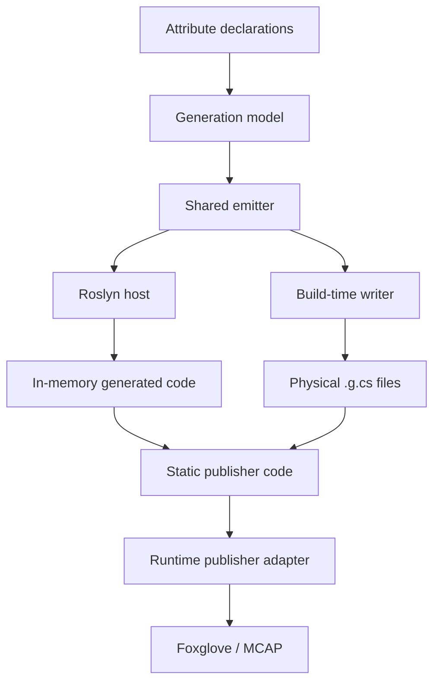

# Shared-Emitter Dual-Host AOT Code Generation for Unity Telemetry

**Draft Research Note — Unity2Foxglove Project, 2026-05-12**

## 1 Introduction

Telemetry systems in game engines and simulation frameworks typically rely on runtime reflection to discover annotated fields, read their values, and publish data. In a standard .NET JIT environment, this works reliably. Under Unity IL2CPP and broader C#/.NET ahead-of-time (AOT) compilation constraints, however, reflection-heavy runtime discovery becomes fragile: reflected members can be stripped by the linker, runtime code generation is unavailable, and build success does not guarantee that the runtime scanner will find the same metadata it found during development.

This note describes the source-generation architecture behind Unity2Foxglove's `[FoxRun]` telemetry mechanism. The central idea is to separate **when code is generated** from **what code is generated**. A platform-neutral shared emitter owns the generated-source semantics, while multiple host integrations invoke that emitter at different lifecycle points: a Roslyn source generator for Unity Editor ergonomics, and a build-time physical `.g.cs` writer for IL2CPP Player builds.

The result is a zero-CLR-reflection telemetry binding path: runtime code does not scan assemblies, inspect attributes, call `FieldInfo.GetValue()`, or emit IL dynamically to discover telemetry members. It only executes statically generated publisher code that has already been produced during compilation or build preparation.

The architecture also treats Player-build success as insufficient evidence by itself. A generated publisher can compile and still fail semantically under IL2CPP if the generated payload shape depends on metadata that the Player runtime strips. Unity2Foxglove therefore validates not only that physical `_FoxRun.g.cs` files participate in the IL2CPP build, but also that a built Player publishes concrete JSON payload values into Foxglove.

## 2 Problem

Telemetry systems often want APIs that look like this:

```csharp
[FoxRun("/debug/status")]
private string _status;
```

The user describes what should be published. The system handles how to publish it.

For Unity developers, this is intentionally close to the familiar `[SerializeField]` mental model: mark a member in a `MonoBehaviour`, keep the runtime code ordinary, and let the tooling build the supporting infrastructure around that declaration.

In a normal JIT runtime, such APIs are often implemented by runtime reflection: scan assemblies, find attributes, read fields, infer schemas, and publish values. That approach is convenient, but it becomes brittle under Unity IL2CPP and other AOT/trimming environments [10]:

- reflected members can be stripped unless explicitly preserved,
- runtime code generation is unavailable,
- Editor behavior can diverge from Player behavior,
- build success does not guarantee the runtime scanner will discover the same metadata.

For telemetry, silent failure is especially dangerous. A missing topic can look like "no data changed" instead of "the build removed the publisher."

## 3 Related Work

### 3.1 System.Text.Json Source Generation

Microsoft's `System.Text.Json` [1] replaces reflection-heavy serialization metadata with compile-time generated code. Microsoft documents source generation as useful for trimming and Native AOT scenarios. More generally, C# source generators [3] provide a compile-time mechanism for adding generated C# source to a user's compilation. The similarity is that both systems replace runtime reflection with generated code for AOT safety. The difference is domain: `System.Text.Json` focuses on JSON serialization contracts, normally with one Roslyn host, not Unity telemetry publication with a dual-host Editor/IL2CPP architecture.

### 3.2 MessagePack-CSharp AOT Generation

MessagePack-CSharp [2] provides AOT-friendly code generation for Unity/Xamarin-style strict-AOT environments. Current MessagePack-CSharp releases use source generation for annotated MessagePack types, while older documentation and versions also describe the `mpc` compiler workflow. This is the closest prior-art pattern to Unity2Foxglove's AOT approach: it recognizes that Unity/IL2CPP needs ahead-of-time generated C# instead of runtime code generation. The key difference is domain and host integration. Unity2Foxglove applies that AOT discipline to field/property-level telemetry, uses a shared emitter as the single generation-semantics source, and integrates the physical fallback into Unity's Player build path.

### 3.3 Unity Netcode for Entities Source Generators

Unity Netcode for Entities [4] uses Roslyn source generation to produce serialization and registration code, avoiding runtime reflection for replicated networking types. The product domain is DOTS/ECS networking, not MonoBehaviour telemetry or Foxglove/MCAP publication. Generated output is part of Unity Netcode's package pipeline, not a dual-host architecture with a shared emitter.

### 3.4 Refitter MSBuild Generation

Refitter [5] demonstrates a multi-entry code-generation workflow where CLI and MSBuild tooling can generate physical `.cs` files before compilation. Its input is OpenAPI contract files, and output is REST client code. The relevance is the multi-host pattern; the difference is that Refitter does not target Unity, IL2CPP, or telemetry publication.

### 3.5 Refit NativeAOT/Trimming Guidance

Refit [6, 7] recommends source-generator-first usage for Native AOT and trimming-sensitive applications. It focuses on HTTP client interface implementations and DTO serialization metadata, not scene/runtime telemetry binding.

### 3.6 ReactiveMarbles ObservableEvents Source Generator

ReactiveMarbles ObservableEvents [8] uses source generation to remove event-to-observable boilerplate and generate typed code from C# declarations. It targets event binding/reactive APIs, not AOT-safe telemetry publishing into visualization tools.

### 3.7 Rerun Logging APIs

Rerun [9] provides a declarative low-friction logging experience for visualization through calls like `rr.log(entity_path, entity)`. Rerun's primary public SDKs are Python, Rust, and C++. Unity2Foxglove adapts declarative telemetry to Unity, Foxglove schemas, MCAP, and IL2CPP constraints.

### 3.8 Comparison

| Feature | System.Text.Json | MessagePack | Unity Netcode | Refitter | Refit | ReactiveMarbles | Rerun | Unity2Foxglove |
| --- | --- | --- | --- | --- | --- | --- | --- | --- |
| Roslyn source generation | Yes | Yes | Yes | MSBuild/CLI | Yes | Yes | No | Yes |
| Physical fallback for AOT | Partial | Yes | No | Yes | No | No | N/A | Yes |
| Dual-host shared emitter | No | No | No | No | No | No | No | Yes |
| Unity IL2CPP target | No | Yes | Yes (DOTS) | No | No | No | No | Yes (MonoBehaviour) |
| Telemetry/visualization domain | No | No | Networking | REST clients | HTTP clients | Events | Visualization | Telemetry |
| Generated/AOT-friendly runtime path | Source-gen mode | Source-gen mode | Yes | Generated clients | Source-gen mode | Yes | N/A | Yes for telemetry binding |

The important boundary is conservative: Unity2Foxglove does not claim to invent source generation or AOT pre-generation. Many systems use these techniques. The narrower claim is that the reviewed public Unity telemetry tooling did not document this exact combination: declarative field/property telemetry attributes, a Roslyn Editor host, a Unity build-time physical `.g.cs` host for IL2CPP, a shared emitter as the generation-semantics source, zero CLR reflection for telemetry member binding at runtime, and Foxglove-compatible streaming and MCAP evidence in the same Unity package.

## 4 Design Principle

The key design principle is:

> Separate "when to generate" from "what to generate."

The shared emitter answers only one question: given a resolved telemetry model, what C# source code should be produced? In the current implementation that resolved model is the shared `FoxRunGenerationModel`; it is also serialized as `foxrun.generation-descriptor.json` so the Roslyn and build-time hosts can be compared at the same semantic boundary.

Host integrations answer a different question: when and where should that generated code be injected?



The emitter is the semantic reference point. Roslyn, Unity build hooks, MSBuild tasks, and CLI tools can all be hosts, but they should not each own a separate copy of the generation semantics.

## 5 Architecture

### 5.1 Attribute Declaration Layer

The user-facing API is intentionally small. A developer annotates fields or properties with `[FoxRun]`, including topic, rate, schema, and publish-policy options.

This layer does not expose Roslyn, IL2CPP, build hooks, generated files, or emitter internals.

### 5.2 Model Resolution Layer

Each host resolves source declarations into a host-independent model:

- containing type,
- member name,
- member type,
- topic,
- schema name,
- rate,
- publish mode,
- change epsilon,
- forced interval,
- diagnostic metadata.

Roslyn and build-time scanning produce this model through different mechanisms, but both lower into the same `FoxRunGenerationModel` DTOs before source emission. The Roslyn lowerer lives under `Editor/SourceGenerators/src/`, the reflection/build-time lowerer lives under `Editor/FoxRun/`, and shared descriptor/model files live under `Editor/Shared/FoxRunDescriptor/` with explicit `.csproj` links into the source-generator and validation projects.

The type fields in that model are intentionally split:

- `RawObservedTypeName` records what a host observed and is provenance only.
- `EmissionTypeName` is the legal C# type expression consumed by the source emitter and participates in semantic equality.
- `CanonicalType` is the normalized schema/contract token used for descriptor and manifest identity.

This distinction matters because Roslyn and reflection can observe the same type with different strings, such as `Outer.Inner` versus `Outer+Inner`, or C# generic syntax versus CLR generic names. The formatter and canonical normalizer turn those host-specific observations into stable emission and schema values before the shared emitter runs.

The descriptor is serialized from the same model instance passed to `FoxgloveSourceEmitter`. Semantic fields such as declaring type, member name, canonical type, topic, schema, encoding, publish mode, and policy values participate in equivalence checks. Provenance fields such as host kind, raw type display, member order, or conditional-symbol notes are retained for diagnostics but are not replay identity and do not define semantic equality.

### 5.3 Shared Emitter Layer

The shared emitter converts the generation model into C# source.

In Unity2Foxglove, this is implemented by:

```text
Packages/dev.unity2foxglove.sdk/Editor/Shared/FoxgloveSourceEmitter.cs
```

Its constraints are deliberate:

- no Unity scene access,
- no `UnityEditor` lifecycle dependency,
- no file-system side effects,
- no runtime reflection assumptions,
- deterministic source output for a given model.

The emitter exists to prevent semantic drift between Editor and Player generation paths.

### 5.4 Host Injection Layer

Unity2Foxglove currently uses two hosts:

| Host | Purpose | Output |
| --- | --- | --- |
| Roslyn source generator | Editor-time authoring and compile feedback | In-memory generated source via `AddSource()` |
| Unity build-time writer | IL2CPP Player build determinism | Physical `.g.cs` files before build |

The Roslyn path is implemented as an incremental source generator. It is fast and ergonomic during development because it can participate in Unity's analyzer pipeline without requiring the user to run a separate generation step. The physical `.g.cs` path gives the Player build a normal source file that participates in compilation and IL2CPP conversion.

The same canonical model now also produces generated runtime schema info under `Assets/Generated/FoxRun/FoxRunSchemaInfo.g.cs`. This file is compiled in both Editor Play Mode and Player builds, and it registers the current manifest hash plus type/contract/field metadata without runtime reflection. MCAP recording writes that evidence into `unity2foxglove.foxrun.schema`, and Unity replay compares the recorded `globalManifestHash` with the current runtime hash before playback. The registry does not own publisher behavior and does not recompute canonical hashes.

### 5.5 Runtime Layer

Runtime code only executes generated publishers. It does not:

- scan loaded assemblies for telemetry attributes,
- read attribute metadata at runtime,
- use `FieldInfo.GetValue()` to publish values,
- rely on dynamic IL generation.

This is the boundary that makes the telemetry path AOT-oriented instead of reflection-oriented.

Unity2Foxglove may still use explicit registration hooks plus a fallback Unity scene query, such as finding active `MonoBehaviour` instances and checking whether they implement `IFoxgloveLogSource`. That is runtime discovery in the Unity object model, not CLR reflection-based telemetry binding. The generated partial type implements the interface, and publisher execution then calls generated methods rather than inspecting fields or attributes.

The IL2CPP preservation story is also part of the boundary. Unity documents `link.xml` as a root-annotation mechanism for preserving assemblies, types, and members from managed code stripping [10]. Before a Player build, the build preprocess path writes physical `_FoxRun.g.cs` fallback files and generates `Assets/FoxRun_link.xml` entries for detected `[FoxRun]` user `MonoBehaviour` types with `preserve="all"`. If that scan or validation fails, the build fails fast instead of silently relying on stripped metadata. The precise runtime claim is therefore **zero CLR reflection for telemetry member discovery and field/property access**, not "no runtime object lookup anywhere" and not "no build-time reflection anywhere."

## 6 Semantic Equivalence

"Equivalent generation" does not mean the Roslyn output and physical `.g.cs` output must be byte-for-byte identical. It means their observable telemetry behavior must match.

For FoxRun publishers, the relevant equivalence surface includes:

- same topic names,
- same schema names,
- same field expansion behavior,
- same rate and publish-policy logic,
- same generated runtime adapter calls,
- same preservation requirements,
- same handling of member-name conflicts and NaN/change detection cases.

Text snapshots are useful, but they are not enough. Unity2Foxglove combines emitter tests, policy tests, runtime tests, IL2CPP smoke validation, and manual Foxglove checks to reduce drift risk.

There is an important caveat: the Roslyn host and the Unity build-time writer resolve declarations through different mechanisms. A Roslyn incremental source generator observes syntax and semantic model data, while the Unity build-time writer may inspect loaded assemblies during the Editor build phase. Unity2Foxglove now makes that boundary explicit by lowering both paths into `FoxRunGenerationModel` and comparing normalized descriptors at same-scope fixture granularity. A release-quality validation strategy therefore checks both:

- **model equivalence**: the same members, topics, schemas, publish modes, and diagnostics are passed to the emitter;
- **output equivalence**: the generated Roslyn source and physical `.g.cs` source are observably equivalent for telemetry behavior.

Current validation includes a Roslyn `CSharpGeneratorDriver` fixture, a compile-and-reflection fixture, a normalized descriptor comparison, negative semantic-drift checks, provenance-only drift checks, and a checked-in analyzer DLL inspection. This matters because Unity loads the package's checked-in analyzer DLL with the `RoslynAnalyzer` label; testing the source-generator source alone would not prove that Unity Editor users receive the same diagnostics and descriptor carrier.

The descriptor comparison is now reader-mediated instead of being a JSON field-removal shortcut. The Roslyn host emits descriptor JSON, the validation reader parses it back into `FoxRunGenerationModel`, and the shared comparer compares that model with the reflection-lowered model. The fixture deliberately includes primitive, array, generic list, nullable, nested, and Unity vector-like member types so `EmissionTypeName` equality is exercised where host drift is most likely. The same fixture also checks that build-time model emission and Roslyn model emission are byte-for-byte identical at the emitter boundary.

The descriptor remains audit evidence, not a replay guard key. Replay blocking still uses the canonical FoxRun `globalManifestHash` written to MCAP metadata, while `foxrun.generation-descriptor.json` helps diagnose generator host drift and sidecar evidence completeness.

The current IL2CPP acceptance evidence also includes a Player-run payload smoke. After the physical fallback generated `FoxRun115FManualProbe_FoxRun.g.cs`, a Win64 IL2CPP Player was built and connected to Foxglove at `ws://127.0.0.1:8765`. Foxglove showed concrete payload values for representative generated JSON topics:

```text
/debug/115f/array
sampleArray: [0.981964767, 0.981964767, 0.7611084]

/debug/115f/string
textValue: "frame 1906"

/debug/115f/list
sampleList: [-0.6825271, -7.308603, 3002]
```

This evidence is intentionally stronger than "the Player build succeeded": it verifies that the generated source survived IL2CPP and still produced observable payload semantics in the target viewer.

## 7 Failure Modes

A shared emitter removes a large class of host drift bugs, but it is also a single source of generated-code defects. If the emitter mishandles string escaping, locale-sensitive numeric formatting, topic grouping, or publish-mode precedence, both hosts can produce the same wrong code.

This is not a reason to avoid a shared emitter. It means the emitter must be treated as a compiler component:

- user-controlled strings must be escaped before entering C# literals;
- floating-point and timestamp formatting must be culture-invariant;
- publish-mode precedence needs tests and diagnostics;
- generated source should have snapshot or structural tests;
- generated JSON payloads must avoid anonymous object shapes that can lose property metadata under IL2CPP serialization;
- physical fallback output should be checked for freshness before IL2CPP release validation.

For example, if the emitter accidentally used the current UI culture and produced a floating-point literal such as `1,5f` instead of `1.5f`, the first line of defense should be emitter-output validation: source snapshots or structural checks around `FoxgloveSourceEmitter` should fail before the generated code reaches a Player build. Runtime behavior tests are the second line of defense, confirming that generated publishers actually publish the expected topics and payloads. This is why the evidence chain must include emitter-level tests, not only runtime smoke tests.

A later IL2CPP acceptance run exposed a related failure mode: anonymous-object payloads such as `new { textValue = this.textValue }` compiled successfully and advertised topics in Foxglove, but the Player serialized them as empty JSON objects. The fix was to emit explicit `Dictionary<string, object>` payloads, including nested dictionaries for Unity value decompositions. This made the generated source less idiomatic C#, but more robust under Unity IL2CPP and Newtonsoft.Json.

## 8 Validation Strategy

The architecture is validated at multiple levels:

| Validation | Purpose |
| --- | --- |
| Emitter output tests | Lock generated source structure |
| Generation-model tests | Confirm parsed metadata survives into the emitter model |
| Reader-mediated descriptor diff | Parses Roslyn descriptor JSON back into `FoxRunGenerationModel` and compares it with the build-time model |
| Runtime behavior tests | Confirm generated publishers publish expected payloads |
| IL2CPP build smoke | Confirm physical fallback files participate in Player builds |
| IL2CPP runtime payload smoke | Confirm a built Player publishes non-empty JSON payload values in Foxglove |
| Manual Foxglove smoke | Confirm topics appear and update in the target viewer |
| Release package checks | Confirm generated artifacts do not leak into samples/package contents |

Unity2Foxglove already includes validation suites that cover shared emitter behavior, FoxRun attribute defaults, publish-policy generation, MCAP recording/replay, package hygiene, and manual Unity/Foxglove acceptance.

Phase 112 adds a FoxRun canonical manifest governance layer to that evidence chain. The manifest is derived from deterministic JSON and its fingerprints ignore generated timestamps, comments, file paths, Unity `Library/` contents, and other machine-local state. Editor Play Mode refreshes the same manifest artifacts before play starts, while leaving physical `_FoxRun.g.cs` fallback generation to the Player build path. This makes the descriptor useful as release evidence without turning transient workstation details into semantic drift.

A debug overlay path stays outside that descriptor. It publishes explicit `/debug/...` schemaless JSON topics as non-contract diagnostics. Those messages are not included in `foxrun.manifest.json` or its fingerprints and are not replay guard keys, even if MCAP records them as ordinary JSON frames for visual inspection.

The MCAP schema metadata path is deliberately narrow: `unity2foxglove.foxrun.schema` stores compact JSON with `globalManifestHash`, the FoxRun section `manifestHash`, manifest/generator versions, counts, and per-contract diagnostic hashes. Replay blocks only on a `globalManifestHash` mismatch. A confirmed mismatch fails closed in explicit replay mode: the Manager aborts startup instead of falling back to live publishers. Missing or malformed recorded metadata is warning-only so older MCAP evidence remains readable.

The SDK schema manifest aggregate broadens release evidence without broadening replay governance. It records the FoxRun evidence summary, bundled protobuf registry, bundled ROS2 `.msg` registry, and SDK typed publisher catalog under `Assets/Generated/Unity2Foxglove/`. Its aggregate hash is useful for audit and coverage review, while replay remains governed only by the FoxRun `globalManifestHash` stored in MCAP metadata.

Schema Evidence identity policy makes that governance adjustable for different project stages. `Off` keeps demos and early debugging low-friction, `Warn` surfaces mismatches while allowing replay and live work to continue, and `Strict` treats the FoxRun identity as an acceptance gate. When MCAP recording runs with identity enabled, Unity2Foxglove writes a sibling `.schema` directory next to the `.mcap` and copies both the `FoxRun/` contract evidence and the broader `Unity2Foxglove/` aggregate evidence, giving each recording a portable audit bundle without changing the replay guard key. The FoxRun generation descriptor is copied into that sidecar when present as optional evidence; missing descriptor evidence is reported as a warning and does not make Strict recording incomplete.

## 9 Implementation Evidence

| Evidence | Location | Meaning |
| --- | --- | --- |
| Shared emitter | `Editor/Shared/FoxgloveSourceEmitter.cs` | Single source of generation semantics |
| Shared generation model | `Editor/Shared/FoxRunDescriptor/` | Host-independent model, descriptor writer, comparer, validator, and canonical type normalizer |
| Emission type formatter | `Editor/Shared/FoxRunDescriptor/FoxRunEmissionTypeNameFormatter.cs` | Converts Roslyn and reflection type observations into legal, stable C# source type names |
| FoxRun canonical manifest | `Editor/Shared/FoxRunManifest/` | Host-independent contract normalization and fingerprinting |
| Roslyn host | `Editor/SourceGenerators/src/FoxgloveLogSourceGenerator.cs` | Editor source generation path |
| Roslyn lowerer | `Editor/SourceGenerators/src/FoxRunRoslynGenerationModelLowerer.cs` | Converts Roslyn-extracted declarations into `FoxRunGenerationModel` |
| Build-time host | `Editor/FoxRun/FoxrunCodeGenerator.cs` | Physical `.g.cs` generation path |
| Build-time lowerer | `Editor/FoxRun/FoxRunReflectionGenerationModelLowerer.cs` | Converts reflection-scanned declarations into `FoxRunGenerationModel` |
| Generation descriptor | `Assets/Generated/FoxRun/foxrun.generation-descriptor.json` | Non-replay-blocking audit descriptor serialized from the model passed to the emitter |
| Descriptor reader validation | `Tests/Runtime/FoxRunGenerationDescriptorJsonReader.cs`, `Phase115FValidation.cs` | Test-owned parser that proves descriptor JSON round-trips back into the model comparer |
| Checked-in analyzer DLL | `Editor/SourceGenerators/analyzers/dotnet/cs/FoxgloveLogSourceGenerator.dll` | Unity-loaded Roslyn analyzer/source generator artifact; must be rebuilt after source changes |
| IL2CPP-safe JSON payload emission | `Editor/Shared/FoxgloveSourceEmitter.cs`, `Phase115FValidation.cs` | Emits dictionary payloads instead of anonymous objects so Player JSON serialization keeps payload fields |
| Play Mode manifest hook | `Editor/FoxRun/FoxrunManifestPlayModeHook.cs` | Refreshes canonical manifest artifacts before Editor Play Mode |
| Build preprocess hook | `Editor/FoxRun/FoxrunBuildPreprocess.cs` | Fails fast before Player build if generation/preservation fails |
| IL2CPP preservation | `Editor/FoxRun/FoxrunCodeGenerator.cs`, `Assets/FoxRun_link.xml` | Preserves detected user `MonoBehaviour` types for generated publisher execution |
| User declaration API | `Runtime/Components/Attributes/FoxRunAttribute.cs` | Topic/rate/schema/policy declaration surface |
| Runtime schema info | `Runtime/Components/FoxRun/FoxRunSchemaInfoRegistry.cs` | Exposes generated manifest hash evidence without reflection |
| MCAP schema metadata | `Runtime/Components/FoxRun/FoxRunSchemaMcapMetadata.cs` | Stores and compares recorded/current `globalManifestHash` values for replay mismatch protection |
| Runtime scheduler | `Runtime/Components/FoxRun/FoxgloveLogHub.cs` | Registers or discovers generated publisher interfaces without CLR reflection-based member binding |

This implementation also generates `FoxRun_link.xml` for IL2CPP preservation. That is separate from publisher execution: it is a build-time preservation artifact, not a runtime reflection scanner.

The FoxRun canonical manifest is the first concrete descriptor artifact in this traceability path. It is scoped to FoxRun automatic telemetry and governance only. The same fingerprints now feed generated runtime schema info, MCAP metadata, and replay mismatch checks; broader schema manifest sections can be added without changing this FoxRun contract boundary.

## 10 Contribution

Unity2Foxglove introduces an AOT-safe dual-host source generation architecture with a shared emitter for zero-reflection telemetry publishing in Unity Editor and IL2CPP Player builds.

The contribution is not the invention of Roslyn source generators, AOT pre-generation, WebSocket telemetry, or MCAP. It is the system-level integration of these known techniques into a Unity-native telemetry pipeline where:

- users declare telemetry with attributes,
- Editor and Player generation paths share one emitter,
- runtime telemetry publishing does not depend on reflection,
- generated behavior is covered by repeatable tests and release checks,
- generated files and validation artifacts can be archived as part of a traceable release evidence chain.

The strongest defensible novelty claim is:

> Unity2Foxglove demonstrates a Unity-native telemetry pipeline in which a shared emitter prevents semantic drift between Editor-time Roslyn generation and Player-build physical `.g.cs` generation, enabling Foxglove telemetry with zero CLR reflection for telemetry member binding under IL2CPP constraints.

The contribution boundary is:

- Unity2Foxglove is not an official Foxglove replacement.
- Unity2Foxglove is not a complete general-purpose MCAP library.
- Unity2Foxglove does not claim deterministic physics reproduction.
- Unity2Foxglove does not claim to invent Roslyn, AOT pre-generation, WebSocket telemetry, or MCAP.

The work is best framed as system integration and domain adaptation: existing code-generation ideas are organized into a new telemetry-specific architecture with Unity IL2CPP as the high-pressure target environment.

The traceability value is secondary to the AOT safety claim, but important for robotics and simulation evidence. A release can archive the physical `_FoxRun.g.cs` output, generation descriptors, validation logs, and MCAP smoke artifacts to show which telemetry bindings participated in a Player build. This makes missing or changed telemetry topics easier to audit after a recorded experiment.

A useful future comparison is Unity2Rerun or any other Unity telemetry target that reuses the same declaration-to-model layer. If a second target can share the model resolution and most emitter infrastructure while swapping only the runtime adapter and schema mapping, the architecture is better described as multi-target declarative telemetry rather than only a dual-host Foxglove generator. That claim should wait for measured migration evidence instead of being assumed here.

## 11 Future Work

The following evidence would strengthen this research note:

1. **Generated-vs-reflection benchmark.** Compare direct generated field access against `FieldInfo.GetValue()` and reflection-based publisher dispatch.

2. **Emitter migration/churn analysis.** If the shared-emitter pattern is reused in Unity2Rerun, measure how much code changes in the declaration/model layer, shared emitter infrastructure, schema mapping, and runtime adapter layer.

3. **Broader model-equivalence matrix.** The single-fixture descriptor comparison now proves the shared-model boundary, and the current manual evidence covers one IL2CPP Player payload smoke. Future work should extend that matrix to more Unity assemblies, asmdef layouts, conditional symbols, Unity value types, and additional Player-build scenarios.

4. **Player-build performance smoke.** Capture IL2CPP Player evidence for frame cost, allocations, and publisher behavior beyond the current payload-correctness smoke.

5. **Traceability bundle.** Archive physical `_FoxRun.g.cs` outputs, normalized generation descriptors, validation logs, and MCAP smoke artifacts with the release evidence so the telemetry binding used in an experiment can be audited later.

6. **Public evidence release.** Tag the exact version and archive it through Zenodo while keeping the repository-level `CITATION.cff` on the Zenodo Concept DOI. Record the version-specific DOI in release notes and evidence metadata only when exact artifact reproduction is required.

## 12 Conclusion

This note describes a dual-host, shared-emitter source generation architecture for Unity telemetry. The architecture separates generation semantics from host injection timing, enabling the same emitter to serve both Roslyn in-memory generation during Editor development and physical `.g.cs` file generation for IL2CPP Player builds.

The practical result is a telemetry pipeline where `[FoxRun]`-annotated fields and properties in Unity `MonoBehaviour` classes are compiled into static publisher code without runtime reflection. The shared emitter acts as the semantic reference point, preventing the Editor and Player generation paths from drifting apart silently.

The contribution is best understood as a compositional systems contribution: Roslyn source generation, AOT pre-generation, and Unity build hooks are established techniques, but their combination into a shared-emitter dual-host architecture for Unity telemetry publication, targeting Foxglove streaming, MCAP recording, and IL2CPP constraints in a single package, has not been identified in the reviewed public Unity telemetry literature and project documentation.

## References

[1] Microsoft. "Reflection versus source generation in System.Text.Json." Microsoft Learn. https://learn.microsoft.com/en-us/dotnet/standard/serialization/system-text-json/reflection-vs-source-generation

[2] MessagePack-CSharp Contributors. "MessagePack for C#." GitHub repository. https://github.com/MessagePack-CSharp/MessagePack-CSharp

[3] Microsoft .NET Blog. "Introducing C# Source Generators." https://devblogs.microsoft.com/dotnet/introducing-c-source-generators/

[4] Unity Technologies. "Netcode for Entities source generators." Unity Documentation. https://docs.unity.cn/Packages/com.unity.netcode%401.4/manual/source-generators.html

[5] Helle, C. "Refitter." GitHub repository. https://github.com/christianhelle/refitter

[6] ReactiveUI Contributors. "Refit: NativeAOT and trimming guidance." GitHub repository. https://github.com/reactiveui/refit#native-aot--trimming-guidance

[7] ReactiveUI Contributors. "Refit should be linker-friendly and support trimming." GitHub Issue #1389. https://github.com/reactiveui/refit/issues/1389

[8] ReactiveMarbles Contributors. "ReactiveMarbles ObservableEvents Source Generator." NuGet. https://www.nuget.org/packages/ReactiveMarbles.ObservableEvents.SourceGenerator/

[9] Rerun Contributors. "Rerun Python API: Logging functions." https://ref.rerun.io/docs/python/0.31.2/common/logging_functions/

[10] Unity Technologies. "Managed code stripping." Unity Manual. https://docs.unity.cn/Manual/ManagedCodeStripping.html

## Evidence Scope

This document records the design state represented by the current Unity2Foxglove repository documentation and the latest IL2CPP payload acceptance evidence. Future versions may add benchmark data, a broader IL2CPP Player matrix, a more complete related-work review, and a clearly versioned implementation artifact.
