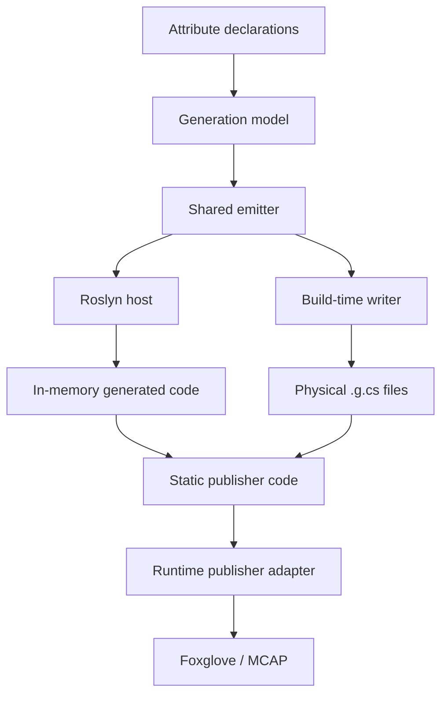

# Shared-Emitter Dual-Host AOT Code Generation for Unity Telemetry

## Abstract

This note describes the source-generation architecture behind Unity2Foxglove's `[FoxRun]` telemetry mechanism. The central idea is to separate **when code is generated** from **what code is generated**. A platform-neutral shared emitter owns the generated-source semantics, while multiple host integrations invoke that emitter at different lifecycle points: a Roslyn source generator for Unity Editor ergonomics, and a build-time physical `.g.cs` writer for IL2CPP Player builds.

The result is a zero-CLR-reflection telemetry binding path: runtime code does not scan assemblies, inspect attributes, call `FieldInfo.GetValue()`, or emit IL dynamically to discover telemetry members. It only executes statically generated publisher code that has already been produced during compilation or build preparation.

This architecture is motivated by Unity IL2CPP and broader C#/.NET AOT constraints, where reflection-heavy runtime discovery can be fragile under trimming, ahead-of-time compilation, or platform-specific build pipelines.

## Contribution Statement

Unity2Foxglove introduces an AOT-safe dual-host source generation architecture with a shared emitter for zero-reflection telemetry publishing in Unity Editor and IL2CPP Player builds.

The contribution is not the invention of Roslyn source generators, AOT pre-generation, WebSocket telemetry, or MCAP. It is the system-level integration of these known techniques into a Unity-native telemetry pipeline where:

- users declare telemetry with attributes,
- Editor and Player generation paths share one emitter,
- runtime telemetry publishing does not depend on reflection,
- generated behavior is covered by repeatable tests and release checks.

To the best of our knowledge, this specific combination has not been documented as a Unity-native Foxglove telemetry architecture before this project.

## Problem

Telemetry systems often want APIs that look like this:

```csharp
[FoxRun("/debug/status")]
private string _status;
```

The user describes what should be published. The system handles how to publish it.

For Unity developers, this is intentionally close to the familiar `[SerializeField]` mental model: mark a member in a `MonoBehaviour`, keep the runtime code ordinary, and let the tooling build the supporting infrastructure around that declaration.

In a normal JIT runtime, such APIs are often implemented by runtime reflection: scan assemblies, find attributes, read fields, infer schemas, and publish values. That approach is convenient, but it becomes brittle under Unity IL2CPP and other AOT/trimming environments:

- reflected members can be stripped unless explicitly preserved,
- runtime code generation is unavailable,
- Editor behavior can diverge from Player behavior,
- build success does not guarantee the runtime scanner will discover the same metadata.

For telemetry, silent failure is especially dangerous. A missing topic can look like "no data changed" instead of "the build removed the publisher."

## Design Principle

The key design principle is:

> Separate "when to generate" from "what to generate."

The shared emitter answers only one question: given a resolved telemetry model, what C# source code should be produced?

Host integrations answer a different question: when and where should that generated code be injected?



The emitter is the semantic reference point. Roslyn, Unity build hooks, MSBuild tasks, and CLI tools can all be hosts, but they should not each own a separate copy of the generation semantics.

## Architecture Layers

### Attribute Declaration Layer

The user-facing API is intentionally small. A developer annotates fields or properties with `[FoxRun]`, including topic, rate, schema, and publish-policy options.

This layer should not expose Roslyn, IL2CPP, build hooks, generated files, or emitter internals.

### Model Resolution Layer

Each host resolves source declarations into a host-independent model:

- containing type,
- member name,
- member type,
- topic,
- schema name,
- rate,
- publish mode,
- change epsilon,
- forced interval,
- diagnostic metadata.

Roslyn and build-time scanning can produce this model through different mechanisms, but the model passed to the emitter should converge.

### Shared Emitter Layer

The shared emitter converts the generation model into C# source.

In Unity2Foxglove, this is implemented by:

```text
Packages/dev.unity2foxglove.sdk/Editor/Shared/FoxgloveSourceEmitter.cs
```

Its constraints are deliberate:

- no Unity scene access,
- no `UnityEditor` lifecycle dependency,
- no file-system side effects,
- no runtime reflection assumptions,
- deterministic source output for a given model.

The emitter exists to prevent semantic drift between Editor and Player generation paths.

### Host Injection Layer

Unity2Foxglove currently uses two hosts:

| Host | Purpose | Output |
| --- | --- | --- |
| Roslyn source generator | Editor-time authoring and compile feedback | In-memory generated source via `AddSource()` |
| Unity build-time writer | IL2CPP Player build determinism | Physical `.g.cs` files before build |

The Roslyn path is fast and ergonomic during development. The physical `.g.cs` path gives the Player build a normal source file that participates in compilation and IL2CPP conversion.

### Runtime Layer

Runtime code only executes generated publishers. It does not:

- scan loaded assemblies for telemetry attributes,
- read attribute metadata at runtime,
- use `FieldInfo.GetValue()` to publish values,
- rely on dynamic IL generation.

This is the boundary that makes the telemetry path AOT-oriented instead of reflection-oriented.

Unity2Foxglove may still use explicit registration hooks plus a fallback Unity scene query, such as finding active `MonoBehaviour` instances and checking whether they implement `IFoxgloveLogSource`. That is runtime discovery in the Unity object model, not CLR reflection-based telemetry binding. The generated partial type implements the interface, and publisher execution then calls generated methods rather than inspecting fields or attributes.

The IL2CPP preservation story is also part of the boundary. Before a Player build, the build preprocess path writes physical `_FoxRun.g.cs` fallback files and generates `Assets/FoxRun_link.xml` entries for detected `[FoxRun]` user `MonoBehaviour` types with `preserve="all"`. If that scan or validation fails, the build fails fast instead of silently relying on stripped metadata. The precise runtime claim is therefore **zero CLR reflection for telemetry member discovery and field/property access**, not "no runtime object lookup anywhere" and not "no build-time reflection anywhere."

## Unity2Foxglove Implementation Evidence

| Evidence | Location | Meaning |
| --- | --- | --- |
| Shared emitter | `Editor/Shared/FoxgloveSourceEmitter.cs` | Single source of generation semantics |
| Roslyn host | `Editor/SourceGenerators/src/FoxgloveLogSourceGenerator.cs` | Editor source generation path |
| Build-time host | `Editor/FoxrunCodeGenerator.cs` | Physical `.g.cs` generation path |
| Build preprocess hook | `Editor/FoxrunBuildPreprocess.cs` | Fails fast before Player build if generation/preservation fails |
| IL2CPP preservation | `Editor/FoxrunCodeGenerator.cs`, `Assets/FoxRun_link.xml` | Preserves detected user `MonoBehaviour` types for generated publisher execution |
| User declaration API | `Runtime/Unity/Attributes/FoxRunAttribute.cs` | Topic/rate/schema/policy declaration surface |
| Runtime scheduler | `Runtime/Unity/FoxgloveLogHub.cs` | Registers or discovers generated publisher interfaces without CLR reflection-based member binding |

This implementation also generates `FoxRun_link.xml` for IL2CPP preservation. That is separate from publisher execution: it is a build-time preservation artifact, not a runtime reflection scanner.

## Semantic Equivalence Boundary

"Equivalent generation" does not mean the Roslyn output and physical `.g.cs` output must be byte-for-byte identical. It means their observable telemetry behavior must match.

For FoxRun publishers, the relevant equivalence surface includes:

- same topic names,
- same schema names,
- same field expansion behavior,
- same rate and publish-policy logic,
- same generated runtime adapter calls,
- same preservation requirements,
- same handling of member-name conflicts and NaN/change detection cases.

Text snapshots are useful, but they are not enough. Unity2Foxglove combines emitter tests, policy tests, runtime tests, IL2CPP smoke validation, and manual Foxglove checks to reduce drift risk.

There is an important caveat: the Roslyn host and the Unity build-time writer can resolve the input model through different mechanisms. For example, a Roslyn incremental source generator observes syntax and semantic model data, while a Unity build-time writer may inspect loaded assemblies during the Editor build phase. The shared emitter prevents drift after the model is resolved, but it does not automatically prove that both hosts resolved the exact same model. A release-quality validation strategy must therefore check both:

- **model equivalence**: the same members, topics, schemas, publish modes, and diagnostics are passed to the emitter;
- **output equivalence**: the generated Roslyn source and physical `.g.cs` source are observably equivalent for telemetry behavior.

Phase 50 explicitly starts closing this gap by adding physical generated-file freshness checks for `TestLog_FoxRun.g.cs`. A deeper semantic diff between Roslyn-generated output and build-time output remains a higher-confidence follow-up.

A practical next step is to make each host emit a normalized generation descriptor, for example JSON containing the declaring type, member name, member type, topic, schema, rate, publish mode, diagnostics, and preservation requirements. CI can then diff the descriptors before comparing generated source. That keeps the check close to the model-equivalence claim without requiring tests to compare host-specific Roslyn or Unity object graphs directly.

## Shared Emitter Failure Mode

A shared emitter removes a large class of host drift bugs, but it is also a single source of generated-code defects. If the emitter mishandles string escaping, locale-sensitive numeric formatting, topic grouping, or publish-mode precedence, both hosts can produce the same wrong code.

This is not a reason to avoid a shared emitter. It means the emitter must be treated as a compiler component:

- user-controlled strings must be escaped before entering C# literals;
- floating-point and timestamp formatting must be culture-invariant;
- publish-mode precedence needs tests and diagnostics;
- generated source should have snapshot or structural tests;
- physical fallback output should be checked for freshness before IL2CPP release validation.

For example, if the emitter accidentally used the current UI culture and produced a floating-point literal such as `1,5f` instead of `1.5f`, the first line of defense should be emitter-output validation: source snapshots or structural checks around `FoxgloveSourceEmitter` should fail before the generated code reaches a Player build. Runtime behavior tests are the second line of defense, confirming that generated publishers actually publish the expected topics and payloads. This is why the evidence chain must include emitter-level tests, not only runtime smoke tests.

## Validation Strategy

The architecture should be validated at multiple levels:

| Validation | Purpose |
| --- | --- |
| Emitter output tests | Lock generated source structure |
| Generation-model tests | Confirm parsed metadata survives into the emitter model |
| Normalized descriptor diff | Future release gate comparing Roslyn and build-time host models before source comparison |
| Runtime behavior tests | Confirm generated publishers publish expected payloads |
| IL2CPP build smoke | Confirm physical fallback files participate in Player builds |
| Manual Foxglove smoke | Confirm topics appear and update in the target viewer |
| Release package checks | Confirm generated artifacts do not leak into samples/package contents |

Unity2Foxglove already includes validation phases that cover shared emitter behavior, FoxRun attribute defaults, publish-policy generation, MCAP recording/replay, package hygiene, and manual Unity/Foxglove acceptance.

## Related Work and Prior Art

This architecture sits near several existing practices, but has a different target:

| System / Practice | Similarity | Difference |
| --- | --- | --- |
| [`System.Text.Json` source generation](https://learn.microsoft.com/en-us/dotnet/standard/serialization/system-text-json/reflection-vs-source-generation) | Replaces reflection-heavy serialization metadata with generated code; Microsoft documents source generation as useful for trimming and Native AOT scenarios | Focused on JSON serialization contracts, not Unity telemetry publication; normally one Roslyn host, not Unity Editor plus IL2CPP physical fallback |
| [MessagePack-CSharp AOT generation](https://msgpack.org/index.html) | Provides AOT code generation for Unity/Xamarin-style strict-AOT environments; `mpc` uses Roslyn analysis to generate C# ahead of time | Focused on formatter/resolver generation rather than telemetry publishers; the CLI path is usually a developer/build tool, not a Unity-specific dual-host telemetry workflow |
| [Unity Netcode for Entities source generators](https://docs.unity.cn/Packages/com.unity.netcode%401.4/manual/source-generators.html) | Unity uses Roslyn source generation to produce serialization/registration code and avoid runtime reflection for replicated networking types | Product domain is DOTS/ECS networking, not MonoBehaviour telemetry or Foxglove/MCAP publication; generated output is part of Unity Netcode's package pipeline |
| [Refitter MSBuild generation](https://refitter.github.io/articles/msbuild.html) | Shows a multi-entry code-generation workflow where CLI/MSBuild tooling can generate physical `.cs` files before compilation | Input is OpenAPI contract files, not runtime telemetry attributes; output is REST client code rather than Unity publisher code |
| [Refit NativeAOT/trimming guidance](https://github.com/reactiveui/refit#native-aot--trimming-guidance) | Recommends source-generator-first usage for Native AOT and trimming-sensitive applications | Focused on HTTP client interface implementations and DTO serialization metadata, not scene/runtime telemetry binding |
| [ReactiveMarbles ObservableEvents source generator](https://www.nuget.org/packages/ReactiveMarbles.ObservableEvents.SourceGenerator/) | Uses source generation to remove event-to-observable boilerplate and generate typed code from C# declarations | Targets event binding/reactive APIs, not AOT-safe telemetry publishing into visualization tools |
| [Rerun logging APIs](https://ref.rerun.io/docs/python/0.31.2/common/logging_functions/) | Provides a declarative low-friction logging experience for visualization through calls like `rr.log(entity_path, entity)` | Rerun's primary public SDKs are Python/Rust/C++; Unity2Foxglove adapts declarative telemetry to Unity, Foxglove schemas, MCAP, and IL2CPP constraints |

The important boundary is conservative: Unity2Foxglove does not claim to invent source generation or AOT pre-generation. It claims that a shared-emitter, dual-host architecture is a practical way to make declarative Unity telemetry work across Editor and IL2CPP Player builds without runtime reflection.

The closest prior-art pattern is MessagePack-CSharp's AOT generation ecosystem: it recognizes that Unity/IL2CPP needs ahead-of-time generated C# instead of runtime code generation. The key difference is domain and host integration. Unity2Foxglove applies that AOT discipline to field/property-level telemetry, uses a shared emitter as the single telemetry generation semantics source, and integrates the physical fallback into Unity's Player build path.

A useful future comparison is Unity2Rerun or any other Unity telemetry target that reuses the same declaration-to-model layer. If a second target can share the model resolution and most emitter infrastructure while swapping only the runtime adapter and schema mapping, the architecture is better described as multi-target declarative telemetry rather than only a dual-host Foxglove generator. That claim should wait for measured migration evidence instead of being assumed here.

The strongest prior-art contrast is therefore not "nobody uses source generators." Many systems do. The narrower claim is that, to the best of our knowledge, public Unity telemetry tooling has not documented this exact combination:

- declarative field/property telemetry attributes;
- Roslyn Editor host;
- Unity build-time physical `.g.cs` host for IL2CPP;
- shared emitter as the generation-semantics source;
- zero CLR reflection for telemetry member binding at runtime;
- Foxglove-compatible streaming and MCAP evidence in the same Unity package.

## Novelty Boundary

The strongest defensible novelty claim is:

> Unity2Foxglove demonstrates a Unity-native telemetry pipeline in which a shared emitter prevents semantic drift between Editor-time Roslyn generation and Player-build physical `.g.cs` generation, enabling Foxglove telemetry with zero CLR reflection for telemetry member binding under IL2CPP constraints.

The claim should avoid overstatements such as:

- absolute first-in-the-world claims,
- "official Foxglove replacement",
- replay claims that imply deterministic physics reproduction,
- claims that the project is a complete general-purpose MCAP library.

The work is best framed as system integration and domain adaptation: existing code-generation ideas are organized into a new telemetry-specific architecture with Unity IL2CPP as the high-pressure target environment.

## Future Technical Report Work

Before turning this note into a paper section, the following evidence would make the argument stronger:

1. **Generated-vs-reflection benchmark**

   Compare direct generated field access against `FieldInfo.GetValue()` and reflection-based publisher dispatch.

2. **Emitter migration/churn analysis**

   If the shared-emitter pattern is reused in Unity2Rerun, measure how much code changes in the declaration/model layer, shared emitter infrastructure, schema mapping, and runtime adapter layer.

3. **Model and generated-output equivalence checks**

   Compare Roslyn and physical writer output at the semantic level rather than only through text snapshots. A minimal release gate should at least detect stale physical `.g.cs` files for demo/sample sources; a stronger gate should have both hosts emit normalized JSON descriptors, diff resolved generation models, and then compare generated output structure between hosts.

4. **Player-build performance smoke**

   Capture IL2CPP Player evidence for frame cost, allocations, and publisher behavior.

5. **Public evidence release**

   Tag the exact version, archive it through Zenodo, and cite that DOI from `CITATION.cff`, `PAPER.md`, and release notes.

## References

- Microsoft .NET Blog: [Introducing C# Source Generators](https://devblogs.microsoft.com/dotnet/introducing-c-source-generators/)
- Microsoft Learn: [Reflection versus source generation in System.Text.Json](https://learn.microsoft.com/en-us/dotnet/standard/serialization/system-text-json/reflection-vs-source-generation)
- MessagePack: [MessagePack for C# AOT Code Generation](https://msgpack.org/index.html)
- Unity: [Netcode for Entities source generators](https://docs.unity.cn/Packages/com.unity.netcode%401.4/manual/source-generators.html)
- Refitter: [GitHub repository](https://github.com/christianhelle/refitter)
- Refit: [NativeAOT and trimming guidance](https://github.com/reactiveui/refit#native-aot--trimming-guidance)
- ReactiveUI Refit issue 1389: [Refit should be linker-friendly and support trimming](https://github.com/reactiveui/refit/issues/1389)
- ReactiveMarbles ObservableEvents source generator: [NuGet package](https://www.nuget.org/packages/ReactiveMarbles.ObservableEvents.SourceGenerator/)
- Rerun Python API: [Logging functions](https://ref.rerun.io/docs/python/0.31.2/common/logging_functions/)
