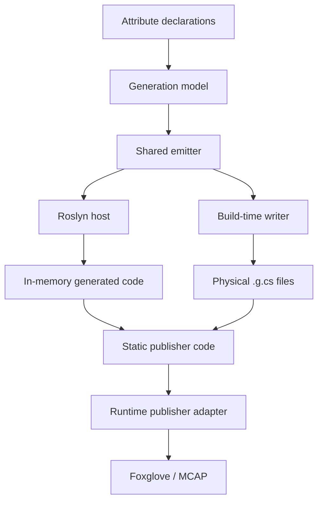

# Shared-Emitter Dual-Host AOT Code Generation for Unity Telemetry

## Abstract

This note describes the source-generation architecture behind Unity2Foxglove's `[FoxRun]` telemetry mechanism. The central idea is to separate **when code is generated** from **what code is generated**. A platform-neutral shared emitter owns the generated-source semantics, while multiple host integrations invoke that emitter at different lifecycle points: a Roslyn source generator for Unity Editor ergonomics, and a build-time physical `.g.cs` writer for IL2CPP Player builds.

The result is a zero-runtime-reflection telemetry path: runtime code does not scan assemblies, inspect attributes, or emit IL dynamically. It only executes statically generated publisher code that has already been produced during compilation or build preparation.

This architecture is motivated by Unity IL2CPP and broader C#/.NET AOT constraints, where reflection-heavy runtime discovery can be fragile under trimming, ahead-of-time compilation, or platform-specific build pipelines.

## Contribution Statement

Unity2Foxglove introduces an AOT-safe dual-host source generation architecture with a shared emitter for zero-reflection telemetry publishing in Unity Editor and IL2CPP Player builds.

The contribution is not the invention of Roslyn source generators, AOT pre-generation, WebSocket telemetry, or MCAP. It is the system-level integration of these known techniques into a Unity-native telemetry pipeline where:

- users declare telemetry with attributes,
- Editor and Player generation paths share one emitter,
- runtime telemetry publishing does not depend on reflection,
- generated behavior is covered by repeatable tests and release checks.

To the best of our knowledge, this specific combination has not been documented as a Unity-native Foxglove telemetry architecture before this project.

## Problem

Telemetry systems often want APIs that look like this:

```csharp
[FoxRun("/debug/status")]
private string _status;
```

The user describes what should be published. The system handles how to publish it.

In a normal JIT runtime, such APIs are often implemented by runtime reflection: scan assemblies, find attributes, read fields, infer schemas, and publish values. That approach is convenient, but it becomes brittle under Unity IL2CPP and other AOT/trimming environments:

- reflected members can be stripped unless explicitly preserved,
- runtime code generation is unavailable,
- Editor behavior can diverge from Player behavior,
- build success does not guarantee the runtime scanner will discover the same metadata.

For telemetry, silent failure is especially dangerous. A missing topic can look like "no data changed" instead of "the build removed the publisher."

## Design Principle

The key design principle is:

> Separate "when to generate" from "what to generate."

The shared emitter answers only one question: given a resolved telemetry model, what C# source code should be produced?

Host integrations answer a different question: when and where should that generated code be injected?



The emitter is the semantic reference point. Roslyn, Unity build hooks, MSBuild tasks, and CLI tools can all be hosts, but they should not each own a separate copy of the generation semantics.

## Architecture Layers

### Attribute Declaration Layer

The user-facing API is intentionally small. A developer annotates fields or properties with `[FoxRun]`, including topic, rate, schema, and publish-policy options.

This layer should not expose Roslyn, IL2CPP, build hooks, generated files, or emitter internals.

### Model Resolution Layer

Each host resolves source declarations into a host-independent model:

- containing type,
- member name,
- member type,
- topic,
- schema name,
- rate,
- publish mode,
- change epsilon,
- forced interval,
- diagnostic metadata.

Roslyn and build-time scanning can produce this model through different mechanisms, but the model passed to the emitter should converge.

### Shared Emitter Layer

The shared emitter converts the generation model into C# source.

In Unity2Foxglove, this is implemented by:

```text
Packages/dev.unity2foxglove.sdk/Editor/Shared/FoxgloveSourceEmitter.cs
```

Its constraints are deliberate:

- no Unity scene access,
- no `UnityEditor` lifecycle dependency,
- no file-system side effects,
- no runtime reflection assumptions,
- deterministic source output for a given model.

The emitter exists to prevent semantic drift between Editor and Player generation paths.

### Host Injection Layer

Unity2Foxglove currently uses two hosts:

| Host | Purpose | Output |
| --- | --- | --- |
| Roslyn source generator | Editor-time authoring and compile feedback | In-memory generated source via `AddSource()` |
| Unity build-time writer | IL2CPP Player build determinism | Physical `.g.cs` files before build |

The Roslyn path is fast and ergonomic during development. The physical `.g.cs` path gives the Player build a normal source file that participates in compilation and IL2CPP conversion.

### Runtime Layer

Runtime code only executes generated publishers. It does not:

- scan loaded assemblies for telemetry attributes,
- read attribute metadata at runtime,
- use `FieldInfo.GetValue()` to publish values,
- rely on dynamic IL generation.

This is the boundary that makes the telemetry path AOT-oriented instead of reflection-oriented.

## Unity2Foxglove Implementation Evidence

| Evidence | Location | Meaning |
| --- | --- | --- |
| Shared emitter | `Editor/Shared/FoxgloveSourceEmitter.cs` | Single source of generation semantics |
| Roslyn host | `Editor/SourceGenerators/src/FoxgloveLogSourceGenerator.cs` | Editor source generation path |
| Build-time host | `Editor/FoxrunCodeGenerator.cs` | Physical `.g.cs` generation path |
| Build preprocess hook | `Editor/FoxrunBuildPreprocess.cs` | Fails fast before Player build if generation/preservation fails |
| User declaration API | `Runtime/Unity/Attributes/FoxRunAttribute.cs` | Topic/rate/schema/policy declaration surface |
| Runtime scheduler | `Runtime/Unity/FoxgloveLogHub.cs` | Executes generated publishers without runtime discovery |

This implementation also generates `FoxRun_link.xml` for IL2CPP preservation. That is separate from publisher execution: it is a build-time preservation artifact, not a runtime reflection scanner.

## Semantic Equivalence Boundary

"Equivalent generation" does not mean the Roslyn output and physical `.g.cs` output must be byte-for-byte identical. It means their observable telemetry behavior must match.

For FoxRun publishers, the relevant equivalence surface includes:

- same topic names,
- same schema names,
- same field expansion behavior,
- same rate and publish-policy logic,
- same generated runtime adapter calls,
- same preservation requirements,
- same handling of member-name conflicts and NaN/change detection cases.

Text snapshots are useful, but they are not enough. Unity2Foxglove combines emitter tests, policy tests, runtime tests, IL2CPP smoke validation, and manual Foxglove checks to reduce drift risk.

## Validation Strategy

The architecture should be validated at multiple levels:

| Validation | Purpose |
| --- | --- |
| Emitter output tests | Lock generated source structure |
| Generation-model tests | Confirm parsed metadata survives into the emitter model |
| Runtime behavior tests | Confirm generated publishers publish expected payloads |
| IL2CPP build smoke | Confirm physical fallback files participate in Player builds |
| Manual Foxglove smoke | Confirm topics appear and update in the target viewer |
| Release package checks | Confirm generated artifacts do not leak into samples/package contents |

Unity2Foxglove already includes validation phases that cover shared emitter behavior, FoxRun attribute defaults, publish-policy generation, MCAP recording/replay, package hygiene, and manual Unity/Foxglove acceptance.

## Related Work Boundary

This architecture sits near several existing practices, but has a different target:

| System / Practice | Similarity | Difference |
| --- | --- | --- |
| `System.Text.Json` source generation | Replaces reflection-heavy serialization metadata with generated code | Focused on JSON serialization contracts, not Unity telemetry publication |
| MessagePack-CSharp AOT generation | Uses pre-generated code for AOT environments | Focused on formatter/serializer generation |
| Unity Netcode source generators | Uses source generation to avoid runtime reflection in Unity networking | Product domain is ECS/network replication rather than telemetry publishing |
| Refitter / Refit source generation | Shows multiple codegen entry points and NativeAOT-oriented client generation | Input is OpenAPI/interface contracts, not runtime telemetry attributes |
| Rerun-style declarative logging | Provides a low-friction developer experience for visualization/logging | Unity2Foxglove adapts declarative telemetry to Unity/Foxglove/IL2CPP constraints |

The important boundary is conservative: Unity2Foxglove does not claim to invent source generation or AOT pre-generation. It claims that a shared-emitter, dual-host architecture is a practical way to make declarative Unity telemetry work across Editor and IL2CPP Player builds without runtime reflection.

## Novelty Boundary

The strongest defensible novelty claim is:

> Unity2Foxglove demonstrates a Unity-native telemetry pipeline in which a shared emitter prevents semantic drift between Editor-time Roslyn generation and Player-build physical `.g.cs` generation, enabling zero-runtime-reflection Foxglove telemetry under IL2CPP constraints.

The claim should avoid overstatements such as:

- absolute first-in-the-world claims,
- "official Foxglove replacement",
- replay claims that imply deterministic physics reproduction,
- claims that the project is a complete general-purpose MCAP library.

The work is best framed as system integration and domain adaptation: existing code-generation ideas are organized into a new telemetry-specific architecture with Unity IL2CPP as the high-pressure target environment.

## Future Technical Report Work

Before turning this note into a paper section, the following evidence would make the argument stronger:

1. **Generated-vs-reflection benchmark**

   Compare direct generated field access against `FieldInfo.GetValue()` and reflection-based publisher dispatch.

2. **Emitter migration/churn analysis**

   If the shared-emitter pattern is reused in Unity2Rerun, measure how much code changes in the emitter/model layer versus runtime adapter layer.

3. **Generated-output equivalence checks**

   Compare Roslyn and physical writer output at the semantic level rather than only through text snapshots.

4. **Player-build performance smoke**

   Capture IL2CPP Player evidence for frame cost, allocations, and publisher behavior.

5. **Public evidence release**

   Tag the exact version, archive it through Zenodo, and cite that DOI from `CITATION.cff`, `PAPER.md`, and release notes.

## References

- Microsoft .NET Blog: [Introducing C# Source Generators](https://devblogs.microsoft.com/dotnet/introducing-c-source-generators/)
- Microsoft Learn: [Reflection versus source generation in System.Text.Json](https://learn.microsoft.com/en-us/dotnet/standard/serialization/system-text-json/reflection-vs-source-generation)
- MessagePack: [MessagePack for C# AOT Code Generation](https://msgpack.org/index.html)
- Unity: [Netcode for Entities source generators](https://docs.unity.cn/Packages/com.unity.netcode%401.4/manual/source-generators.html)
- Refitter: [GitHub repository](https://github.com/christianhelle/refitter)
- Refit: [NativeAOT and trimming guidance](https://github.com/reactiveui/refit#native-aot--trimming-guidance)
- ReactiveUI Refit issue 1389: [Refit should be linker-friendly and support trimming](https://github.com/reactiveui/refit/issues/1389)
