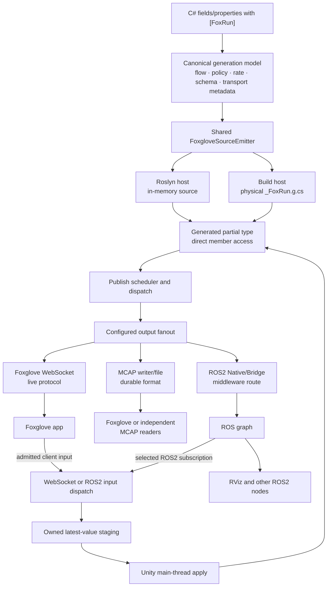
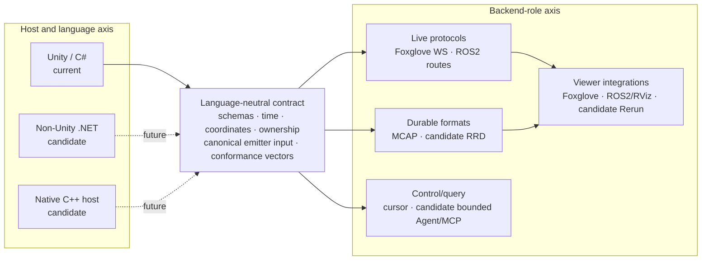

# Shared-Emitter Dual-Host AOT Code Generation for Bidirectional Unity Telemetry

Updated: 2026-07-28

## Abstract

FoxRun turns annotated Unity fields and properties into static telemetry bindings. A binding can publish from Unity, subscribe into Unity, or do both. The same resolved generation model feeds two hosts: a Roslyn source generator for normal Editor compilation and a build-time writer that emits physical `_FoxRun.g.cs` files for IL2CPP Player builds.

The architecture is deliberately bidirectional but asymmetric at the transport boundary. One subscribed member has exactly one resolved input source for a session, while a published member may fan out to Foxglove WebSocket, MCAP recording, and supported ROS2 routes. Generated input code stages owned values off the Unity main thread and applies them on the main thread. Generated output code reads the member directly and dispatches through the configured sinks. Neither path discovers or accesses FoxRun members through CLR reflection at runtime.

This note describes the public declaration model, its lowering into generated code, the runtime safety boundary, and the evidence used to keep Roslyn and IL2CPP behavior equivalent.

It also records a deliberately narrower portability claim. The current system
is a Unity-first C# implementation with useful extraction seams; it is not yet
a platform-neutral core or a multi-language SDK. The longer-term candidate is
a language-neutral semantic contract with independently tested host and
backend adapters. That direction must be proven by a non-Unity consumer or a
second backend rather than inferred from interface names.

## 1. FoxRun's User Mental Model

FoxRun is a field binding, not merely a publishing shortcut. The topic is positional; direction, update policy, and rate are optional.

```csharp
using static Unity.FoxgloveSDK.Components.FoxRunFlow;
using static Unity.FoxgloveSDK.Components.FoxRunPolicy;

public partial class RobotTelemetry : MonoBehaviour
{
    // Defaults: Publish + FixedRate + 10 Hz.
    [FoxRun("/robot/pose")]
    private PoseState _pose;

    // Apply subscribed changes on the Unity main thread, at most 30 times/s.
    [FoxRun("/robot/state", Mode = Subscribe, Policy = Change, Hz = 30)]
    private RobotState _state;

    // Debug-oriented full duplex binding. Both directions use the same policy/rate.
    [FoxRun("/debug/state", Mode = PublishAndSubscribe, Policy = FixedRate, Hz = 10)]
    private DebugState _debugState;

    // Explicit API-driven update only; a periodic rate is invalid here.
    [FoxRun("/robot/reset", Policy = Trigger)]
    private ResetEvent _reset;
}
```

The default is intentionally useful:

```csharp
[FoxRun("/debug/position")]
private Vector3 _position;
```

is a 10 Hz fixed-rate publisher. Users add options only when the data flow or scheduling semantics differ.

### 1.1 Flow

| `Mode` | Unity member behavior | Intended use |
| --- | --- | --- |
| `Publish` | Reads the Unity member and emits it to enabled output sinks. This is the default. | Normal telemetry and visualization. |
| `Subscribe` | Accepts one resolved external source, stages the newest owned value, and applies it on the Unity main thread. | Remote state injection and controls. |
| `PublishAndSubscribe` | Enables both halves with one declaration. Inbound application is not echoed back as a new outbound update. | Debugging and integration; avoid where ownership would be ambiguous in production. |

### 1.2 Policy

The three policies describe when a direction is eligible to update. They are not transport QoS settings.

| `Policy` | Publish behavior | Subscribe behavior |
| --- | --- | --- |
| `FixedRate` | Emits the current value on each eligible cadence. | Applies only when a newer staged value exists; it never re-applies stale data just because a timer fired. |
| `Change` without `Hz` | Emits the first value and later value changes. | Applies changed accepted values at the next main-thread opportunity, bounded by the safety ceiling. |
| `Change` with `Hz` | Emits changes and supplies a heartbeat at `Hz`. | May apply a newly received equal duplicate at `Hz`; it never invents a heartbeat from old staged state. |
| `Trigger` | Emits only through the generated explicit publish API. | Applies only through the generated explicit apply API. A positive `Hz` is contradictory and fails validation. |

### 1.3 What `Hz` Means

`Hz` is a declaration-level scheduling override:

- on publish, it is the maximum output cadence;
- on subscribe, it is the maximum Unity main-thread apply cadence;
- on full duplex, the two directions are scheduled independently under the same ceiling.

It does not throttle network receive callbacks, alter discovery, select a
provider, or change ROS2 QoS. Fixed-rate declarations without `Hz` inherit the
appropriate frozen Manager default. `Change` without `Hz` applies changed input
at the next main-thread opportunity; `Change + Hz` adds a heartbeat/duplicate
refresh cadence.

## 2. Why Static Generation Is Required

Unity has two materially different authoring and deployment environments:

- Editor development benefits from Roslyn generation during compilation [3].
- IL2CPP Players require ahead-of-time-visible source and preservation
  evidence; runtime IL emission is unavailable and reflection-only metadata
  may be stripped [1][2].

A telemetry system that scans assemblies, reads attributes, and calls `FieldInfo.GetValue()` or `SetValue()` on every message is fragile under stripping and expensive on hot paths. Silent failure is especially dangerous: a missing binding can look like unchanged robot data rather than a broken build.

FoxRun therefore follows the source-generation side of the documented
reflection/source-generation trade-off [4][5]: it resolves attributes before
runtime and emits direct member access. A Player build is not considered
proven merely because it compiles. Validation also checks that generated
bindings are present, that real payload values cross the boundary, and that
inbound values reach the intended member on the Unity main thread.

## 3. Architecture


```mermaid
flowchart TB
  Source["C# fields/properties with [FoxRun]"]
  Resolve["Canonical generation model<br/>flow · policy · rate · schema · transport metadata"]
  Emitter["Shared FoxgloveSourceEmitter"]
  Roslyn["Roslyn host<br/>in-memory source"]
  Physical["Build host<br/>physical _FoxRun.g.cs"]
  Generated["Generated partial type<br/>direct member access"]
  Output["Publish scheduler and dispatch"]
  Inputs["WebSocket or ROS2 input dispatch"]
  Stage["Owned latest-value staging"]
  Main["Unity main-thread apply"]
  Fanout["Configured output fanout"]
  FoxWs["Foxglove WebSocket<br/>live protocol"]
  Mcap["MCAP writer/file<br/>durable format"]
  Ros2["ROS2 Native/Bridge<br/>middleware route"]
  Foxglove["Foxglove app"]
  McapReaders["Foxglove or independent<br/>MCAP readers"]
  RosGraph["ROS graph"]
  Rviz["RViz and other ROS2 nodes"]

  Source --> Resolve --> Emitter
  Emitter --> Roslyn --> Generated
  Emitter --> Physical --> Generated
  Generated --> Output --> Fanout
  Fanout --> FoxWs --> Foxglove
  Fanout --> Mcap --> McapReaders
  Fanout --> Ros2 --> RosGraph --> Rviz
  Foxglove -->|"admitted client input"| Inputs
  RosGraph -->|"selected ROS2 subscription"| Inputs
  Inputs --> Stage --> Main --> Generated
```

The shared emitter is the semantic authority. The two hosts own discovery and
injection timing, not two independent implementations of FoxRun behavior.
The right side deliberately separates viewer, live protocol, middleware, and
durable format. Foxglove WebSocket and MCAP reuse canonical message semantics,
but neither is a required dependency of the other. RViz is an indirect ROS2
consumer, not a Manager sink.

### 3.1 Declaration and Model Resolution

The declaration layer captures the compact user contract. The resolver expands it into a canonical model containing, as applicable:

- declaring type and directly accessible member expression;
- topic and schema identity;
- `Flow`, `Policy`, explicit/effective rate, and trigger shape;
- JSON, Protobuf, or typed schemaless MessagePack wire contract;
- one resolved input provider and its admission policy;
- ROS2 canonical type, QoS preset, and custom-interface identity;
- publish sink demand and replay suppression behavior;
- stable diagnostics and manifest identity.

The Roslyn builder and reflection-based build-time reader must lower to this same model. Reflection is permitted in the Editor/build preparation host where it is used to describe code. It is not used for per-message member binding in the generated runtime path.

### 3.2 Shared Emitter Modules

The emitter is split by responsibility under `Editor/Shared/FoxgloveSourceEmitter/`:

| Module | Responsibility |
| --- | --- |
| `FoxgloveSourceEmitter.cs` | Coordinates canonical members and emitted partial types. |
| `ClassFrameEmitter.cs` | Writes class/interface framing and generated lifecycle entry points. |
| `TopicMetadataEmitter.cs` | Emits stable topic, schema, flow, policy, and rate metadata. |
| `PolicyEmitter.cs` | Emits direction-aware eligibility state and scheduling calls. |
| `TriggerEmitter.cs` | Emits explicit trigger/apply entry points. |
| `PublishDispatchEmitter.cs` | Emits JSON/output dispatch and sink fanout. |
| `ProtobufPublishDispatchEmitter.cs` | Emits static Protobuf output encoding. |
| `MessagePackPublishDispatchEmitter.cs` | Emits deterministic typed MessagePack output encoding and immutable sink fanout. |
| `InputDispatchEmitter.cs` | Emits WebSocket input registration, decode, staging, and apply. |
| `ProtobufInputDispatchEmitter.cs` | Emits typed Protobuf input decoding. |
| `MessagePackInputDispatchEmitter.cs` | Emits bounded transactional MessagePack input decoding and main-thread apply wiring. |
| `Ros2InputDispatchEmitter.cs` | Emits native ROS2 registration and owned-copy/apply wiring. |
| `Ros2CustomPublishEmitter.cs` | Emits custom ROS2 DTO output binding. |
| `Ros2CustomDtoMapperEmitter.cs` | Emits static DTO-to-ROS2 mapping, copy, and cleanup code. |
| `ConditionEmitter.cs` | Emits declaration gates resolved by the model. |
| `TypeExprEmitter.cs`, `StringLiteralEmitter.cs`, `IdentifierUtils.cs` | Keep generated C# syntax, names, and literals deterministic. |

Splitting the emitter this way is not a second architecture layer. It keeps input, output, Protobuf, MessagePack, ROS2, policy, and syntax concerns independently testable while preserving one model and one generated class.

### 3.3 Dual Hosts

The Roslyn host injects generated source into normal compilation for fast authoring feedback. The physical-file host runs before Player compilation and writes source below the project-generated FoxRun directory so IL2CPP sees ordinary C# input.

Both hosts must agree on:

- member inclusion and ordering;
- defaults and validation failures;
- flow/policy/rate lowering;
- topic and schema identity;
- JSON, Protobuf, and ROS2 type mapping;
- generated method and field names;
- manifest and descriptor hashes.

A build-time descriptor comparison and emitter-output tests are therefore more useful than two unrelated source snapshots: they prove that host-specific discovery produced the same semantic input before code emission.

## 4. Generated Runtime Behavior

### 4.1 Output: One Member, Multiple Destinations

Generated output reads the member directly, evaluates its local policy state, builds the selected wire representation, and sends one logical topic envelope through the topic bus and sink router. The Manager may enable more than one destination. Adding ROS2 Native does not replace Foxglove output, and recording does not require a second user declaration.

Replay suppression is applied before external fanout. Replayed state must not masquerade as new live telemetry or feed a native ROS2 loop.

The destinations occupy different architectural layers:

| Current route | Role | Direct consumers |
| --- | --- | --- |
| Foxglove WebSocket | Live application protocol and sink | Foxglove and compatible clients. |
| MCAP writer | Durable, indexed container sink | Foxglove or any independent MCAP reader. |
| ROS2 Native / Bridge | Robotics middleware route | The ROS graph; RViz and other nodes consume from that graph. |

Foxglove and MCAP are closely related in the upstream ecosystem, and the
current SDK intentionally gives them the same schema, timestamp, coordinate,
and identity boundary. That semantic reuse is not a hard product coupling:
live Foxglove operation does not require recording, and MCAP files remain
usable without the Foxglove application.

### 4.2 Input: Exactly One Source

A subscribed member resolves exactly one provider for an enabled Manager session. The source may be Foxglove WebSocket or the optional ROS2 Native facade, but it cannot be both. Contradictory declarations, unavailable capabilities, encoding mismatches, unauthorized clients, and unsupported schemas fail closed rather than falling back to a different source.

The session freezes provider, encoding, QoS, copy budget, and apply-rate policy. Changing those Inspector settings requires a new subscription session.

### 4.3 Threading and Ownership

Input callbacks never mutate Unity fields. They perform bounded work:

1. validate the topic, client, schema, encoding, and session contract;
2. decode or deep-copy into memory owned by Unity2Foxglove;
3. replace the single pending value in a latest-wins slot;
4. return without calling a Unity API.

The generated main-thread path later drains the newest pending value, evaluates
`Policy`, `Hz`, and `OnlyIf`, writes the member directly, and disposes replaced
or applied owned graphs exactly once. This prevents borrowed ros2cs message
graphs from escaping a callback and prevents unbounded history from
accumulating behind a slow scene.

### 4.4 Full Duplex Without Echo

Full duplex is two independently scheduled halves sharing one declaration. Applying a remote value updates the field, but the generated origin/session guard prevents that application from being immediately emitted as a new local change. A later genuine Unity-side change remains publishable. This makes the mode useful for diagnostics without turning it into an accidental feedback oscillator.

## 5. AOT and Reflection Boundary

The precise claim is narrow:

> Generated FoxRun member binding uses direct static access for both publish and subscribe paths; it does not require CLR reflection in the per-message runtime path.

Unity scene discovery may still find active components that implement generated interfaces. Editor tooling and the physical-file host may still inspect assemblies while generating source. Replay decoding may use a separate cached property adapter for dynamic recorded schemas. None of those paths changes the generated FoxRun member-binding claim.

Generated source also carries link-preservation evidence for the user `MonoBehaviour` types that IL2CPP must retain. Preservation is a build artifact, not a runtime attribute scanner.

## 6. Schema Identity, Recording, and Governance

FoxRun generation produces a canonical manifest with deterministic ordering, invariant numeric formatting, normalized type identity, and stable timestamps policy. The canonical manifest is source-controlled governance evidence; generated local artifacts are machine-local and remain outside the tracked source package.

Generated runtime schema info is compiled for both Editor Play Mode and Player builds. It registers the manifest hash and contract metadata without runtime member reflection. MCAP recording stores compact FoxRun evidence under `unity2foxglove.foxrun.schema`, including `globalManifestHash`. On replay, a confirmed current-versus-recorded mismatch fails closed; missing historical metadata remains a compatibility warning rather than inventing an identity.

The broader SDK schema manifest is separate from replay governance. It aggregates FoxRun evidence, bundled protobuf descriptors, bundled ROS2 message registries, and the SDK typed publisher catalog for release audit. Replay's FoxRun guard remains keyed to the recorded FoxRun `globalManifestHash`, not to every aggregate SDK section.

The `Schema Evidence` policy supports `Off`, `Warn`, and `Strict` identity handling. Human-readable `.schema` sidecars and generated artifacts live below the Unity2Foxglove evidence root. They make the build inspectable without changing the runtime contract.

The debug overlay is explicitly non-contract evidence. It is not included in canonical hashes and is not a replay guard key.

Repository citation metadata follows a two-level rule: `CITATION.cff` points to the Zenodo Concept DOI, while an exact release may record its version-specific DOI in release notes or archived evidence.

## 7. Validation Strategy

No single test proves the architecture. The useful evidence chain is layered:

| Layer | What it proves |
| --- | --- |
| Attribute/model tests | Defaults, validation, flow/policy/rate semantics, and canonical identity. |
| Roslyn/reflection parity tests | Both hosts describe the same binding, including difficult type shapes. |
| Emitter structural and compile tests | Generated C# is deterministic, syntax-safe, and directly accesses members. |
| Runtime unit tests | Publish scheduling, input admission, latest-wins staging, main-thread apply, cleanup, and echo suppression. |
| Optional ROS2 tests | Static built-in/custom mapping, QoS, provider ownership, and native lifecycle boundaries. |
| Editor Play Mode tests | Generated bindings work with Unity lifecycle and session freezes. |
| IL2CPP Player smoke | Physical generated source survives stripping and transfers concrete values. |
| MCAP/schema checks | Recorded identity is auditable and replay mismatch behavior is deterministic. |

Generated-code tests must cover both directions. A source file that compiles but stages a borrowed native graph, mutates a field on a callback thread, or emits an inbound echo is not semantically correct.

## 8. Implementation Map

| Concern | Primary repository area |
| --- | --- |
| Public declaration | `Runtime/Components/Attributes/` |
| Direction-aware update policy | `Runtime/Utilities/FoxRunUpdatePolicy.cs` |
| Shared semantic descriptors | `Editor/Shared/FoxRunDescriptor/` |
| Shared emitter | `Editor/Shared/FoxgloveSourceEmitter/` |
| Roslyn host | `Editor/SourceGenerators/` |
| Physical Player-build host | `Editor/FoxRun/` |
| Output bus and sink fanout | `Runtime/Components/FoxRun/FoxTopicBus.cs`, `FoxTopicSinkRouter.cs`, `FoxgloveLogHub.cs` |
| Input admission and routing | `Runtime/Components/FoxRun/FoxgloveInputHub.cs`, `FoxRunInputRouter.cs`, `FoxRunInputSource.cs` |
| Schema and replay guard | `Runtime/Components/FoxRun/FoxRunSchemaInfoRegistry.cs`, `FoxRunSchemaMcapMetadata.cs` |
| Optional ROS2 facade | `Packages/dev.unity2foxglove.ros2forunity/` |

The core SDK remains ROS-free. Native node, subscription, publisher, RMW, and ros2cs ownership stay in the optional facade and distro runtime packages. Shared emitter descriptors can describe the contract without introducing a reverse package dependency.

## 9. Portability and Interoperability Boundary

The present architecture is **shared-emitter and dual-host inside Unity**. It
does not yet prove a shared runtime across engines or languages. The following
repository evidence makes staged extraction plausible while also showing why
the claim must remain conditional.

### 9.1 Current Extraction Seams and Remaining Coupling

| Surface | Current evidence | Why it is not yet a portable package |
| --- | --- | --- |
| Runtime abstractions | `IFoxgloveLogger`, `IFoxgloveProfiler`, and `IFoxgloveClock` separate logging, profiling, and time from concrete Unity services. | Interfaces alone do not isolate their transitive dependencies or lifecycle. |
| Transport framing | The current `Runtime/Transport/` C# source surface avoids direct `UnityEngine` references. | It is still compiled inside `Unity.FoxgloveSDK.asmdef` and consumes SDK schema/utilities. |
| Low-level MCAP IO | `McapWriter` and `McapReader` are primarily stream/format code and do not require a viewer. | The wider MCAP tree includes Unity lifecycle registration and replay/component integration. |
| Replay primitives | `ExternalReplayCursorController`, `ReplayPoseOwnershipArbiter`, and replay message/batch contexts use bounded scalar/state models. | Unity scene discovery, decoding, adapters, and mutation remain separate Unity-specific layers. |
| Canonical descriptors and emitter modules | Roslyn and physical-file hosts already share one resolved model and modular C# emitter. | The emitted syntax, lifecycle, accessible-member model, and several type paths are C#/Unity specific. |

All core SDK runtime code currently ships under one Unity assembly definition.
`CoordinateConverter` directly uses `UnityEngine.Vector3` and
`UnityEngine.Quaternion`; some core/MCAP registry files use Unity runtime
initialization hooks; generated bindings target Unity component lifecycle and
direct C# members. There is no current `IEngineHost`, standalone core package,
C++ emitter, Godot adapter, or Unreal plugin.

The correct next proof is therefore a dependency-closed managed library plus a
small non-Unity executable that exercises real framing, MCAP, and replay
primitives. A broad engine abstraction designed before that fixture would
mostly encode guesses about engines that the repository does not yet support.

### 9.2 Two Axes, Four Backend Planes

A portable middle layer has two independent extension axes:


```mermaid
flowchart LR
  subgraph Hosts["Host and language axis"]
    Unity["Unity / C#<br/>current"]
    Managed["Non-Unity .NET<br/>candidate"]
    Native["Native C++ host<br/>candidate"]
  end

  Contract["Language-neutral contract<br/>schemas · time · coordinates · ownership<br/>canonical emitter input · conformance vectors"]

  subgraph Backends["Backend-role axis"]
    Live["Live protocols<br/>Foxglove WS · ROS2 routes"]
    Durable["Durable formats<br/>MCAP · candidate RRD"]
    Viewers["Viewer integrations<br/>Foxglove · ROS2/RViz · candidate Rerun"]
    Query["Control/query<br/>cursor · candidate bounded Agent/MCP"]
  end

  Unity --> Contract
  Managed -. future .-> Contract
  Native -. future .-> Contract
  Contract --> Live
  Contract --> Durable
  Live --> Viewers
  Durable --> Viewers
  Contract --> Query
```

The language-neutral layer is a specification and evidence boundary, not
necessarily one binary. It should define versioned schemas, time and coordinate
semantics, ownership/disposal rules, canonical emitter input, and shared test
vectors. C# can remain the first reference implementation. A later C++
implementation would reuse those contracts and conformance fixtures, not the
C# object model.

For Unreal, a credible future integration would normally be a native C++
plugin with selected functions exposed to Blueprint [20]. Embedding a managed
C# runtime should not be the default architecture. Whether a native library,
C ABI, generated C++, or out-of-process sidecar is the right boundary can only
be decided with a concrete consumer and latency/lifecycle fixture.

The backend axis needs the same discipline. A Rerun path would map canonical
semantics to Rerun archetypes, streaming, and RRD rather than adding
viewer-specific branches throughout the Foxglove emitter. A direct Foxglove
viewer, an MCAP file, a ROS2 route consumed by RViz, and a future query API are
different adapter roles even when one declaration feeds all of them.

### 9.3 Bounded Query Consumers

The existing replay design provides useful ingredients for query-oriented
workflows:

- MCAP indexes and reader APIs support bounded time/channel access;
- latest-at and range replay distinguish state reconstruction from sequential
  message delivery;
- the replay cursor is a latest-only, authenticated control mailbox;
- ownership arbitration defines which registered source may mutate a Unity
  target.

Those ingredients do **not** make the cursor endpoint a world-state query
service. It carries time intent and returns acknowledgement state; Unity then
reads its local MCAP and applies only registered/decoded scene behaviors. It
does not return a complete scene snapshot, rewind physics or external systems,
or create an independent replay session per agent.

A future Agent/MCP or programmatic query surface must therefore declare:

1. whether it returns raw messages, latest-at registered state, a forward
   range, or a separately defined scene snapshot;
2. exact time/channel/schema, byte, result-count, and execution budgets;
3. provenance and replay-identity evidence for every result;
4. isolation between read-only analysis and state-changing control;
5. authentication, local/remote deployment scope, cancellation, and cleanup.

This would make agentic analysis a separately specified consumer model without
redefining ordinary playback or promoting an unbounded remote-control surface.

## 10. Adjacent Systems and the Open Integration Gap

The surrounding field is active rather than empty. This scoped source review
found strong projects at nearly every individual layer:

| System | What it already covers | Boundary relative to this direction |
| --- | --- | --- |
| Foxglove SDK and MCAP [7][8][9] | C++, Python, and Rust SDKs; live Foxglove streaming; independent MCAP recording; common schemas and multiple sinks. | Foxglove-centered producer APIs, not a cross-engine direct-member/AOT binding model or a viewer-neutral multi-backend contract. |
| Rerun [6] | C++, Python, and Rust logging; live gRPC streaming; RRD files; viewer, catalog, and query workflows. | A strong integrated visualization/data stack whose archetypes and storage remain Rerun-specific. |
| ROS2, rosbag2, and RViz [10][11] | Multi-language robotics middleware, record/playback, and an established 3D visualization consumer. | ROS graph and message semantics rather than a common engine declaration/emitter layer spanning non-ROS backends. |
| Zenoh [12] | Multi-language publish/subscribe plus queryables and storage, joining data in motion and at rest. | A general key/value communication and query substrate, not 3D scene semantics, engine binding generation, or a replay viewer contract. |
| Unity ROS-TCP-Connector, O3DE ROS2 Gems, and Isaac Sim ROS2 Bridge [13][14][15] | Concrete bidirectional ROS integrations for individual engines/simulators. | They demonstrate demand but remain host/ecosystem-specific integrations rather than one shared cross-engine, cross-viewer layer. |
| NASA Open MCT [16] | Extensible real-time and historical telemetry visualization across multiple sources. | A web mission-operations visualization framework, not an AOT engine binding or multimodal scene-state replay standard. |
| OpenTelemetry [17] | A language-neutral specification, language SDKs, collector, exporters, and backend-neutral conventions. | A useful organizational precedent, but its standard signals are traces, metrics, logs, and related observability data rather than high-rate 3D/robotics world state. |
| OpenUSD and Apache Arrow [18][19] | Time-sampled scene interchange and language-neutral analytical memory/data interchange, respectively. | Valuable possible substrates, but neither supplies the complete live transport, ownership, engine binding, replay-control, and visualization-adapter contract. |

This review did **not** identify a dominant open project that combines all of
the following in one evidence-backed contract:

- direct, AOT-safe engine member binding and generated bidirectional access;
- bounded ownership, staging, disposal, and echo rules;
- separate adapters for live protocols, middleware, durable formats, viewers,
  and query consumers;
- indexed replay plus explicit latest-at/range scene-state application;
- language-neutral contracts with cross-implementation conformance fixtures.

That is a defensible **integration and conformance gap**, not proof of a global
research vacuum or a novelty claim. The current repository occupies one
substantial Unity-to-Foxglove/MCAP/ROS2 vertical slice. It only begins to occupy
the broader gap when a portable core, independent consumer, second backend,
and cross-language conformance evidence exist.

## 11. Contribution and Limits

The individual ingredients—source generation, AOT pre-generation, direct member access, bounded queues, and generated serialization—are established techniques. The project contribution is their composition into one Unity declaration model that produces equivalent Editor and IL2CPP bindings for:

- outbound live Foxglove/ROS2 telemetry and independent MCAP recording;
- inbound WebSocket or ROS2 state application;
- JSON, Protobuf, and typed schemaless MessagePack contracts;
- custom typed ROS2 DTOs;
- deterministic schema evidence and replay guards.

The system does not claim deterministic simulation execution, unlimited input history, arbitrary runtime schema reflection, or simultaneous subscription from multiple providers. Full duplex is an explicit debugging convenience, not a substitute for defining production data ownership.

It also does not claim current multi-language, cross-engine, or
visualization-backend parity. The proposed broader data plane is a roadmap
direction whose abstractions must earn their shape through independent
implementations.

## 12. Future Evidence

Useful next measurements include:

1. generated direct-access versus reflection-based get/set throughput and allocations;
2. IL2CPP Player input acceptance across more Unity assemblies and value shapes;
3. high-rate ROS2 callback pressure with bounded replacement/disposal accounting;
4. a dependency-closed managed-core build and non-Unity console acceptance fixture;
5. versioned language-neutral contract vectors exercised by two independent implementations;
6. a second backend mapping, such as a separately maintained Rerun/RRD path, without viewer-specific branches leaking into the canonical model;
7. bounded raw-message/latest-at/range query fixtures with provenance, cancellation, and authorization evidence;
8. archived generation descriptors, physical source, manifest hashes, and version-specific release evidence.

## 13. Conclusion

FoxRun reduces telemetry authoring to a topic plus optional flow, policy, and rate. Under that compact surface is a shared semantic model, one modular emitter, two generation hosts, and direction-specific runtime safety rules.

The central design property is not simply that code is generated. It is that
the Editor and Player paths generate the same direct-access binding, output may
fan out while input remains single-owner, callback work stays bounded, and
generated inbound FoxRun member mutation occurs on the Unity main thread. That
combination gives FoxRun a small user mental model without hiding transport
ownership or AOT constraints.

The strategic opportunity is broader but still conditional: preserve this
small declaration model while separating host language from backend role.
Today that means a validated Unity/C# path to Foxglove WebSocket and independent
MCAP recording/replay, plus ROS2 routes within the documented Windows-local
Editor matrix. Tomorrow it may support additional managed/native hosts,
viewers, formats, and bounded query consumers—but only after language-neutral
contracts and independent conformance evidence replace architectural
inference.

## References

[1] Unity Technologies. "Scripting restrictions." https://docs.unity.cn/Manual/ScriptingRestrictions.html

[2] Unity Technologies. "Managed code stripping." https://docs.unity.cn/Manual/ManagedCodeStripping.html

[3] Unity Technologies. "Roslyn analyzers and source generators." https://docs.unity.cn/Manual/roslyn-analyzers.html

[4] Microsoft. "Reflection versus source generation in System.Text.Json." https://learn.microsoft.com/en-us/dotnet/standard/serialization/system-text-json/reflection-vs-source-generation

[5] Microsoft .NET Blog. "Introducing C# Source Generators." https://devblogs.microsoft.com/dotnet/introducing-c-source-generators/

[6] Rerun Contributors. "How does Rerun work?" https://rerun.io/docs/concepts/how-does-rerun-work

[7] Foxglove Technologies. "Foxglove SDK." https://docs.foxglove.dev/docs/sdk

[8] Foxglove Technologies. "SDK Concepts." https://docs.foxglove.dev/docs/sdk/concepts

[9] MCAP Contributors. "MCAP." https://mcap.dev/

[10] ROS 2 Contributors. "rosbag2." https://github.com/ros2/rosbag2

[11] ROS 2 Contributors. "rviz2." https://docs.ros.org/en/ros2_packages/rolling/api/rviz2/index.html

[12] Eclipse Zenoh Contributors. "Abstractions." https://zenoh.io/docs/manual/abstractions/

[13] Unity Technologies. "ROS-TCP-Connector." https://github.com/Unity-Technologies/ROS-TCP-Connector

[14] Open 3D Engine Contributors. "ROS 2 Concepts and Structure." https://www.docs.o3de.org/docs/user-guide/interactivity/robotics/concepts-and-components-overview/

[15] NVIDIA. "Isaac Sim ROS 2 Bridge." https://docs.isaacsim.omniverse.nvidia.com/latest/py/source/extensions/isaacsim.ros2.bridge/docs/index.html

[16] NASA. "About Open MCT." https://nasa.github.io/openmct/about-open-mct/

[17] OpenTelemetry Contributors. "Components." https://opentelemetry.io/docs/concepts/components/

[18] Pixar Animation Studios. "Universal Scene Description." https://openusd.org/release/api/

[19] Apache Arrow Contributors. "Introduction." https://arrow.apache.org/docs/format/Intro.html

[20] Epic Games. "Coding in Unreal Engine: Blueprint vs. C++." https://dev.epicgames.com/documentation/en-us/unreal-engine/coding-in-unreal-engine-blueprint-vs-cplusplus

## Evidence Scope

This document describes the merged Phase183 declaration model and Phase184
profile/acceptance baseline, grounding implementation claims in the
repository's current shared emitter, input/output routing, optional ROS2
facade, schema evidence, and Player-generation architecture reviewed on
2026-07-28. The adjacent-system comparison is a scoped review of cited primary
sources, not an exhaustive market survey or proof of novelty. Performance
statements remain design expectations unless a benchmark is cited; validation
rows describe evidence classes rather than claiming every platform matrix cell
has passed.
